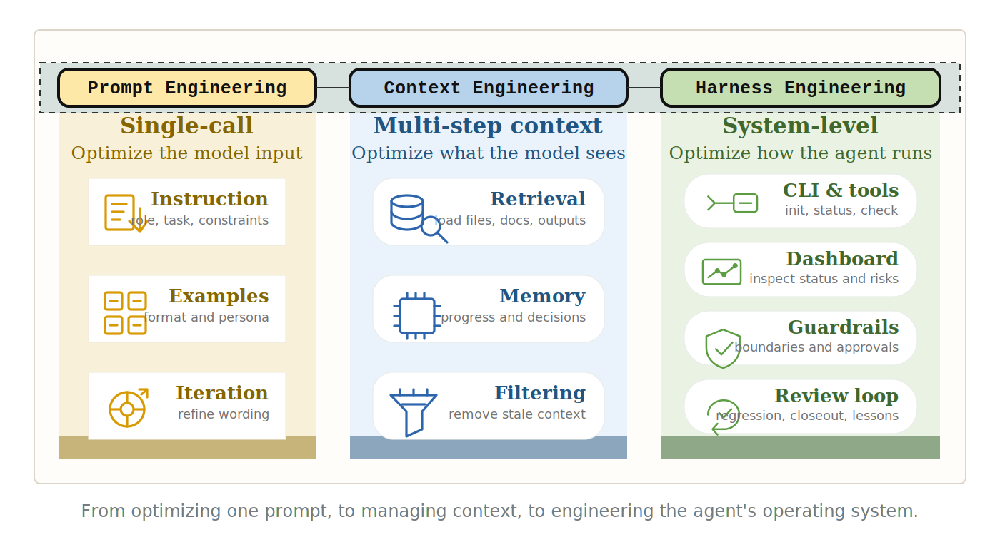
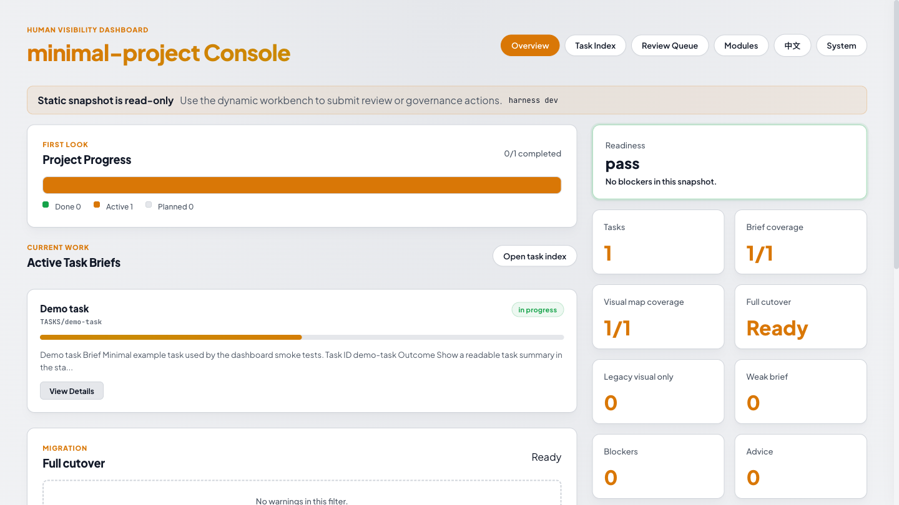
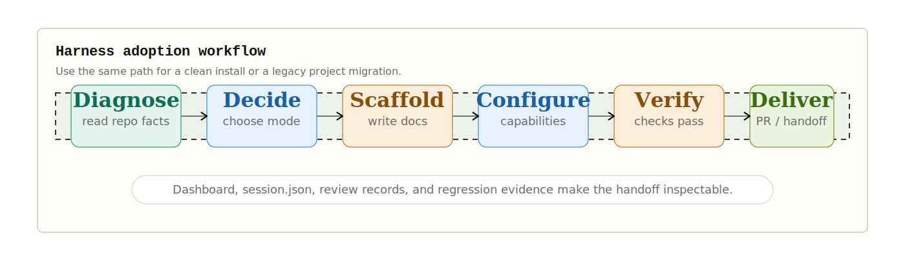

# Coding Agent Harness

[](https://skills.sh/FairladyZ625/coding-agent-harness)

English | [简体中文](README.zh-CN.md) | [日本語](docs-release/intl/ja-JP.md) | [한국어](docs-release/intl/ko-KR.md) | [Français](docs-release/intl/fr-FR.md) | [Español](docs-release/intl/es-ES.md) | [Deutsch](docs-release/intl/de-DE.md)



> An open-source, document-native, ready-to-use Agent Harness for keeping Codex, Claude Code, Gemini CLI, and other coding agents clear, transparent, and reviewable during long-running software work.



## At A Glance

Coding Agent Harness is not another collection of chat prompts. It turns the durable facts that coding agents need into repository files: entry agreements, task plans, execution evidence, regression results, dashboards, and closeout records.

The smallest loop is:

- A human states the goal, and the agent reads the repository Harness first.
- The agent follows Diagnose → Decide → Scaffold → Configure → Verify → Deliver.
- The CLI and Dashboard expose status, risk, migration plans, and review evidence.
- The next agent resumes from repository facts instead of previous chat memory.



## What It Is

Coding Agent Harness is a project engineering framework for AI coding agents.

It adds working agreements, document structure, task lifecycle, regression evidence, and review loops directly into your repository so agents can read, execute, update, and verify the project from durable local facts.

## Why It Exists

Generating a few thousand lines of code with AI is not the hard part. The hard part is keeping the agent oriented after days of work, preventing parallel agents from overwriting each other, and letting a new agent continue from repository facts instead of chat memory.

Coding Agent Harness turns those facts into part of the project.

## Core Strengths

### Open Source, Simple, Ready To Use

Harness runs as ordinary project files: Markdown, templates, check scripts, static dashboard snapshots, and an optional local dynamic Workbench. The core package has no third-party runtime dependencies and does not require a background service or database. When a human needs web actions, `harness dev` starts a temporary localhost-only workbench.

Give the installation prompt to your agent, and it can initialize, scan, migrate, and verify the target project.

### Compatible With Coding Agents

Any agent that can read files, write files, and run commands can use this Harness. It works with Codex, Claude Code, Gemini CLI, Cursor-style agents, OpenClaw, and similar coding agents.

### Document-Native And Transparent

Important project state stays visible in the repository:

- what the current task is
- why it matters
- how it should be executed
- where the evidence is
- whether regression passed
- what residual risks remain
- which tasks are complete and which still need work

Humans can read briefs, dashboards, and migration reports. Agents can read structured docs, task contracts, and check results.

### Built For Long-Running Work

Harness covers the continuity layer of real development: task lifecycle, Brief, Execution Strategy, Visual Map, Progress Log, Review, Regression Evidence, Closeout, and Lessons.

It gives each agent step context, evidence, and a finish condition.

### Safe Migration For Existing Projects

Legacy project migration starts with a scan, a migration plan, a recommended migration mode, and user confirmation. Only then should the agent write files. Final status is proven with a dashboard and checks.

## Good Fit

Coding Agent Harness is useful for:

- teams using coding agents on real software projects;
- projects that run for days, weeks, or many iterations;
- work involving multiple agents or multiple developers;
- repositories with historical task docs, regression records, or migration notes;
- teams that want AI development to be visible, reviewable, and reusable.

## Quick Start

### Install The Skills

If your agent supports Skills, inspect this repository's Skill entries with `npx`.
Because the repository has a root Skill plus nested Skills, use `--full-depth`
when you want to see or install `preset-creator`:

```bash
npx skills add FairladyZ625/coding-agent-harness --list --full-depth
npx skills add FairladyZ625/coding-agent-harness --skill coding-agent-harness
npx skills add FairladyZ625/coding-agent-harness --skill preset-creator --full-depth
```

Use the Skills separately:

- `coding-agent-harness`: for installing, migrating, operating, and reviewing a Harness inside a target project.
- `preset-creator`: for authoring reusable Harness preset packages when a family of tasks shares a method, external references, artifacts, evidence requirements, or complex-task skeleton overlays. This Skill includes its own Complex Task skeleton reference, so an agent can build a correct preset without already knowing Harness internals.

Install a Skill into the global Codex skill directory:

```bash
npx skills add FairladyZ625/coding-agent-harness \
  --skill coding-agent-harness \
  --agent codex \
  --global \
  -y
```

For the Preset Creator Skill:

```bash
npx skills add FairladyZ625/coding-agent-harness \
  --skill preset-creator \
  --full-depth \
  --agent codex \
  --global \
  -y
```

The CLI is not automatically added to the target project's dependencies. Use `npx` when you need to run Harness commands. The first run downloads the package into the local npm cache; it does not write to the target project:

```bash
npx --yes coding-agent-harness init --locale zh-CN --capabilities core,dashboard .
npx --yes coding-agent-harness dev .
npx --yes coding-agent-harness check --profile target-project .
```

If you want to use `harness` as a long-lived system command, install it globally:

```bash
npm install -g coding-agent-harness
harness --help
```

The npm install seeds bundled presets into `~/.coding-agent-harness/presets/`.
`harness init` also seeds those presets into the target project at
`.coding-agent-harness/presets/`, so agents can discover stable task methods
with `harness preset list --json`.

Agents must not silently run a global install. They may run `npm install -g coding-agent-harness` only after the user explicitly approves changing the global npm environment. Without that approval, keep using `npx --yes coding-agent-harness ...`.

### Commands For Humans

Initialize a Chinese Harness:

```bash
npx --yes coding-agent-harness init --locale zh-CN --capabilities core,dashboard .
```

Start the local dynamic Workbench:

```bash
npx --yes coding-agent-harness dev .
```

The Workbench includes a Presets view for checking, installing, seeding, and
uninstalling project or user presets. Static dashboards show the same preset
catalog as read-only evidence.

Generate a static Dashboard that can be opened offline:

```bash
npx --yes coding-agent-harness dashboard --out-dir tmp/harness-dashboard .
open tmp/harness-dashboard/index.html
```

Run target-project checks:

```bash
npx --yes coding-agent-harness check --profile target-project .
```

### Prompt For Agents

Send this to the agent inside your target project:

```text
Install and read Coding Agent Harness first:

npx skills add FairladyZ625/coding-agent-harness --skill coding-agent-harness

First check whether this environment has the harness command.

If it does not, do not silently install globally. Ask me first:
"This environment does not have the harness command. May I run npm install -g coding-agent-harness?
This changes the global npm environment and then lets you use harness directly.
If you do not approve, I will use npx --yes coding-agent-harness ... temporarily and will not write to project dependencies."

Only after I explicitly approve, run:
npm install -g coding-agent-harness
harness preset list --json

If I do not approve or do not respond, run CLI commands with:
npx --yes coding-agent-harness <command>

Set up Coding Agent Harness in the current project.
Use Chinese templates by default. If the project is clearly an English team or English documentation project, ask me before switching to English.

First diagnose the project structure, then give me an initialization plan.
If this is a microservice, multi-repo, split frontend/backend, or externally integrated project, proactively ask me whether I have external architecture docs, API docs, diagrams, meeting notes, links, source paths, or exported packets.
If the external material is large, create an external-source-packs index and digests first, then project stable conclusions into 03-ARCHITECTURE / 04-DEVELOPMENT / 06-INTEGRATIONS.
After confirmation, execute Diagnose → Decide → Scaffold → Configure → Verify → Deliver.
When initializing, run:
npx --yes coding-agent-harness init --locale zh-CN --capabilities core,dashboard .
npx --yes coding-agent-harness preset list --json .

After initialization, use the dynamic web UI for daily viewing and human confirmations:
npx --yes coding-agent-harness dev .

If you only need an offline evidence snapshot, generate a static dashboard:
npx --yes coding-agent-harness dashboard --out-dir tmp/harness-dashboard .

Do not overwrite existing business docs, historical tasks, regression records, or user changes.
When finished, report created files, check results, and recommended next steps.
```

If the target already has an older Harness, use this:

```text
Install and read Coding Agent Harness first:

npx skills add FairladyZ625/coding-agent-harness --skill coding-agent-harness

First check whether this environment has the harness command.

If it does not, do not silently install globally. Ask me first:
"This environment does not have the harness command. May I run npm install -g coding-agent-harness?
This changes the global npm environment and then lets you use harness directly.
If you do not approve, I will use npx --yes coding-agent-harness ... temporarily and will not write to project dependencies."

Only after I explicitly approve, run:
npm install -g coding-agent-harness
harness preset list --json

If I do not approve or do not respond, run CLI commands with:
npx --yes coding-agent-harness <command>

This project already has an older Harness. Do not edit files yet.

First run a detailed scan and give me a migration plan:
1. Check git status, Harness status, task count, brief coverage, visual_map coverage, warnings/actions/residuals, strict status, and dashboard usability.
2. If this is a microservice, multi-repo, split frontend/backend, or externally integrated project, proactively ask me for external source material; when the material is large, create an external-source-packs index and digests before projecting facts into 03/04/06.
3. Recommend the migration mode from project evidence:
   - baseline-preserve: safe adoption first; only add necessary structure and visibility.
   - status-aware-rewrite: rewrite current or reopened tasks from SSoT, Ledger, progress, review, and git evidence.
   - full-semantic-rewrite: rewrite task briefs / execution_strategy / visual_map so the old project becomes v1.0-readable.
4. Report the recommended mode, rationale, expected write scope, estimated token/time cost, risks, and whether subagents are needed.
5. Ask me the confirmation questions you need, then wait for my confirmation before writing files.

During the scan phase, run at least:
npx --yes coding-agent-harness status --json .
npx --yes coding-agent-harness migrate-plan --json --limit 1000 .

When the migration is complete, report the dynamic workbench URL or static dashboard HTML, session.json, normal/strict checks, migrate-plan summary, and whether full-cutover verification passes. If human review confirmation is required, expose that action in the local web workbench; static dashboards are read-only evidence snapshots.
```

## Contributing

External contributors should start with [`CONTRIBUTING.md`](CONTRIBUTING.md). It covers repository layout, pull request expectations, root package checks, Dashboard smoke tests, npm package dry runs, and GUI submodule validation. The detailed public workflow also lives in [`docs-release/guides/contributing.md`](docs-release/guides/contributing.md).

If you want your coding agent to make a contribution, send it this prompt:

```text
I want to contribute a focused change to FairladyZ625/coding-agent-harness.

Start from the latest main branch and create a new feature branch. Read README.md and CONTRIBUTING.md first. Before editing files, inspect the relevant code/docs and give me a short plan.

Keep the change scoped. Use only public repository files and do not rely on maintainer-local state, hidden workflows, credentials, generated dashboards, temporary files, or ignored local-only files.

Run the checks that match the change. For docs-only changes, run git diff --check. For root package changes, run npm install, npm test, npm run smoke:dashboard, npm run check, node scripts/harness.mjs check --profile target-project examples/minimal-project, npm run pack:dry-run, and git diff --check as relevant. If the change touches harness-gui, also run cd harness-gui && npm ci && npm run typecheck && npm test && npm run build.

When done, summarize what changed, list verification results, call out any skipped checks with reasons, and prepare the PR using the repository template.
```

## Learn More

- Contributor guide: [`CONTRIBUTING.md`](CONTRIBUTING.md)
- Detailed contributor guide: [`docs-release/guides/contributing.md`](docs-release/guides/contributing.md)
- Agent installation guide: [`docs-release/guides/agent-installation.en-US.md`](docs-release/guides/agent-installation.en-US.md)
- Minimal project example: [`examples/minimal-project/`](examples/minimal-project/)
- Legacy migration playbook: [`docs-release/guides/migration-playbook.en-US.md`](docs-release/guides/migration-playbook.en-US.md)
- Full legacy migration strategy: [`docs-release/guides/full-legacy-migration-subagent-strategy.md`](docs-release/guides/full-legacy-migration-subagent-strategy.md)
- Architecture overview: [`docs-release/architecture/overview.md`](docs-release/architecture/overview.md)

## Star History

[](https://star-history.com/#FairladyZ625/coding-agent-harness&Date)

## License

MIT
