# Architecture Overview

English | [简体中文](overview.zh-CN.md)

Coding Agent Harness is a repository-native operating layer for long-running
coding agent work. It gives agents a stable project memory, a task lifecycle,
review gates, migration rails, and a dashboard that humans can inspect.

The core idea is simple: keep the important state in files the agent can read,
then use the CLI to derive status, checks, migration plans, and dashboard views
from those files.

## Mental Model

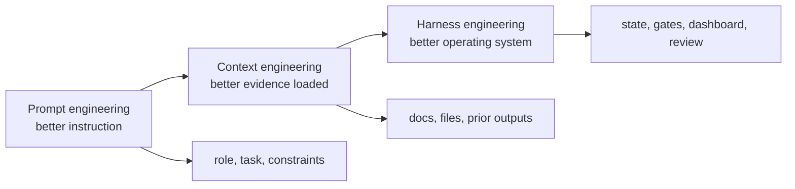

Prompt engineering improves a single model call. Context engineering improves
what the model sees across a task. Harness engineering improves how the whole
agent workflow runs over days, handoffs, reviews, and releases.

## Product Architecture

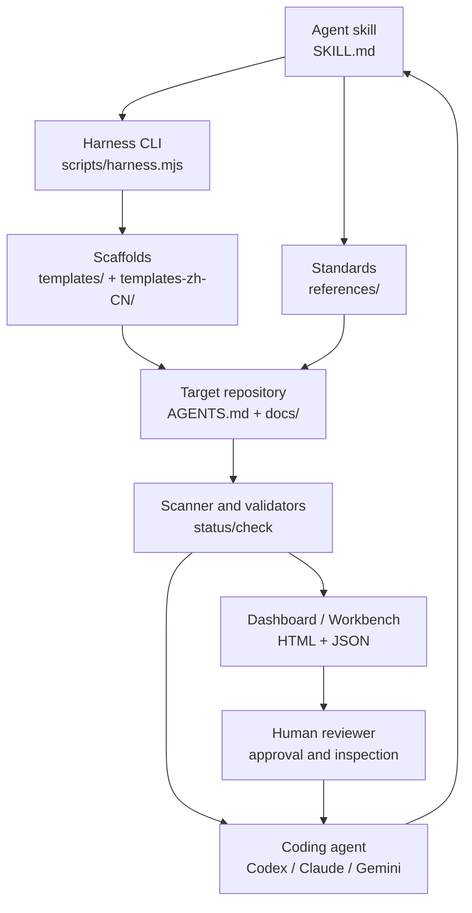

The package ships the repeatable pieces: standards, templates, CLI logic,
dashboard assets, examples, and public docs. Target projects hold the live
project facts.

## Target Repository Model

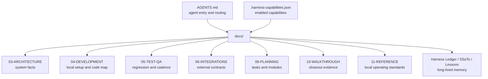

The target repository is the source of truth. The agent should be able to resume
from these files without relying on previous chat memory.

## Repository Operating Models

The target repository can be organized in three ways:

| Model | Control surface | Execution surface |
| --- | --- | --- |
| Single repo | The same repository owns `AGENTS.md`, `docs/`, code, tests, and closeout. | The same repository. |
| Independent multi-repo | Each repository owns its own local `AGENTS.md` and `docs/`. | Each repository runs independently. |
| Parent-control repository | A parent repository owns the global Harness control plane. | Child repositories own implementation code and local checks. |

For products split across frontend, backend, SDKs, services, and upstream references,
the parent-control model keeps the agent startup point, Feature SSoT, regression
state, and closeout evidence in one place. See
`docs-release/guides/repository-operating-models.en-US.md` and
`docs-release/guides/parent-control-repository-pattern.en-US.md`.

## CLI Command Surface

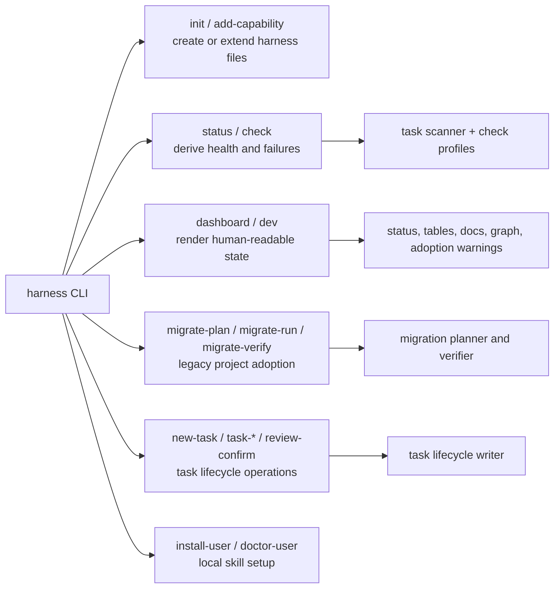

All command families read the same repository facts. That keeps CLI output,
checks, migration reports, and dashboard views aligned.

## Dashboard Data Flow

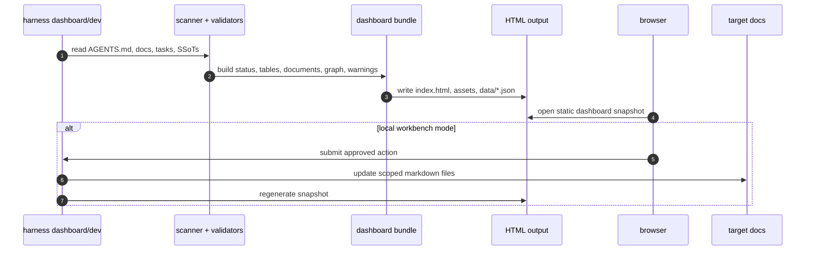

The static dashboard is a portable evidence snapshot. The local workbench adds a
small writable surface for human-confirmed actions such as review completion.

## Task Lifecycle State Machine

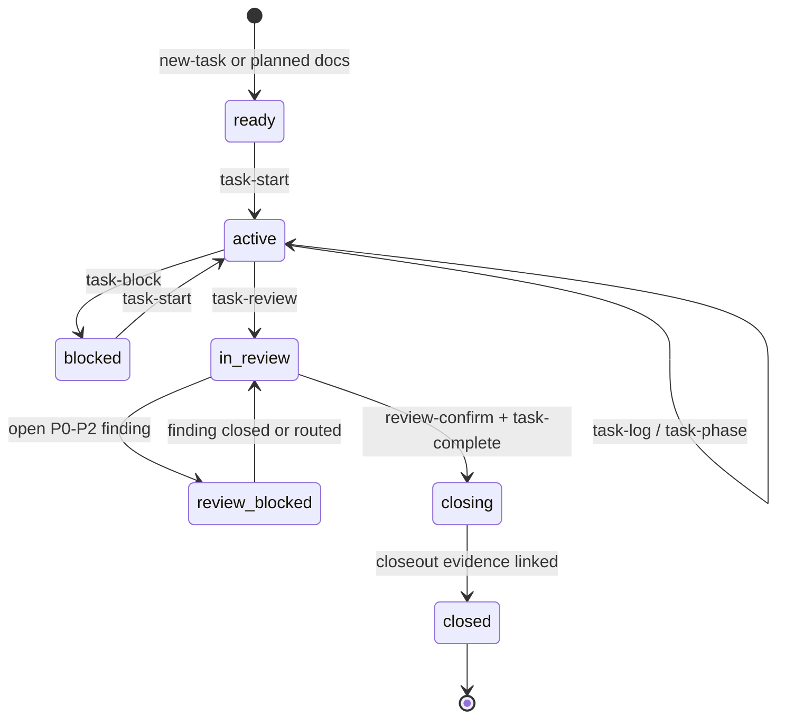

The scanner keeps raw task state and derived lifecycle state separate:

| Raw task state | Derived lifecycle meaning |
| --- | --- |
| `not_started` / `planned` | `ready` |
| `in_progress` | `active` |
| `blocked` | `blocked` |
| `review` with open blocking findings | `review-blocked` |
| `review` without blocking findings | `in_review` |
| `done` without closeout | `closing` |
| any state with closed closeout evidence | `closed` |

This prevents a task from looking finished just because one file says `done`.

## Review And Closeout Gate

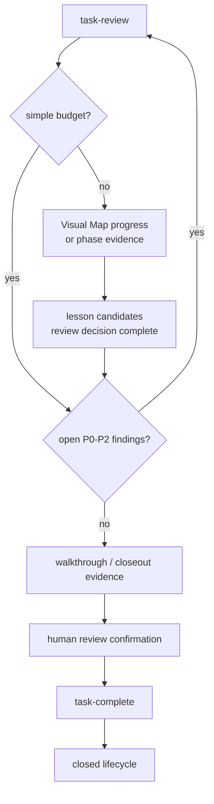

Standard and complex tasks must show progress, evidence, lesson resolution,
review confirmation, and closeout linkage before they are treated as closed.

## Migration Rails

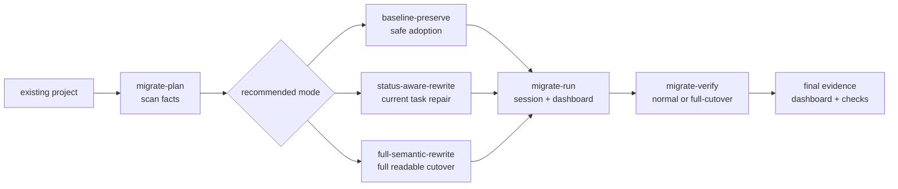

Migration is plan-first. The agent scans the project, recommends a mode, and
waits for confirmation before changing old task history.

## Documentation Surface

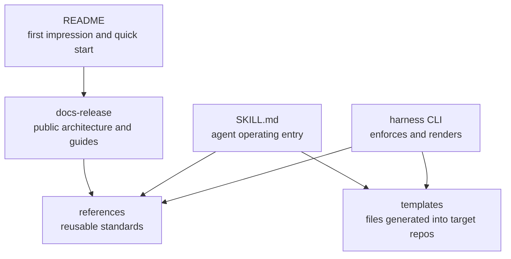

`README` introduces the product. `docs-release` explains architecture and user
workflows. `references` defines reusable standards. `templates` are the concrete
files installed into a target project.

## Release Package Surface

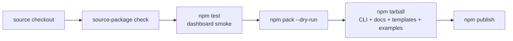

The public release artifact is the npm package. `npm pack --dry-run` is the
final shape check before publish because it shows exactly which docs, scripts,
templates, examples, and assets will be shipped.

## Worker / Coordinator Boundary

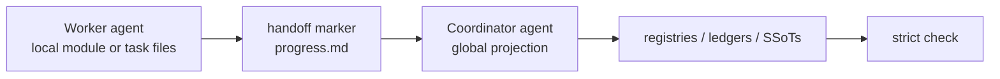

Workers own local task and module facts. Coordinators own global projections:
registries, ledgers, closeout indexes, and regression state.
