# 架构总览

[English](overview.md) | 简体中文

Coding Agent Harness 是一套面向长程 Coding Agent 工作的、仓库原生的运行层。它给 Agent 提供稳定的项目记忆、任务生命周期、审查门禁、迁移轨道，以及人可以检查的 Dashboard。

核心思路很简单：把重要状态放进 Agent 能读取的文件里，再用 CLI 从这些文件推导 status、check、migration plan 和 dashboard view。

## 心智模型

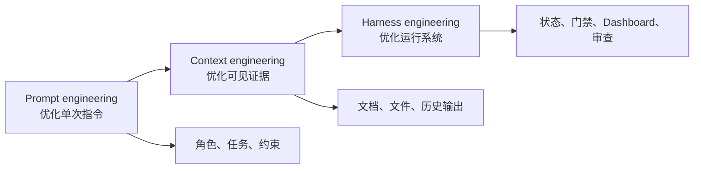

Prompt engineering 改善一次模型调用。Context engineering 改善模型在任务中能看到什么。Harness engineering 改善 Agent 在多天执行、多人交接、审查和发布中的整体运行方式。

## 产品架构

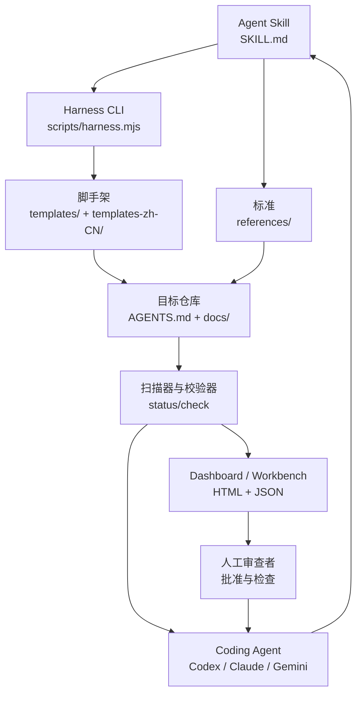

这个包交付的是可复用部件：标准、模板、CLI 逻辑、Dashboard 资产、示例和公开文档。目标项目保存真实运行中的项目事实。

## 目标仓库模型

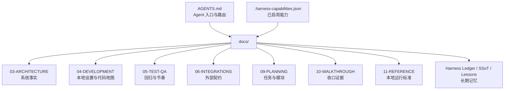

目标仓库是事实源。Agent 应该能从这些文件恢复上下文，而不是依赖上一轮聊天记忆。

## 仓库运行模式

目标项目可以采用三种仓库组织方式：

| 模式 | 控制面 | 执行面 |
| --- | --- | --- |
| 单仓模式 | 同一个仓库管理 `AGENTS.md`、`docs/`、代码、测试和收口。 | 同一个仓库。 |
| 多仓独立模式 | 每个仓库都有自己的局部 `AGENTS.md` 和 `docs/`。 | 每个仓库独立执行。 |
| 主控仓库模式 | 父仓库管理全局 Harness 控制面。 | 子仓库管理实现代码和局部检查。 |

如果一个产品拆成前端、后端、SDK、微服务和上游参考仓库，主控仓库模式可以把 Agent 启动入口、Feature SSoT、回归状态和收口证据固定在一个地方。详见 `docs-release/guides/repository-operating-models.md` 和 `docs-release/guides/parent-control-repository-pattern.md`。

## CLI 命令面

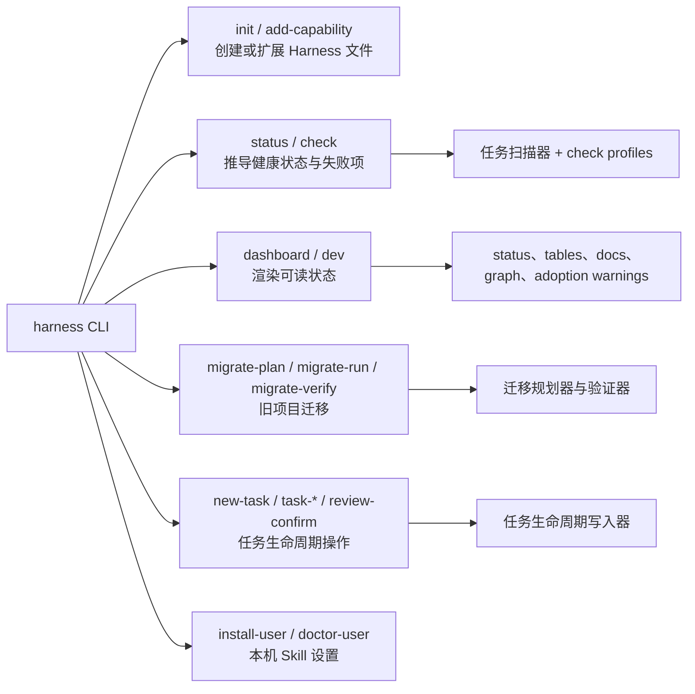

所有命令族都读取同一份仓库事实，因此 CLI 输出、检查结果、迁移报告和 Dashboard 视图会保持一致。

## Dashboard 数据流

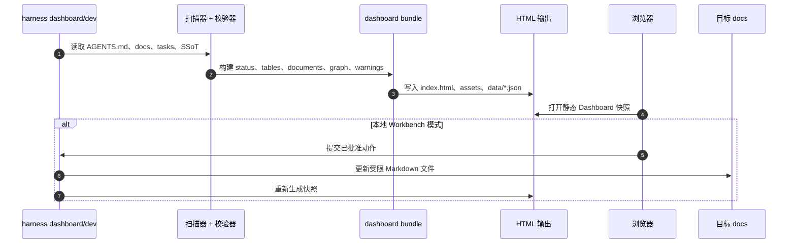

静态 Dashboard 是可携带的证据快照。本地 Workbench 增加一个很小的可写操作面，用于人工确认过的动作，例如 review completion。

## 任务生命周期状态机

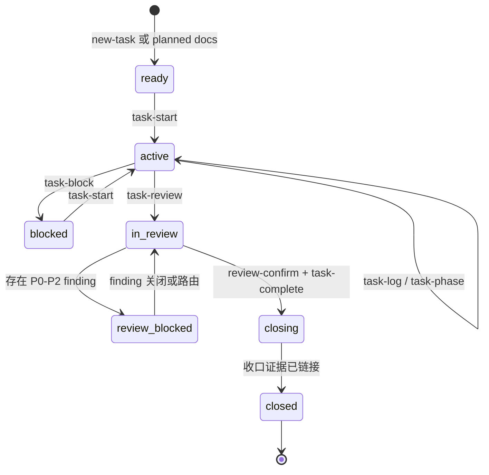

扫描器会区分原始任务状态和派生生命周期状态：

| 原始任务状态 | 派生生命周期含义 |
| --- | --- |
| `not_started` / `planned` | `ready` |
| `in_progress` | `active` |
| `blocked` | `blocked` |
| `review` 且存在阻塞 finding | `review-blocked` |
| `review` 且无阻塞 finding | `in_review` |
| `done` 但缺少 closeout | `closing` |
| 任意状态且已有 closed closeout 证据 | `closed` |

这样可以避免一个文件里写了 `done`，任务就被误认为真正完成。

## Review 与 Closeout 门禁

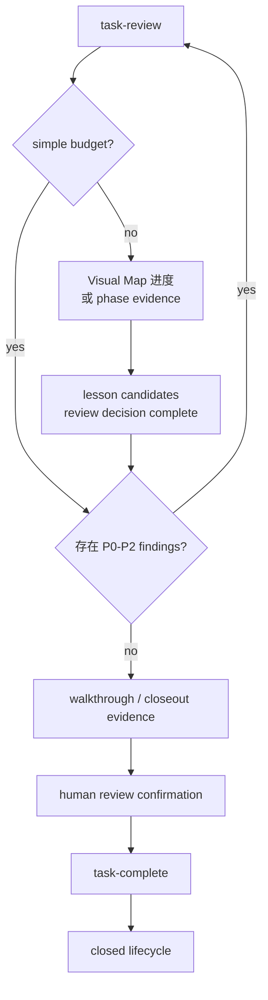

standard 和 complex 任务必须具备进度、证据、lesson 决议、人工确认和收口链接，才会被视为真正关闭。

## 迁移轨道

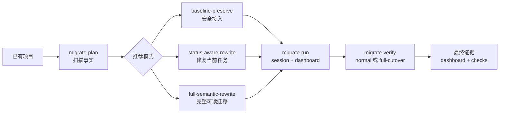

迁移是 plan-first 的。Agent 先扫描项目、推荐模式，并在修改旧任务历史前等待确认。

## 文档表面

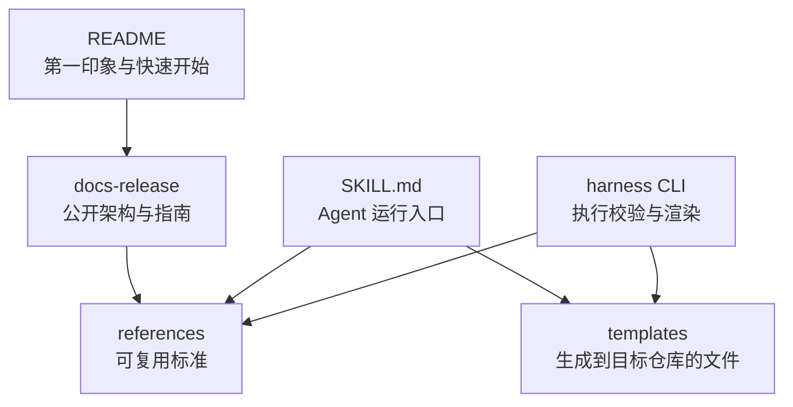

`README` 介绍产品。`docs-release` 解释架构和用户工作流。`references` 定义可复用标准。`templates` 是安装到目标项目里的具体文件。

## 发布包表面

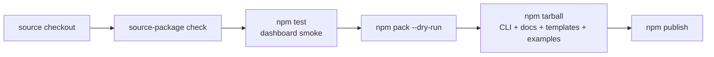

公开发布物是 npm package。`npm pack --dry-run` 是 publish 前的最终形态检查，因为它展示了会被发布出去的 docs、scripts、templates、examples 和 assets。

## Worker / Coordinator 边界

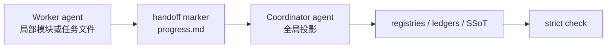

Worker 负责局部任务与模块事实。Coordinator 负责全局投影：registries、ledgers、closeout indexes 和 regression state。
