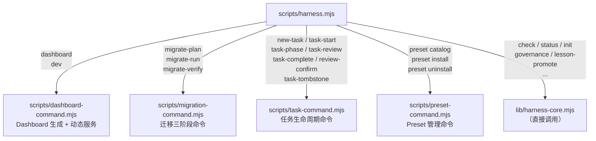
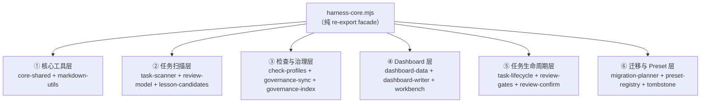
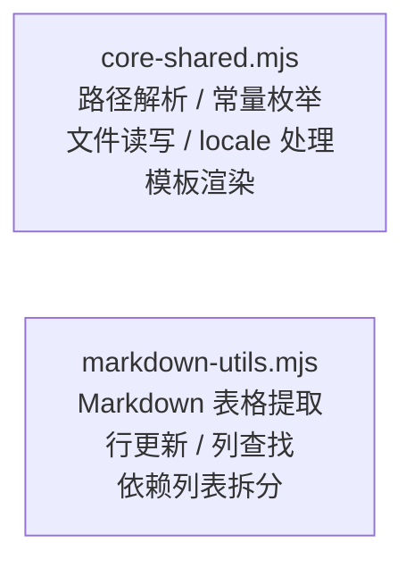
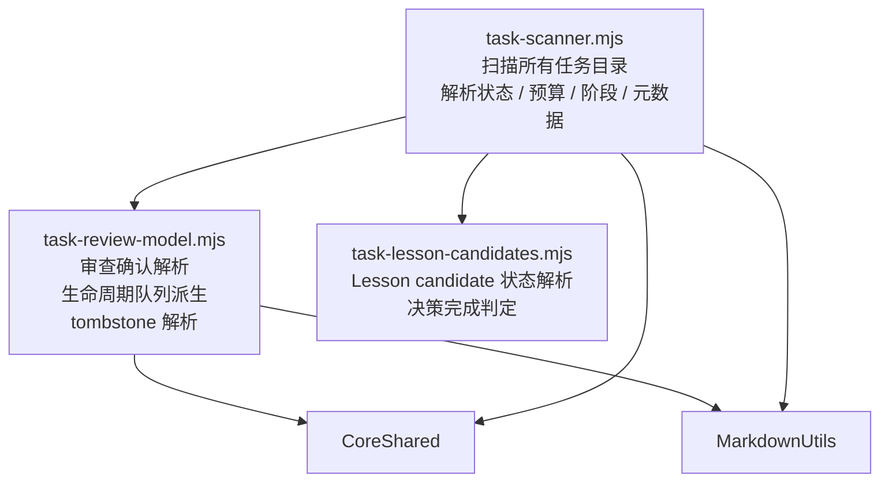
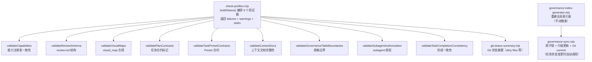
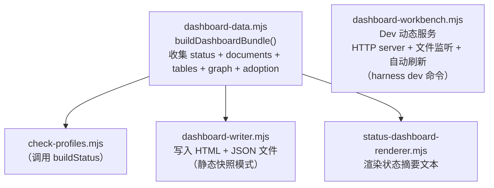
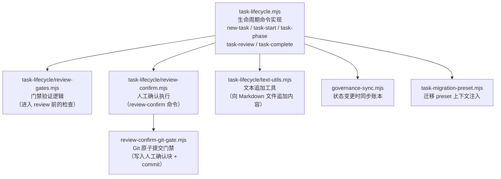
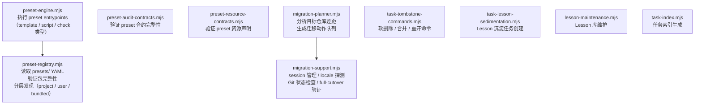
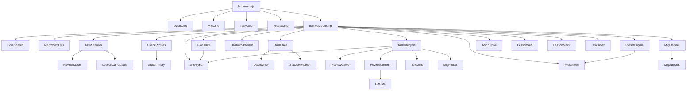

# 02 — 代码模块依赖关系

## Level 0 — 入口在哪

所有命令都从一个文件进来：

`harness.mjs` 做两件事：解析命令行参数，然后分发给对应的 command 模块或直接调用核心库。
它本身不包含任何业务逻辑。

---

## Level 1 — 命令如何分发

四个 command 模块各自负责一个领域，其余命令直接调用 `harness-core.mjs`。

**为什么这样分**：command 模块处理的是有复杂交互逻辑的命令（多步骤、需要读写多个文件、
有用户提示），而简单的查询类命令（`check`、`status`）直接调用核心库更简洁。

---

## Level 2 — harness-core.mjs 是什么

`harness-core.mjs` 是一个 **facade（门面）**，它自己不写任何业务逻辑，
只是把 `lib/` 下所有模块的导出重新 re-export 出来。

这样设计的好处：外部代码只需要 `import from "./lib/harness-core.mjs"` 就能拿到所有功能，
不需要知道具体在哪个子模块里。

下面逐层展开。

---

## Level 3 — 六个功能层详解

### ① 核心工具层

这两个模块是所有其他模块的基础，几乎每个模块都会 import 它们：

`core-shared` 定义了所有允许的枚举值，是整个系统的"类型系统"：

| 枚举 | 允许值 |
| --- | --- |
| `allowedTaskStates` | `not_started / planned / in_progress / review / blocked / done` |
| `allowedTaskBudgets` | `simple / standard / complex` |
| `allowedPhaseStates` | `planned / in_progress / review / blocked / done / skipped` |
| `allowedCapabilities` | `core / module-parallel / subagent-worker / adversarial-review / ...` |

`markdown-utils` 提供了对 Markdown 表格的结构化操作——这是整个系统能从 Markdown 文件
派生状态的技术基础。

---

### ② 任务扫描层

负责读取 `docs/09-PLANNING/TASKS/` 下的所有文件，解析出结构化数据：

`task-review-model` 里有几个关键的**派生函数**——它们不读文件，
只根据已解析的数据计算出新的状态：

| 函数 | 输入 | 输出 |
| --- | --- | --- |
| `deriveLifecycleState()` | taskState + reviewStatus + tombstone | `lifecycleState`（队列分类） |
| `deriveTaskQueues()` | lifecycleState + materials + lessons | `taskQueues[]`（属于哪些队列） |
| `deriveReviewQueueState()` | findings + confirmation | `reviewQueueState` |
| `parseTaskTombstone()` | task_plan.md 内容 | 软删除 / 合并 / 被取代状态 |

这些派生函数是**纯函数**，相同输入永远得到相同输出，便于测试和调试。

---

### ③ 检查与治理层

负责验证合规性，以及维护全局索引的原子写入：

**重要区分**：`governance-sync` 和 `check-profiles` 没有依赖关系。
- `check-profiles`：只读，验证状态，不写文件
- `governance-sync`：只写，更新账本，不做验证

---

### ④ Dashboard 层

负责把扫描结果转换成 HTML Dashboard：

`DashWorkbench` 和 `DashData` / `DashWriter` 是**独立的**：
- `DashData` + `DashWriter`：生成静态快照（只读）
- `DashWorkbench`：启动本地 HTTP 服务，支持 Workbench 写操作

---

### ⑤ 任务生命周期层

负责执行所有任务状态转换命令：

`review-confirm` 是整个生命周期层里最特殊的命令——它是唯一需要 Git 原子提交的操作，
也是唯一不能被 Agent 自动执行的操作（见 [01-system-overview.md](01-system-overview.md) 的设计决策）。

---

### ⑥ 迁移与 Preset 层

---

## 一张完整的依赖总图（参考用）

如果你已经理解了上面的分层，这张图可以作为查阅索引：

---

## Level 2 — 模块命名规律

理解命名规律可以帮你快速定位代码：

| 前缀 / 后缀 | 含义 | 例子 |
| --- | --- | --- |
| `task-` | 与任务相关 | `task-scanner`, `task-lifecycle`, `task-review-model` |
| `dashboard-` | 与 Dashboard 相关 | `dashboard-data`, `dashboard-writer`, `dashboard-workbench` |
| `governance-` | 与治理 / 账本相关 | `governance-sync`, `governance-index-generator` |
| `migration-` | 与迁移相关 | `migration-planner`, `migration-support` |
| `preset-` | 与 Preset 相关 | `preset-registry`, `preset-engine`, `preset-audit-contracts` |
| `check-` | 验证器 | `check-profiles`, `check-module-parallel` |
| `-command.mjs` | CLI 命令模块 | `task-command`, `dashboard-command` |
| `-utils.mjs` | 工具函数 | `markdown-utils`, `text-utils` |
| `-gates.mjs` | 门禁逻辑 | `review-gates`, `review-confirm-git-gate` |
