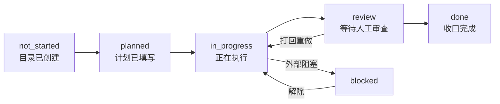
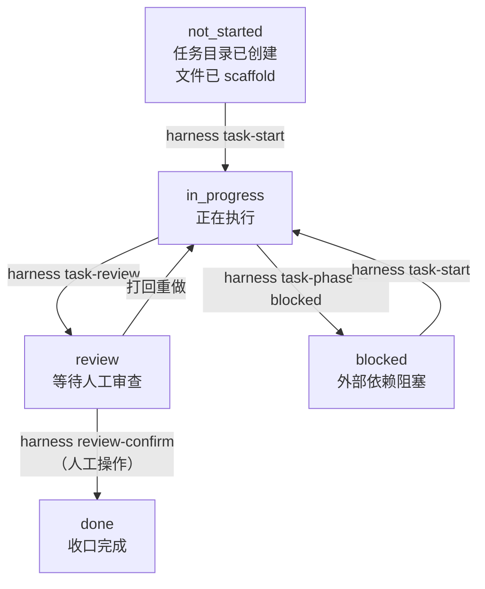
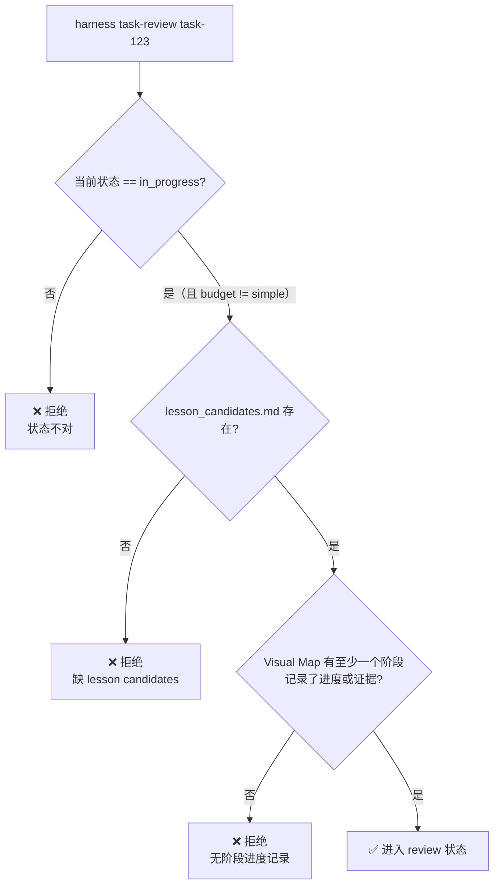
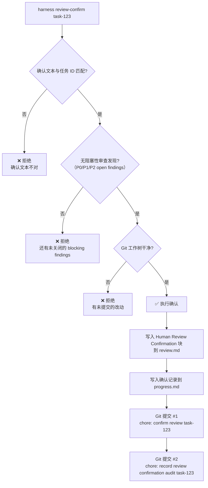
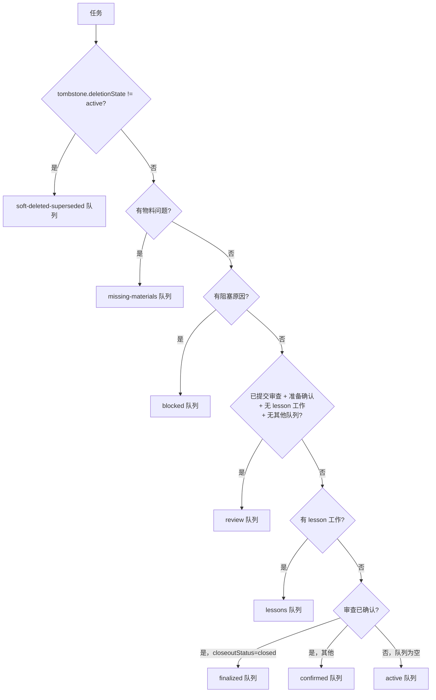
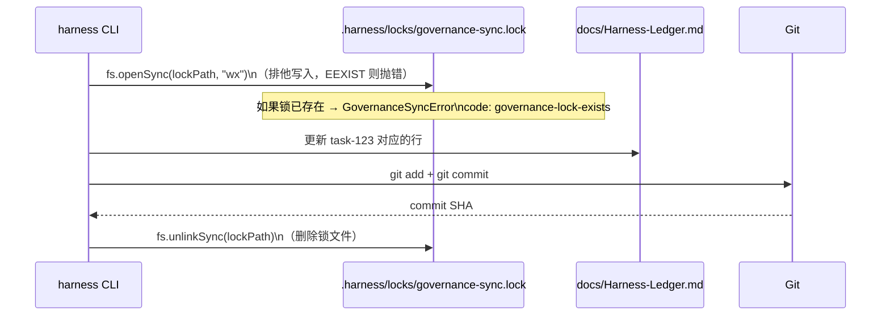

# 03 — 任务生命周期

## Level 0 — 一个任务的一生

一个任务从创建到收口，经历六个状态：



每个状态转换都有对应的 CLI 命令触发。`planned` 状态在实践中通常被跳过——
Agent 创建任务后直接进入 `in_progress`。

---

## Level 1 — 状态与命令的对应关系



**关键点**：`review-confirm` 是整个系统里**唯一不能被 Agent 自动执行**的命令。
它需要真实的人类操作，并会写入带有 Git `user.name` / `user.email` 的可审计确认块。

---

## Level 2 — Budget 决定门禁严格程度

Budget 是任务的复杂度等级，直接决定审查门禁有多严：

| 门禁项 | simple | standard | complex |
| --- | --- | --- | --- |
| 需要 Visual Map 阶段进度 | ✗ | ✓ | ✓ |
| 需要 lesson_candidates.md | ✗ | ✓ | ✓ |
| 需要 Agent 写 review.md | ✗ | ✓ | ✓ |
| 需要关闭所有 blocking findings | ✗ | ✓ | ✓ |
| 需要 Walkthrough 链接 | ✗ | ✓ | ✓ |
| 需要 Lesson 决策完成 | ✗ | ✓ | ✓ |
| 需要人工 review-confirm | ✗ | ✓ | ✓ |

`simple` 任务可以直接从 `in_progress` 跳到 `done`，没有任何门禁。
`standard` 和 `complex` 的门禁完全相同——区别在于 `complex` 任务通常需要 subagent 授权和对抗审查。

---

## Level 3 — task-review 的门禁细节

当 Agent 执行 `harness task-review` 时，系统在**进入 review 状态之前**做三项检查
（`review-gates.mjs`）：



"阶段记录了进度"的判定（`review-gates.mjs`）：
- `phase.completion > 0`，或
- `phase.state` 是 `in_progress / review / blocked / done`，或
- `phase.evidenceStatus` 是 `partial / present / waived`

进入 review 状态后，Agent 需要写 `review.md`，填写 findings 表格。

---

## Level 3 — review-confirm 的门禁细节

当人类执行 `harness review-confirm` 时，系统在**执行确认之前**做四项检查：



**两次提交策略**：第一次提交 review.md 和 progress.md，第二次提交最终审计元数据。
这样即使第二次提交失败，第一次提交也已经锁定了确认记录。

**Human Review Confirmation 块格式**（写入 review.md）：

```markdown
## Human Review Confirmation

| Field | Value |
| --- | --- |
| Confirmation ID | HRC-<timestamp> |
| Confirmed At | <ISO timestamp> |
| Reviewer | <git user.name> |
| Reviewer Email | <git user.email> |
| Task Key | <canonical task id> |
| Confirm Text | <task id confirmation> |
| Evidence Checked | <evidence path> |
| Commit SHA | <git commit sha> |
| Audit Status | committed |
```

---

## Level 3 — lifecycleState 派生逻辑

`lifecycleState` 是从任务状态 + 审查状态综合派生的，不存储在文件里，每次运行时重新计算。

派生函数 `deriveLifecycleState()` 的完整决策树（按优先级顺序）：

| 条件 | lifecycleState |
| --- | --- |
| `reviewStatus == "blocked-open-findings"` | `review-blocked` |
| `closeoutStatus == "closed"` 且 `reviewStatus != "confirmed"` | `closed-review-pending` |
| `closeoutStatus == "closed"` | `closed` |
| `state == "blocked"` | `blocked` |
| `state == "done"` | `closing` |
| `state == "review"` | `in_review` |
| `state == "in_progress"` | `active` |
| `state == "planned"` 或 `"not_started"` | `ready` |
| 其他 | `unknown` |

---

## Level 3 — 生命周期队列

任务根据当前状态被自动分配到不同队列，这些队列在 Dashboard 中可见。
**一个任务可以同时属于多个队列**（比如同时在 `missing-materials` 和 `blocked`）。

队列分配逻辑（`deriveTaskQueues()`）：



**阻塞原因来源**：物料问题、P0-P2 阻塞性 findings、状态冲突、过时的扫描器版本。

---

## Level 4 — Governance Sync：状态变更如何写入账本

任务状态每次变更，都会触发 `syncTaskGovernance()`，原子地更新 `Harness-Ledger.md`。

**锁机制**（`governance-sync.mjs`）：



锁文件使用 `wx` 标志（写入+排他）创建，这是 Node.js 文件系统的原子操作——
如果文件已存在，`openSync` 会抛出 `EEXIST` 错误，不会覆盖。

**与 `governance rebuild` 的区别**：

| 操作 | 触发方式 | 写入目标 | 频率 |
| --- | --- | --- | --- |
| `syncTaskGovernance` | 自动（每次状态变更） | `Harness-Ledger.md` 对应行 | 高频 |
| `rebuildGovernanceIndexes` | 手动（`harness governance rebuild`） | `docs/09-PLANNING/generated/` 索引表 | 低频 |

---

## Level 3 — Tombstone：软删除与合并

任务可以被软删除、合并或被取代，而不是物理删除。
Tombstone 块追加到 `task_plan.md` 末尾（不替换原内容），保留历史审计链。

支持的操作：
- `supersedeTask()`：标记为被新任务替代
- `softDeleteTask()`：软删除
- `archiveTask()`：归档
- `reopenTask()`：移除 Tombstone 块，重新激活任务

**Tombstone 块格式**：

```markdown
## Task Tombstone

| Field | Value |
| --- | --- |
| State | superseded |
| Superseded By | new-task-id |
| Reason | <reason text> |
| Operator | coordinator |
| Timestamp | <ISO timestamp> |
| Reopen Eligible | yes |
| Archive Eligible | no |
```

---

## Level 2 — 设计决策

### 为什么需要 lifecycleState 这个派生状态

`task.state` 是 Agent 手写进 `progress.md` 的原始执行阶段，只有粗粒度值，
且存在大量历史别名（`complete`、`completed`、`doing`、`active` 等）。
这个字段无法区分"Agent 说自己完成了"和"人工确认完成了"，
也无法区分"等待人审"和"材料缺失"。

`lifecycleState` 从多个文件综合推导，是 Dashboard 的主生命周期语义。
驱动这个设计的核心场景是：一个 `task.state = review` 的任务，
可能实际上处于"缺材料"、"有 open P0 finding"、"等待人审"三种完全不同的治理状态，
而旧模型把这三种情况全部混入同一个 review 队列。

### 为什么一个任务可以同时属于多个队列

一个任务可以同时"等待人审"（Review 队列）且"有未决 lesson candidate"（Lessons 队列），
这两件事的责任方不同（前者是 human reviewer，后者是 coordinator），
退出条件也不同，不应该合并成一个状态。多队列模型让每个治理关注点独立可追踪。

### 为什么 Tombstone 不直接删除任务目录

文档库没有数据库级外键，物理删除后会留下孤儿引用
（Ledger、Closeout SSoT、其他任务的 `Supersedes` 字段都可能指向被删任务）。
Tombstone 标记让 Soft-deleted / Superseded 队列可以只读追溯"为什么这个任务不在活跃队列里"。

### 为什么 review-confirm 需要两次 Git 提交

两次提交让 audit commit 的 SHA 成为不可篡改的时间戳。
第一次提交确认本身，第二次提交包含第一个 commit SHA 的审计记录。
如果只写文件不提交，Agent 可以在不留 Git 历史的情况下伪造确认状态。
检查器可以验证 confirmation commit 是否真实存在于 Git 历史中。

### 为什么 governance-sync 用文件锁而不是 Git 自身的锁

Git 自身的锁（`.git/index.lock`）只保护 index 操作，
不保护 Markdown 文件的读-改-写序列。两个并发 CLI 进程可以同时读取同一个 governance 表、
各自修改、然后先后提交，导致后者覆盖前者的行列更新。
文件锁的粒度是"整个 governance sync 操作"，而不是单次 git 命令。

### 为什么 simple budget 跳过所有门禁

simple 任务对应 trivial 级别的改动（文档修正、配置调整），
强制经过 `task-review → review-confirm → task-complete` 三步会让 overhead 超过任务本身的价值。
这是有意的快速路径，不是遗漏。

### Lesson 系统的设计意图

Lesson 系统把任务执行中发现的可复用经验从"聊天里提到过"变成
"可追踪、可审查、可沉淀到标准文档"的治理对象。
Lesson candidate 决策必须在 `review-confirm` 之前完成，
因为 `review-confirm` 是责任转移点——人工确认后，任务进入 finalization，
此时再要求 Agent 补 lesson 决策会造成责任归属混乱。
