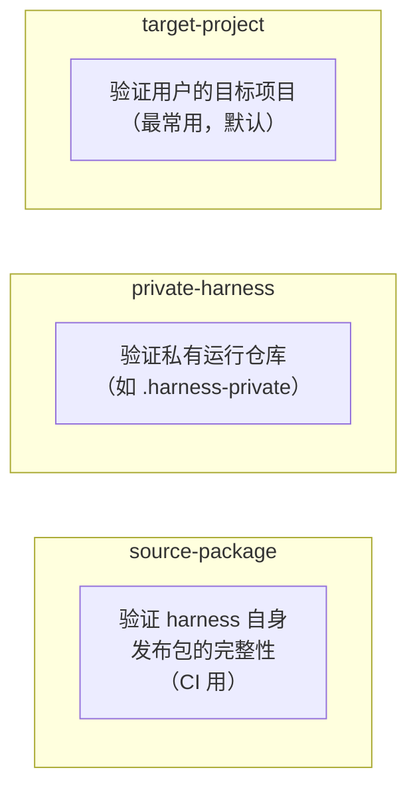
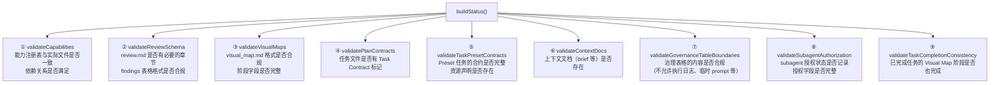
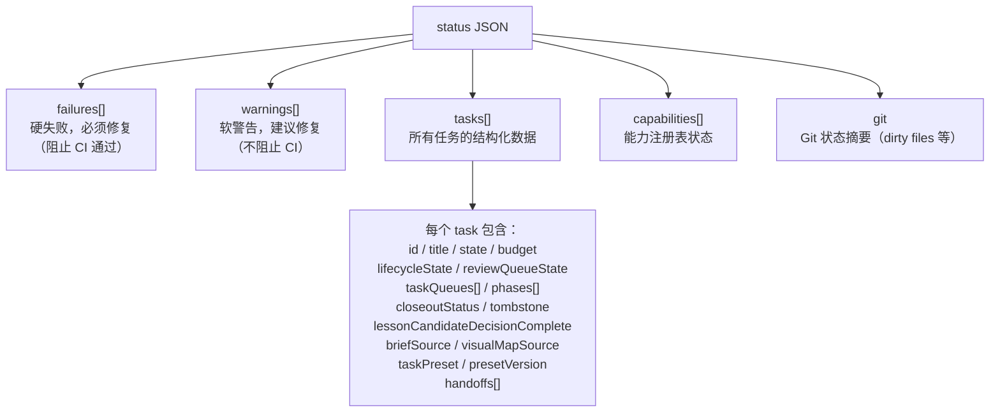
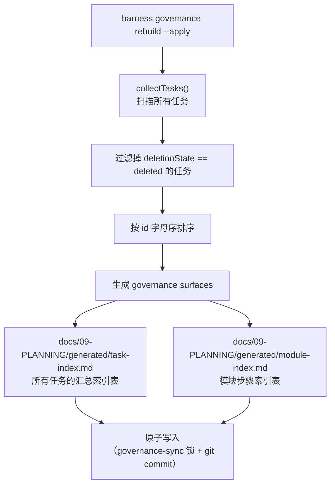

# 04 — 检查体系与治理

## Level 0 — 检查的目的

`harness check` 和 `harness status` 的核心问题是：

> **这个仓库的文档状态是否合规？**

"合规"的定义因场景不同而不同，所以有三种 profile。
每种 profile 对应不同的使用场景，运行不同的验证器子集。

---

## Level 1 — 三种 Check Profile

| Profile | 典型命令 | 用途 |
| --- | --- | --- |
| `source-package` | `harness check --profile source-package .` | CI 验证 harness 自身发布包，检查 staged 文件边界（不允许 `.harness-private/` 或生成的 dashboard 被 tracked） |
| `private-harness` | `harness check --profile private-harness .harness-private` | 验证私有运行记录 |
| `target-project` | `harness check ~/my-app`（默认） | 验证用户项目合规，运行完整的 9 个验证器 |

**source-package 的特殊检查**：除了运行验证器，还会调用 `validateSourcePackageBoundary()`，
检查 git staged 文件中是否包含了不应发布的内容（`.harness-private/`、生成的 dashboard 等）。

---

## Level 2 — buildStatus() 调用了哪些验证器

`buildStatus()` 是检查的核心函数，它按顺序调用 9 个验证器：

每个验证器返回 `failures`（硬失败，必须修复）和 `warnings`（软警告，建议修复）。

> **注意**：`check-module-parallel.mjs` 存在于 `scripts/lib/` 但**不在** `buildStatus()` 的调用链中，它是独立工具，用于验证模块并行工作的 worktree 隔离。

---

## Level 3 — 每个验证器检查什么

### ① validateCapabilities

读取 `.harness-capabilities.json`，检查：
- 声明的能力是否都是合法的能力名（在 `allowedCapabilities` 枚举中）
- 能力的依赖是否都已启用（如 `subagent-worker` 需要先有 `module-parallel`）
- 能力对应的 artifact 路径是否存在

### ② validateReviewSchema

扫描所有 `review.md` 文件，检查每个文件是否包含 4 个必需章节（用字符串匹配，支持中英文）：

1. `Reviewer Identity` / `审查者身份`
2. `Confidence Challenge` / `信心挑战`
3. `Evidence Checked` / `已检查证据`
4. `Final Confidence Basis` / `最终信心依据`

对于 findings 表格，还会检查：
- 必须有 Severity（P0-P3）、Open（yes/no）、Disposition、Blocks Release 列
- **P0/P1 severity 的 finding 不能同时 open=yes 或 blocks=yes**（这是硬失败）
- `accepted-risk` / `deferred` disposition 必须有 follow-up routing
- Evidence ID 引用（`E-\d+`）必须在 Evidence ID 表中存在

对于 verifier-backed review，还需要 `template_id: harness-verifier/v1` 和 `verdict: pass|fail|inconclusive`。

### ③ validateVisualMaps

检查 `visual_map.md` 中的 Phase ID 表必须包含 9 列：
`Phase ID, Depends On, State, Completion, Output, Required Evidence, Evidence Status, Blocking Risk, Owner / Handoff`

验证规则：
- `State` 必须在 `allowedPhaseStates` 中
- `Evidence Status` 必须在 `allowedEvidenceStatus` 中
- `Completion` 必须是 0-100 的整数
- `state=done` 时 `completion` 必须 = 100
- `state=planned` 时 `completion` 必须 = 0
- canonical 源的 visual map 需要 `Visual Map Contract: v1.0` 标记

### ④ validatePlanContracts

检查 `task_plan.md` 是否包含 `Task Contract: harness-task/v1` 标记行。
这是任务被 harness 识别的最基本要求。

### ⑤ validateTaskPresetContracts

对于使用了 Preset 的任务，检查：
- Preset 声明的资源文件是否存在
- `references/INDEX.md` 中是否有对应的索引行
- `task_plan.md` 的"Preset Required Reads"中是否列出了必需阅读

### ⑦ validateGovernanceTableBoundaries

检查 5 个全局治理表格的内容合规性：

| 表格 | 不允许出现的内容 |
| --- | --- |
| Feature-SSoT | 模块级细节、过长的证据描述 |
| Harness-Ledger | 执行日志、临时修复 prompt、原始对话记录 |
| Closeout-SSoT | 执行日志、原始对话记录 |
| Regression-SSoT | 执行日志、临时 prompt |
| Cadence-Ledger | 原始对话记录、临时 prompt |

**时间边界**：2026-05-24 之前的行标记为 legacy，仅产生 warning；之后的行产生 failure。

### ⑧ validateSubagentAuthorization

扫描所有 `execution_strategy.md` 文件，查找 **Subagent Authorization** 表。

对于 worker 角色且 status 为 `authorized` 的行，检查 4 个字段完整性：
`Authorized By, Authorized At, Scope, Worktree / Branch`

字段值必须是"具体的"（非空、非占位符 `[...]`、非 `pending/n/a/none/—` 等）。

若 **Subagent Delegation Decision** 表中 worker 的 decision=`ask-user`，
则必须在 **User Authorization Decision** 表中找到对应的已解决行。

**warning vs failure**：strict 模式下产生 failure；adoption 模式下产生 warning。

### ⑨ validateTaskCompletionConsistency

检查 `task.state=done` 的任务，其 Visual Map 中的所有 phase 是否也都完成。

"完成"的判定：`phase.state=skipped` 或 `(phase.state=done 且 phase.completion=100)`。

若存在不完整的 phase：
- `closeoutStatus=closed` → **failure**
- 否则 → **warning**

---

## Level 2 — 检查输出结构

`harness status --json` 输出的核心字段：

---

## Level 3 — 治理索引重建

`harness governance rebuild --apply` 从任务扫描结果重建全局索引表：

这个操作是**手动触发**的，不会在每次任务状态变更时自动运行。
自动运行的是 `syncTaskGovernance()`，它只更新 `Harness-Ledger.md` 的对应行。

**为什么分开**：`Harness-Ledger.md` 是高频写入的账本（每次状态变更都更新），
而 `generated/` 索引表是低频的全量重建（需要扫描所有任务，成本较高）。
把两者分开可以避免每次状态变更都触发全量扫描。

---

## Level 2 — 设计决策

### 为什么检查器分 failures 和 warnings 两级

两级从一开始就存在，设计动机是**迁移兼容性**：
- 新安装的项目（`strict=true`）对缺失文件报 failure 并阻断 CI
- 旧项目在 `safe-adoption` 模式下，同样的缺失只报 `adoption-needed: ...` warning，不阻断

这让 harness 可以在不破坏现有用户的情况下逐步收紧规范。
没有考虑过三级或更多级别——两级已经足够区分"必须修复"和"建议迁移"。

### 为什么 governance 表格有时间边界

2026-05-24 之前的行标记为 legacy，仅产生 warning；之后的行产生 failure。
这是因为 governance 表格的内容规范是后来引入的，
不能让历史数据突然变成硬失败阻断所有操作。
时间边界让新写入的行必须合规，同时给历史数据留出迁移窗口。

### 为什么 subagent authorization 区分 strict 和 adoption 模式

subagent 授权检查的严格程度取决于项目的成熟度：
- 新项目从一开始就要求完整的授权记录（strict → failure）
- 旧项目在迁移过程中可能有大量历史任务缺少授权记录（adoption → warning）

这避免了"接入 harness 后所有历史任务突然报错"的体验问题。

### 为什么 validateTaskCompletionConsistency 区分 closed 和非 closed

如果一个任务已经 `closeoutStatus=closed`（人工确认收口），
但 Visual Map 中还有未完成的 phase，这是一个严重的不一致——
说明收口确认时遗漏了检查，必须报 failure。

如果任务还没有 closed，同样的不一致只是 warning——
可能是 Agent 还在工作中，或者某些 phase 会被标记为 skipped。
