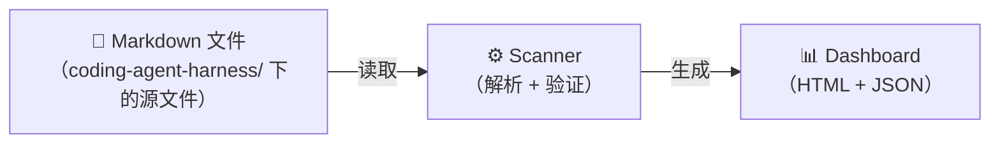
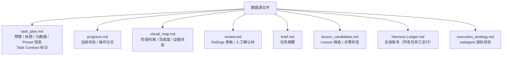
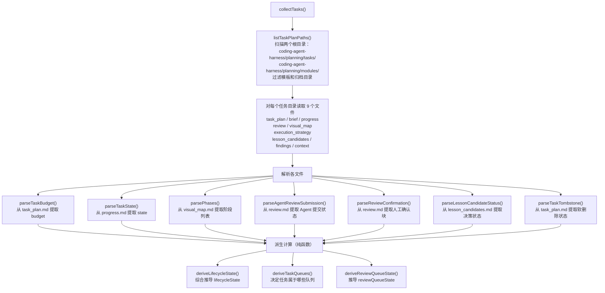
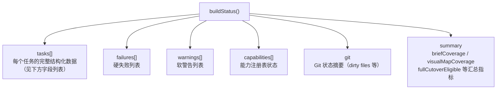
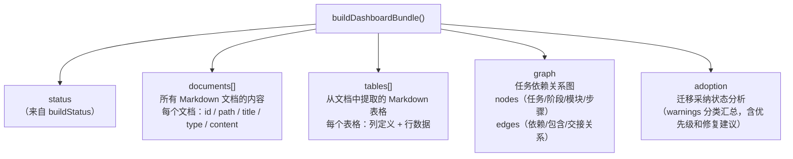
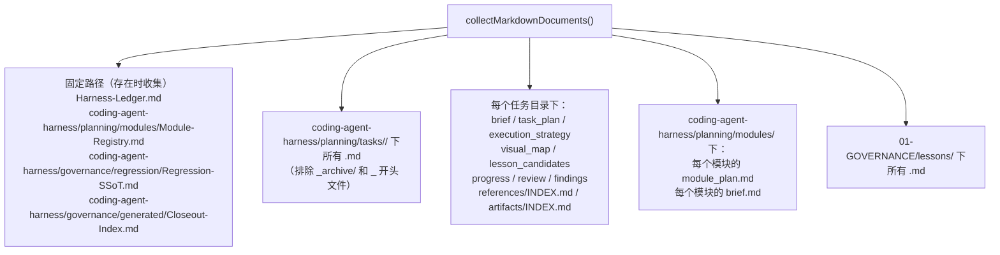
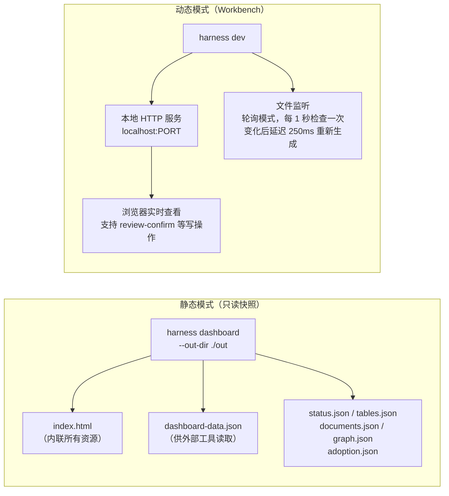

# 05 — 数据流：从 Markdown 到 Dashboard

## Level 0 — 数据的起点和终点



所有数据都来自 Markdown 文件，没有数据库，没有外部服务。
每次运行都从文件系统重新读取，不缓存任何中间状态。

---

## Level 1 — 哪些文件是数据源



---

## Level 2 — Scanner 如何处理这些文件

Scanner 层（`task-scanner.mjs` + `task-review-model.mjs`）把原始 Markdown 解析成结构化对象。

### collectTasks() 的发现流程



### parseTaskState() 的格式

从 `progress.md` 的 `## Current Status` 或 `## Status` 标题后的第一行提取状态：

```markdown
## Current Status

in_progress
```

支持中文别名（`进行中` → `in_progress`）。如果格式不符合预期，会降级到遗留表格解析模式。

### parsePhases() 的表格格式

从 `visual_map.md` 中查找 `Phase ID` 列标题的表格，提取 9 个字段：

```markdown
| Phase ID | Depends On | State | Completion | Output | Required Evidence | Evidence Status | Blocking Risk | Owner / Handoff |
| --- | --- | --- | --- | --- | --- | --- | --- | --- |
| P1 | — | done | 100 | ... | E-001 | present | low | coordinator |
```

依赖字段支持逗号、分号、`&` 分隔的多值。

---

## Level 2 — buildStatus() 把 Scanner 结果组装成什么



**task 对象的完整字段**：

| 字段 | 含义 |
| --- | --- |
| `path` | 相对路径 |
| `title` | 任务标题 |
| `state` | 任务状态（`in_progress / done / ...`） |
| `stateSource` | 状态来源（`valid / invalid`） |
| `budget` | 预算等级（`simple / standard / complex`） |
| `lifecycleState` | 派生的生命周期状态 |
| `reviewQueueState` | 审查队列状态 |
| `taskQueues[]` | 所属队列列表 |
| `phases[]` | 阶段列表（含 id / state / completion / evidenceStatus） |
| `closeoutStatus` | 收口状态 |
| `tombstone` | 软删除信息 |
| `briefSource` | brief 来源（`standalone / missing / ...`） |
| `visualMapSource` | visual map 来源（`canonical / legacy / missing`） |
| `taskPreset` | 使用的 Preset ID |
| `presetVersion` | Preset 版本 |
| `handoffs` | 交接信息数组 |
| `lessonCandidateDecisionComplete` | Lesson 决策是否完成 |

---

## Level 3 — buildDashboardBundle() 在 status 基础上再加什么

`buildDashboardBundle()` 调用 `buildStatus()` 后，再额外收集四类数据：



### documents 收集范围

`collectMarkdownDocuments()` 收集哪些文件：



收集后统一过滤掉 `_archive/`、`_task-template/`、`_optional-structures/` 路径。

### graph 数据结构

图包含两类元素：

- **nodes**：任务节点、阶段节点、模块节点、步骤节点
- **edges**：依赖关系（阶段 → 阶段）、包含关系（任务 → 阶段）、交接关系（步骤 → 步骤）

如果依赖的源节点不存在，会创建一个 `external-dependency` 类型的虚拟节点。

---

## Level 2 — 两种 Dashboard 生成模式



**关键边界**：静态 Dashboard 是只读的，不能触发任何写操作。
只有 `harness dev`（Workbench 模式）才能执行 `review-confirm`、`task-start` 等写操作。

### Dashboard HTML 生成方式

Dashboard HTML 通过字符串拼接生成（非模板引擎）。
`app.js` 通过 manifest 或直接读取获得——如果存在 manifest，
按顺序读取并拼接多个源文件（`app-src/` 目录下的模块化源码）。

payload 中的 `<` 被转义为 `<` 防止 HTML 注入。

### 文件监听实现

`dashboard-workbench.mjs` 的文件监听采用**轮询模式**（`startPollingWatch()`）：
- 每 1000ms 检查一次目录树的最新修改时间（mtime）
- 检测到变化时，延迟 250ms 后触发重新生成（防抖）
- 监听范围：整个 `target.docsRoot`，排除 `.git`、`node_modules`、`tmp`

---

## Level 3 — markdown-utils.mjs 的核心能力

整个系统能从 Markdown 文件派生状态，技术基础是 `markdown-utils.mjs` 提供的表格解析能力：

| 函数 | 用途 |
| --- | --- |
| `markdownTableRows()` | 提取所有表格行 |
| `parseAllMarkdownTables()` | 解析文档中所有表格，返回结构化对象数组 |
| `splitMarkdownRow()` | 分割行单元格（处理转义管道符和代码块） |
| `tableAfterHeading()` | 定位特定标题后的表格 |
| `getCell()` | 按列名获取单元格（支持多个别名） |
| `splitList()` | 分割逗号/分号/加号分隔的列表 |
| `splitDependencies()` | 分割依赖，过滤 `none/n/a` 等占位符 |

**代码块内的管道符**：`splitMarkdownRow()` 会跟踪代码块状态，
代码块内的 `|` 不会被当作列分隔符，保留原始内容。

---

## Level 2 — 设计决策

### 为什么 Dashboard 是纯 HTML + vanilla JS，不用 React/Vite

harness 通过 `npx` 分发，引入 React/Vite 意味着用户每次运行都要拉取大量构建依赖，
破坏零依赖的可移植性。静态 HTML 可以直接从 `file://` 打开，
也可以作为 CI 证据快照分享，不需要任何运行时。

app-src 里的 vanilla JS 组件（`DashboardShell`、`SidebarNav`、`TableView` 等）
通过 manifest 按顺序拼接，每个文件 < 600 行，git diff 可读，不需要 webpack/esbuild。

### 为什么静态 Dashboard 是只读的

静态 Dashboard 的定位是"可分享的证据快照"——它可以被 CI 生成、离线打开、
发给外部审查者。这些场景下写操作没有安全边界（没有 CSRF/Origin/Host 校验）。
写操作只能在 Workbench 模式下执行，因为 Workbench server 绑定 `127.0.0.1`
并有完整的安全校验链。

### 为什么 `harness dev` 和 `harness dashboard` 是两个命令

`harness dashboard` 生成静态只读快照（适合 CI、迁移报告、离线证据）。
`harness dev` 启动本地动态 Workbench server，支持文件 watch、自动刷新、
review-confirm 写操作。两者的边界是：**静态快照可以分享，动态 Workbench 只能本地用**。

### 为什么文件监听用轮询而不是 fs.watch

`fs.watch` 在 macOS 上对深层目录树有已知的漏报问题，
而 harness 的 docs 目录结构是多层嵌套的 Markdown 文件树。
轮询方案实现简单、行为可预期、不引入 chokidar 等第三方依赖（与零依赖原则一致）。
1 秒轮询 + 250ms debounce 对人类编辑场景足够。

### 为什么不引入 SQLite 或 JSON 数据库

引入 JSON/SQLite 若没有清楚的 authority 边界，会形成 Markdown、JSON、SQLite 三份事实互相漂移。
Git review 对 Markdown/JSON 友好，对 SQLite diff 不友好。
当前规模是"几百任务"，generated JSON + indexed in-memory filtering 足够。

决策是：Markdown 是唯一事实源，generated JSON index 是可再生缓存，
SQLite 只在任务数量和查询复杂度超过 JSON 能承载时才考虑引入，
且只能作为可再生查询缓存，不能手写、不能作为权威事实源。
