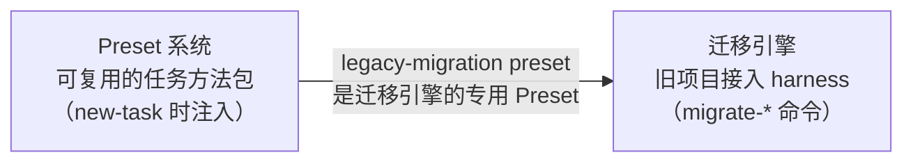
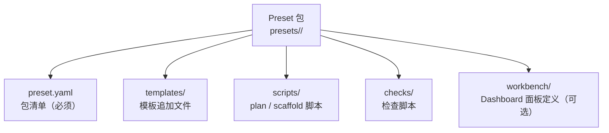
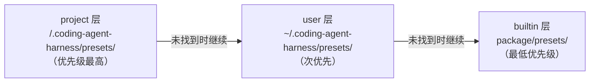
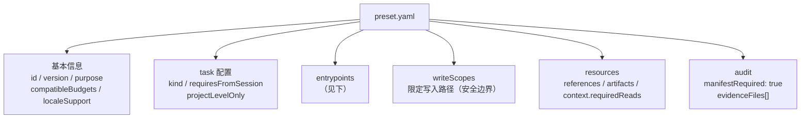
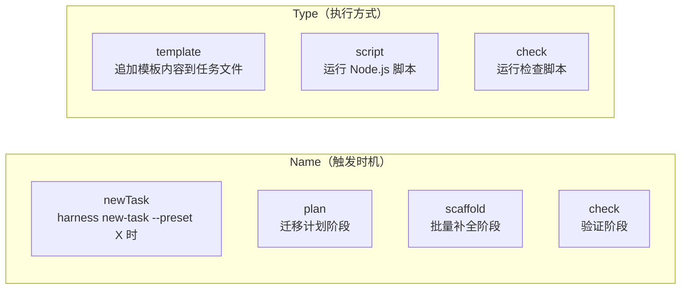
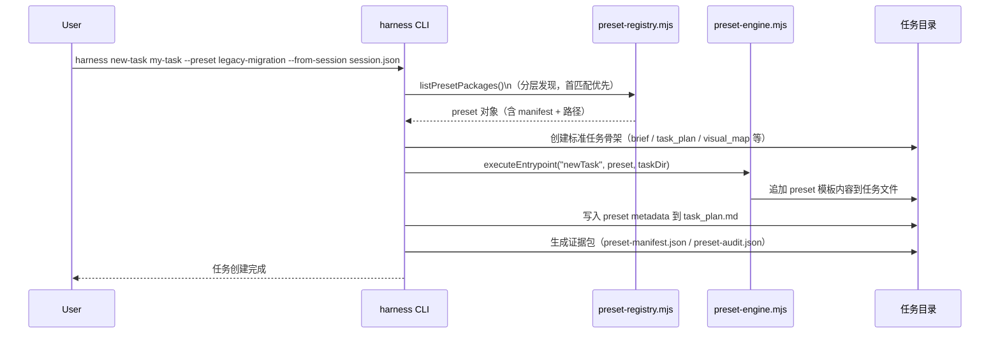
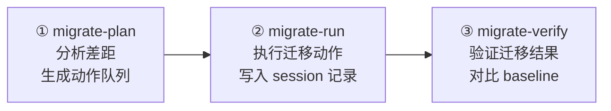
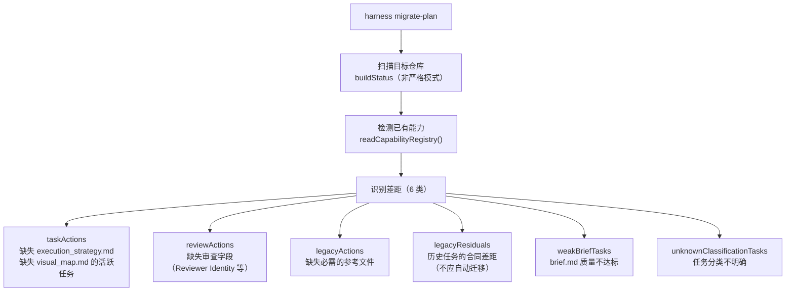
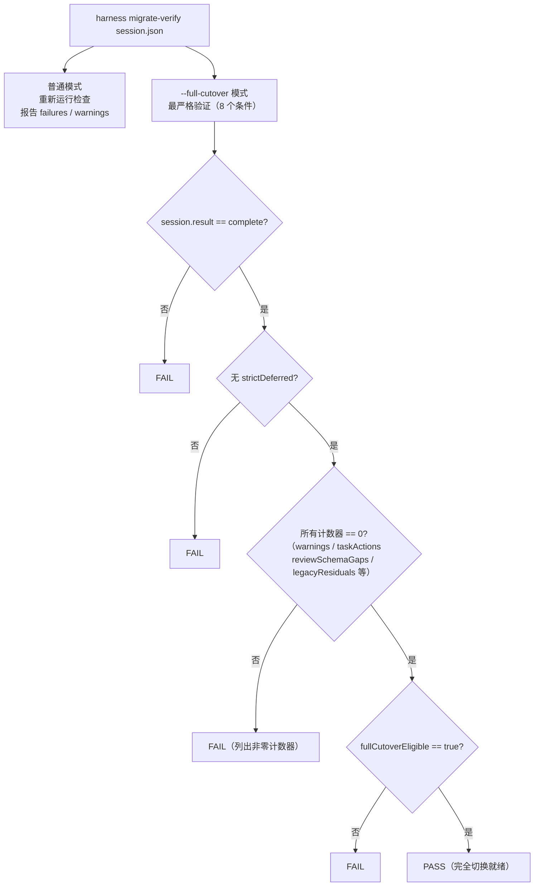
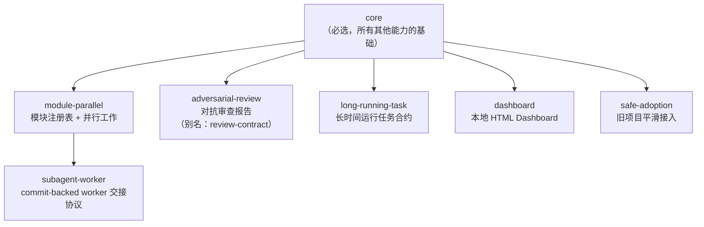

# 06 — Preset 系统与迁移引擎

## Level 0 — 两个独立子系统

本文档覆盖两个相关但独立的子系统：



它们的关系：迁移引擎有一个专用 Preset（`legacy-migration`），但 Preset 系统本身是通用的，
任何类型的任务都可以有自己的 Preset。

---

## Part 1 — Preset 系统

### Level 1 — Preset 是什么

Preset 是一个**可复用的任务方法包**，打包了特定类型任务所需的：
- 模板追加内容（在标准模板基础上追加 preset 专属内容）
- 执行脚本（plan / scaffold 阶段运行）
- 检查脚本（验证 preset 合规）
- 资源声明（参考文件、工件、必需阅读）



### Level 1 — 分层发现：三个搜索层

Preset 按 **project → user → builtin** 的顺序搜索，同名 Preset 采用**首匹配优先**策略：



这个设计允许：
- **项目级覆盖**：在项目里放一个同名 Preset，覆盖 builtin 版本
- **用户级覆盖**：在 home 目录放 Preset，对所有项目生效
- **builtin 兜底**：package 自带的 Preset 作为默认实现

`harness preset install --project <preset-id>` 把 Preset 安装到项目层；
`harness preset uninstall --project <preset-id>` 从项目层移除（不影响 user 和 builtin 层）。

### Level 2 — preset.yaml 的结构



### Level 3 — Entrypoint 类型系统

每个 entrypoint 有两个维度：**name**（触发时机）和 **type**（执行方式）：



三种执行方式的区别：
- **template**：渲染模板文件，将结果追加到任务文件（`task_plan.md`、`execution_strategy.md` 等）
- **script**：执行 Node.js 脚本，脚本可读写文件系统，返回结果作为 audit 证据
- **check**：执行检查脚本，验证 preset 应用的完整性，失败时阻止任务创建

每个 entrypoint 还声明 `writes`（允许写入的路径 glob）和 `reads`（允许读取的路径 glob）。

### Level 3 — writeScopes 安全边界

`writeScopes` 是一个路径白名单，限制 Preset 只能写入声明的目录。
`assertPresetWriteScope()` 在每次文件写入时检查相对路径是否匹配任何 scope。

```
writeScopes:
  tasks:
    path: docs/09-PLANNING/TASKS/**
    access: write
```

支持 `path/**` 通配符表示目录及其所有子目录。
相对路径必须规范化（无 `../`、无绝对路径），防止目录遍历攻击。

### Level 2 — Preset 的生命周期



### Level 1 — 当前可用 Preset

| Preset ID | 用途 | 兼容 Budget | 特殊要求 |
| --- | --- | --- | --- |
| `legacy-migration` | 旧 harness 项目迁移到 v1.0 | complex | 需要 `--from-session session.json` |
| `lesson-sedimentation` | Lesson 沉淀任务 | standard, complex | 无 |
| `module` | 模块并行工作任务 | standard, complex | 需要 `--module <module-id>` |
| `standard-task` | 标准任务方法 | standard, complex | 无 |

---

## Part 2 — 迁移引擎

### Level 1 — 迁移的三个阶段



### Level 2 — migrate-plan 做什么

`buildMigrationPlan()` 识别 6 类差距：



**动作队列格式**：每个 taskAction 包含 `taskId`、`path`、`files[]`、`commands[]`、`action` 描述。
`commands[]` 是可以直接执行的 harness CLI 命令列表。

### Level 2 — migrate-verify 的两种模式



`--full-cutover` 是迁移完成的最终验收标准：8 个条件全部满足才算通过。

---

## Part 3 — Capability 注册表

### Level 1 — 能力依赖图



### Level 2 — 每个能力的 selectWhen

| 能力 | 何时启用 |
| --- | --- |
| `core` | 始终，这是必选基础 |
| `module-parallel` | 项目有 2 个以上独立模块需要并行所有权时 |
| `subagent-worker` | 代码变更 subagent 需要在独立 worktree 工作并 commit 交接时 |
| `adversarial-review` | 发布、架构、安全、数据或策略风险需要独立审查产物时 |
| `long-running-task` | Agent 可能跨多个 loop 运行而无需每步用户确认时 |
| `dashboard` | 需要本地只读状态可视化时 |
| `safe-adoption` | 将 v1.0 接入已有 harness 项目而不重写历史时 |

### Level 2 — Preset 资源声明（resources）

Preset 可以声明三类资源，这些资源会在任务创建时自动生成，并由检查器验证：

| 资源类型 | 含义 | 验证方式 |
| --- | --- | --- |
| `resources.references` | Preset 提供的参考文件 | 文件存在 + `references/INDEX.md` 中有索引 + `task_plan.md` 中有必需阅读声明 |
| `resources.artifacts` | Preset 生成的工件 | 文件存在 + `artifacts/INDEX.md` 中有索引 |
| `context.requiredReads` | 必需阅读的参考文件 ID | 在两个索引中都有记录 |

这是一个**三层验证链**：文件存在 → 索引表中有记录 → task_plan.md 中有必需阅读声明。
任何一层缺失都会产生 failure。

---

## Part 4 — 设计决策

### 为什么 Preset 不是一开始就有的

Preset 系统是从"旧项目迁移太复杂"这个需求演进出来的。最初只有 `new-task --budget complex`，
没有任何 preset 概念。当用户提出旧项目迁移需求时，最初的方案是发明一个新的 "Ultra" 任务等级。

研究后发现问题不是 Complex 不够用，而是"没有 preset 时每个 Agent 都要自己想迁移流程该怎么拆"。
三个独立 subagent 的对抗审查都指向同一结论——preset 是正确抽象，Ultra 是过度设计。

否决 Ultra 的理由：
1. Ultra 会引入第二套任务系统，破坏 simple/standard/complex 的一致性
2. 问题的根因不是 Complex 承载不了，而是没有预填骨架
3. Preset 是通用抽象，不只服务迁移——任何类型的任务都可以有自己的 Preset

### 为什么 Preset manifest 用 YAML

选择 YAML 是因为可读性——preset manifest 需要人工编写和审查，YAML 比 JSON 少引号和括号。
选择自写轻量解析器（`parseSimpleYaml()`）而不是引入 `js-yaml` 是为了保持零依赖。
JS 格式被排除是因为 preset 需要跨工具可审计，不能是可执行代码。

### 为什么分层发现（project/user/builtin）

分层发现比 preset 系统本身晚了两天引入。最初只从 package 的 `presets/` 固定路径读取。
分层设计解决的核心问题是：
- 不同项目可以有自己的私有 preset（project 层）
- 用户可以安装跨项目共享的 preset（user 层）
- Package bundled preset 作为兜底，不需要安装就能用（builtin 层）

优先级顺序（project > user > builtin）确保项目级定制能覆盖全局默认。

### 为什么迁移分三个阶段而不是一步到位

核心考量是"不能自动迁移"——preset 只搭骨架，不自动改历史文档，
不自动 stage 或 commit。真正写入目标仓库前，仍然要先让用户确认写入范围和迁移深度。

- `migrate-plan`：只读分析，无副作用
- `migrate-run`：有写入的执行，需要用户确认
- `migrate-verify`：事后验证，确认迁移结果

三步分离让用户在每个有副作用的节点都有确认机会。

### 为什么 full-cutover 验证这么严格

`full-cutover` 是不可逆的声明——一旦宣称完成迁移，后续 Agent 就不会再把这个项目当成迁移目标处理。
更宽松的方案（只检查 strict pass）被否决，因为真实项目验证（471 个任务）证明了
即使 strict pass，仍然可能有 weak brief 或 legacy-only visual map 残留。

### writeScopes 安全边界

writeScopes 和 preset 系统同时引入，不是后来补的安全加固。
Preset 是第三方可安装的包，如果不限制写入范围，恶意或错误的 preset 可以覆盖任意文件。
运行时强制检查路径，拒绝 `../` 开头的路径和绝对路径（path traversal 防护）。
