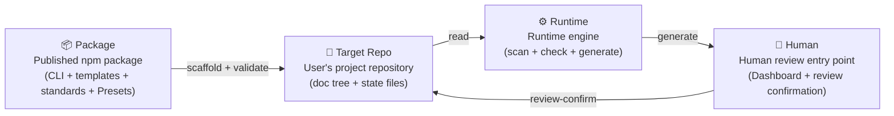
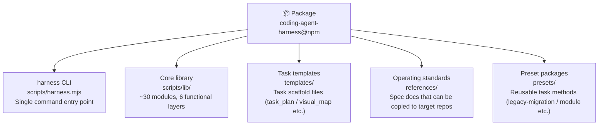
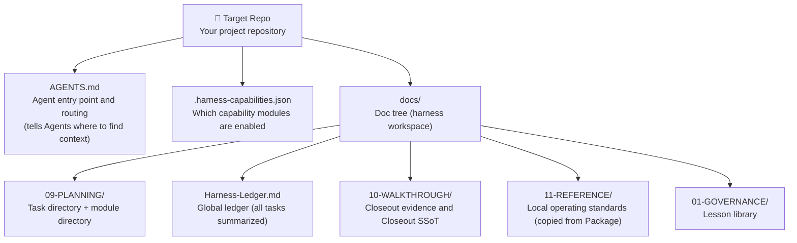
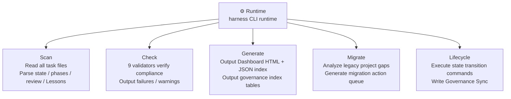

# 01 — System Overview

## What this is and what problem it solves

Before AI coding tools (Codex, Claude Code, Gemini CLI) became widespread,
"task management" for developers meant Jira tickets or GitHub issues —
tools designed for humans that Agents can't read and can't derive verifiable state from.

**Coding Agent Harness** solves a core problem:

> When an Agent is working in your repository, how do you ensure its work is traceable,
> gated, and reviewable?

It's not an Agent itself, and it's not a task management tool for humans.
It's a **repository-native operating layer** — it gives Agents executable structured context
so they can resume execution from files without relying on previous chat memory.

The core design philosophy in one sentence:

> **Store important state in Markdown files that Agents can read, then use the CLI to derive
> status, checks, migration plans, and Dashboard views from those files.**

---

## Why it's called a "Harness"

"Harness" in an engineering context means a constraining device — something used to constrain,
guide, and measure a system's behavior without replacing it. Just like a "test harness" in
testing isn't the tests themselves, but the infrastructure that lets tests be organized,
executed, and verified.

Coding Agent Harness isn't a replacement for Agents — it's a harness for them:
- Tasks have a lifecycle (create → execute → review → closeout)
- Reviews have gates (Agents can't approve their own work)
- State is recorded (every change is written to Markdown, git-blammable)
- Humans have a review entry point (local Dashboard + Workbench review confirmation)

---

## The essential difference from Jira / Linear / GitHub Issues

| | Jira / Linear / GitHub Issues | Coding Agent Harness |
| --- | --- | --- |
| Designed for | Human collaboration | Agent execution + human review |
| State lives in | External SaaS database | Markdown files in the repository |
| Can Agents read it? | Requires API integration | Read files directly |
| Can you git diff it? | No | Yes |
| Works offline? | No | Yes |
| Can resume execution from files? | No | Yes |

---

## Level 0 — Four main blocks

Start at the highest level. The whole system is made up of four blocks:

- **Package**: What you `npm install` — contains the CLI, templates, standards docs, and Preset packages
- **Target Repo**: Your project, where harness creates a `docs/` tree to record task state
- **Runtime**: The CLI runtime that scans the doc tree, validates compliance, and generates the Dashboard
- **Human**: Views the Dashboard in a browser, performs review confirmation in the Workbench

Note the direction of this loop: **Package writes to Target Repo, Runtime reads from Target Repo,
Human writes back to Target Repo via review-confirm**.
The whole system is a read-write loop centered on Markdown files, with no hidden state.

---

## Level 1 — What's inside each block

### What's in the Package

The Package is **read-only** — it provides tools and templates but stores no state.
All state lives in the Target Repo.

### What's in the Target Repo

Each task corresponds to a directory under `docs/09-PLANNING/TASKS/<task-id>/`,
containing files like `task_plan.md`, `progress.md`, `visual_map.md`, `review.md`, etc.

### What the Runtime does

The Runtime is **stateless** — every run re-reads from Markdown files from scratch,
caching no intermediate state (except file watching in `harness dev`).

---

## Level 2 — Core concept glossary

| Concept | One-line explanation | Where |
| --- | --- | --- |
| **Task** | A unit of work with a lifecycle | `docs/09-PLANNING/TASKS/<id>/` |
| **Budget** | Task complexity: `simple` / `standard` / `complex`, determines gate strictness | `task_plan.md` |
| **Phase** | An execution phase in the Visual Map, with state and completion | `visual_map.md` |
| **Capability** | Optional feature module, e.g. `dashboard`, `adversarial-review` | `.harness-capabilities.json` |
| **Review Gate** | A review gate that blocks task completion, requires human confirmation to pass | `review.md` |
| **Governance Sync** | Atomic operation that auto-updates the global ledger on task state changes | `Harness-Ledger.md` |
| **Preset** | A reusable task method package, e.g. `legacy-migration`, `module` | `presets/<id>/` |
| **Lesson** | Reusable knowledge distilled from a task | `docs/01-GOVERNANCE/lessons/` |
| **Tombstone** | Marker for soft-deleted / merged / superseded tasks | Special block in `task_plan.md` |
| **lifecycleState** | Queue classification derived from task state + review state combined | Derived at runtime, not stored in files |

---

## Level 2 — Design decisions

### Why Markdown instead of a database

This is the most frequently asked question.

**Reasons for choosing Markdown**:

1. **Agent-readable**: All major AI coding tools can read and write Markdown without special APIs
2. **Git-native**: State changes can be diffed, blamed, and rolled back — audit trail is built in
3. **Human-readable**: State can be viewed directly without tools, reducing tool dependency
4. **Works offline**: No external service dependency, works without network
5. **Portable**: Switching Agent tools doesn't require data migration
6. **Single source of truth**: Avoids drift between Markdown, JSON, and SQLite as three separate facts

**Trade-offs**:

- Parsing Markdown is slower than querying a database (but not a bottleneck at task management scale)
- Format constraints must be maintained by validators rather than enforced by database schema
- Concurrent writes need file locking (`governance-sync` lock mechanism)

**Alternatives considered and rejected**:
- **SQLite**: Not git-diff-friendly, introduces binary files, and current scale (hundreds of tasks) doesn't need it
- **JSON**: Good for machine parsing but not for Agents understanding narrative context
- **YAML/TOML**: Not suited for carrying long-form content like briefs and execution strategies

### Why an npm package instead of SaaS

Agents need to read and write state on the local filesystem. SaaS would introduce network
dependency, authentication, and latency, breaking Agents' autonomous execution capability.
An npm package lets any environment that can run Node.js use it directly, with no account
or network required. `package.json` `dependencies` is empty — zero runtime dependencies.

### Why review-confirm must be a manual operation

`review-confirm` is the **only operation in the entire system that cannot be automatically
executed by an Agent**.

The reason:

> Agents cannot approve their own work.

This boundary wasn't there from the start. Initially the Dashboard workbench review action
had no Agent/Human distinction. Later, through competitive analysis (Taskr competitive intake),
"Agent auto-confirming review" was identified as a P0 risk, which led to introducing the
Git commit gate: `review-confirm` writes a human confirmation block with Git `user.name` /
`user.email`, and makes two atomic Git commits — the first commits the confirmation itself,
the second commits an audit record containing the first commit's SHA.
This Git commit is an **auditable human signature** proving a real human reviewed the task.

### Why derived state isn't stored in files

`lifecycleState`, `taskQueues`, and `reviewQueueState` are derived state that gets
recalculated on every run and never written back to Markdown files. Three reasons:

1. **Avoid fact drift**: If derived state were also written to files, there would be two sources
   of truth, and either one going stale would cause false reports
2. **Prevent gate bypass**: If Agents could directly modify derived fields, they could bypass
   the review-confirm gate
3. **Governance rules as code**: The scanner's derivation rules are themselves a machine-readable
   expression of governance rules — recalculating on every run is equivalent to re-executing
   the governance check every time

---

## Next steps

- Want to understand how the code is organized → [02-module-dependency.md](02-module-dependency.md)
- Want to understand how a task flows from start to finish → [03-task-lifecycle.md](03-task-lifecycle.md)
- Want to understand what the validators check → [04-check-and-governance.md](04-check-and-governance.md)
- Want to understand where Dashboard data comes from → [05-data-flow.md](05-data-flow.md)
- Want to understand how Presets and migration work → [06-preset-and-migration.md](06-preset-and-migration.md)
