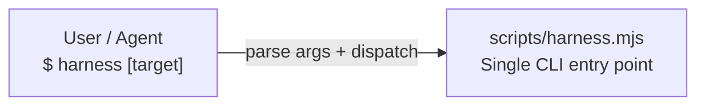
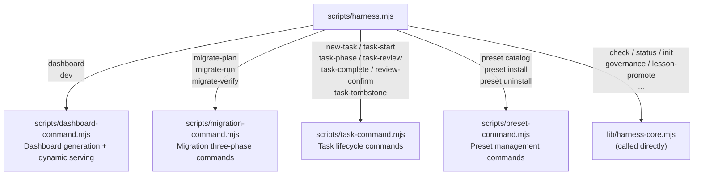
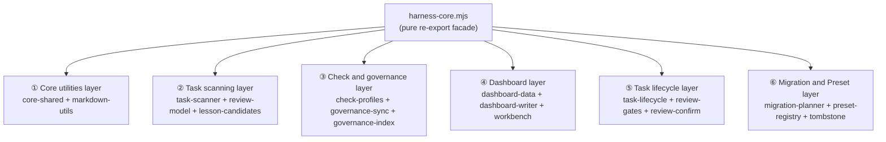
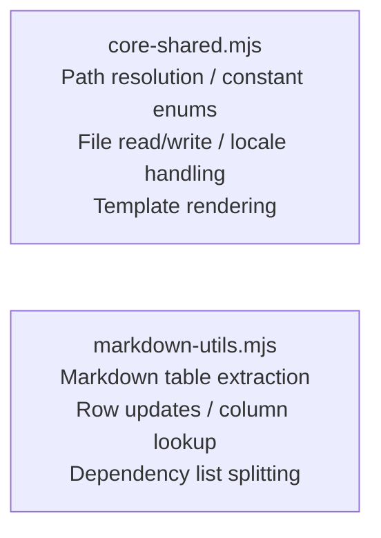
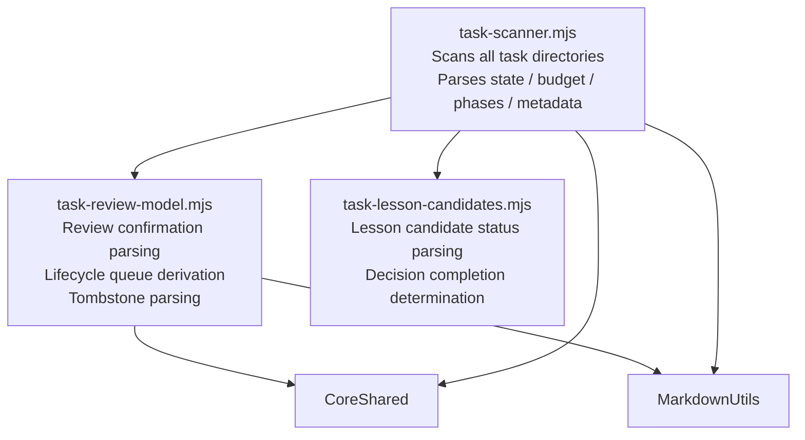
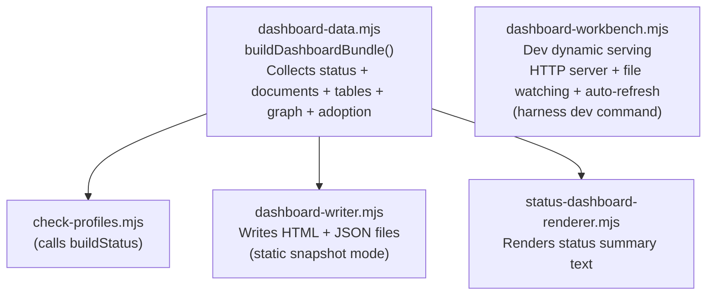
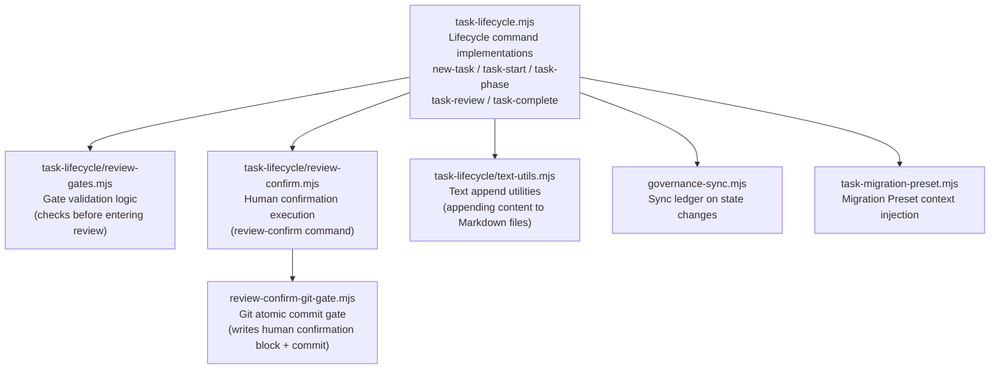
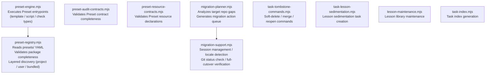
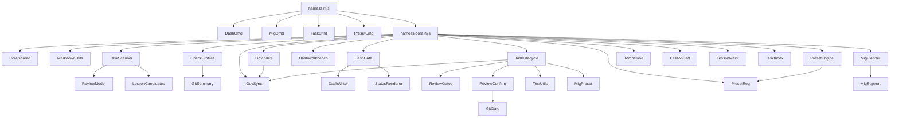

# 02 — Code Module Dependencies

## Level 0 — Where's the entry point

All commands come through a single file:

`harness.mjs` does two things: parses command-line arguments, then dispatches to the
corresponding command module or calls the core library directly.
It contains no business logic itself.

---

## Level 1 — How commands are dispatched

Four command modules each own one domain; other commands call `harness-core.mjs` directly.

**Why this split**: Command modules handle commands with complex interaction logic
(multi-step, reading/writing multiple files, user prompts), while simple query commands
(`check`, `status`) are cleaner calling the core library directly.

---

## Level 2 — What is harness-core.mjs

`harness-core.mjs` is a **facade** — it contains no business logic itself,
it just re-exports everything from all modules under `lib/`.

The benefit of this design: external code only needs to
`import from "./lib/harness-core.mjs"` to get all functionality,
without knowing which sub-module something lives in.

Let's expand each layer.

---

## Level 3 — Six functional layers in detail

### ① Core utilities layer

These two modules are the foundation for all other modules — almost every module imports them:

`core-shared` defines all allowed enum values — it's the "type system" for the whole system:

| Enum | Allowed values |
| --- | --- |
| `allowedTaskStates` | `not_started / planned / in_progress / review / blocked / done` |
| `allowedTaskBudgets` | `simple / standard / complex` |
| `allowedPhaseStates` | `planned / in_progress / review / blocked / done / skipped` |
| `allowedCapabilities` | `core / module-parallel / subagent-worker / adversarial-review / ...` |

`markdown-utils` provides structured operations on Markdown tables — this is the technical
foundation that lets the whole system derive state from Markdown files.

---

### ② Task scanning layer

Responsible for reading all files under `docs/09-PLANNING/TASKS/` and parsing them into
structured data:

`task-review-model` contains several key **derivation functions** — they don't read files,
they compute new state from already-parsed data:

| Function | Input | Output |
| --- | --- | --- |
| `deriveLifecycleState()` | taskState + reviewStatus + tombstone | `lifecycleState` (queue classification) |
| `deriveTaskQueues()` | lifecycleState + materials + lessons | `taskQueues[]` (which queues it belongs to) |
| `deriveReviewQueueState()` | findings + confirmation | `reviewQueueState` |
| `parseTaskTombstone()` | task_plan.md content | soft-delete / merge / superseded state |

These derivation functions are **pure functions** — same input always produces same output,
making them easy to test and debug.

---

### ③ Check and governance layer

Responsible for validating compliance and maintaining atomic writes to global indexes:

```mermaid
flowchart TD
  CheckProfiles["check-profiles.mjs\nbuildStatus() orchestrates 9 validators\nReturns failures + warnings + tasks"]

  CheckProfiles --> V1["validateCapabilities\nCapability registry consistency"]
  CheckProfiles --> V2["validateReviewSchema\nreview.md structure"]
  CheckProfiles --> V3["validateVisualMaps\nvisual_map compliance"]
  CheckProfiles --> V4["validatePlanContracts\nTask contract markers"]
  CheckProfiles --> V5["validateTaskPresetContracts\nPreset contracts"]
  CheckProfiles --> V6["validateContextDocs\nContext doc completeness"]
  CheckProfiles --> V7["validateGovernanceTableBoundaries\nTable boundaries"]
  CheckProfiles --> V8["validateSubagentAuthorization\nSubagent authorization"]
  CheckProfiles --> V9["validateTaskCompletionConsistency\nCompletion consistency"]

  CheckProfiles --> GitSummary["git-status-summary.mjs\nGit status summary (dirty files etc.)"]

  GovSync["governance-sync.mjs\nAtomic lock + row-level update + Git commit\n(auto-called on task state changes)"]
  GovIndex["governance-index-generator.mjs\nRebuilds global index tables\n(manually triggered)"]
  GovIndex --> GovSync
```

**Important distinction**: `governance-sync` and `check-profiles` have no dependency on each other.
- `check-profiles`: read-only, validates state, writes no files
- `governance-sync`: write-only, updates the ledger, does no validation

---

### ④ Dashboard layer

Responsible for converting scan results into an HTML Dashboard:

`DashWorkbench` and `DashData` / `DashWriter` are **independent**:
- `DashData` + `DashWriter`: generates static snapshots (read-only)
- `DashWorkbench`: starts a local HTTP server, supports Workbench write operations

---

### ⑤ Task lifecycle layer

Responsible for executing all task state transition commands:

`review-confirm` is the most special command in the entire lifecycle layer — it's the only
operation that requires a Git atomic commit, and the only one that cannot be automatically
executed by an Agent (see design decisions in [01-system-overview.md](01-system-overview.md)).

---

### ⑥ Migration and Preset layer

---

## Complete dependency map (reference)

If you've understood the layering above, this diagram serves as a lookup index:

---

## Level 2 — Module naming patterns

Understanding naming patterns helps you locate code quickly:

| Prefix / suffix | Meaning | Examples |
| --- | --- | --- |
| `task-` | Task-related | `task-scanner`, `task-lifecycle`, `task-review-model` |
| `dashboard-` | Dashboard-related | `dashboard-data`, `dashboard-writer`, `dashboard-workbench` |
| `governance-` | Governance / ledger-related | `governance-sync`, `governance-index-generator` |
| `migration-` | Migration-related | `migration-planner`, `migration-support` |
| `preset-` | Preset-related | `preset-registry`, `preset-engine`, `preset-audit-contracts` |
| `check-` | Validators | `check-profiles`, `check-module-parallel` |
| `-command.mjs` | CLI command modules | `task-command`, `dashboard-command` |
| `-utils.mjs` | Utility functions | `markdown-utils`, `text-utils` |
| `-gates.mjs` | Gate logic | `review-gates`, `review-confirm-git-gate` |
