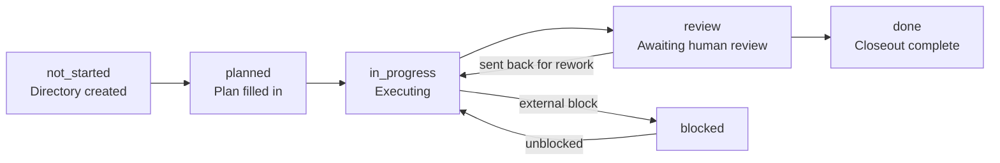
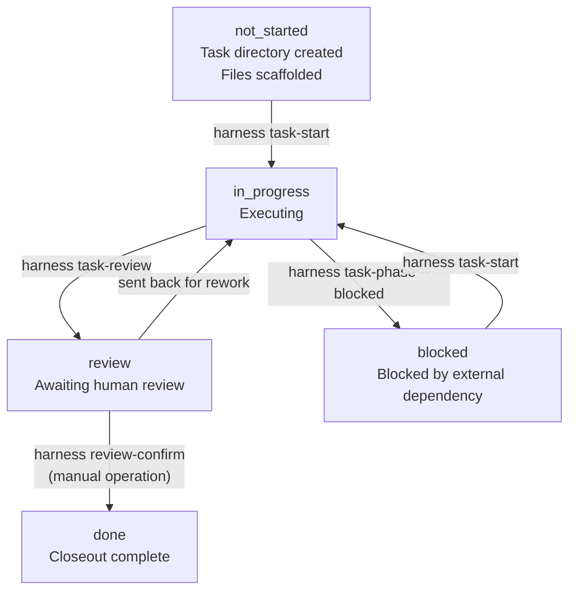
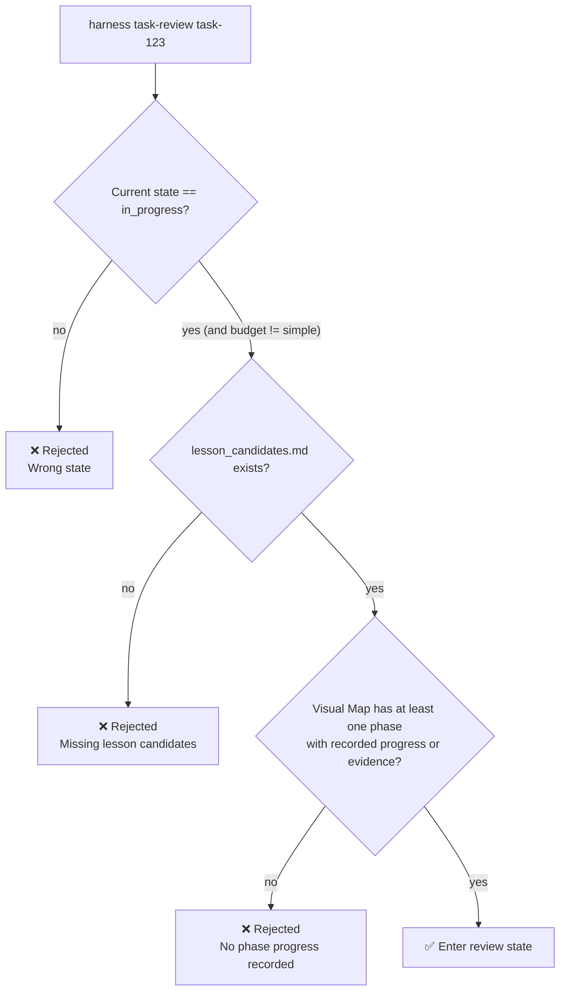
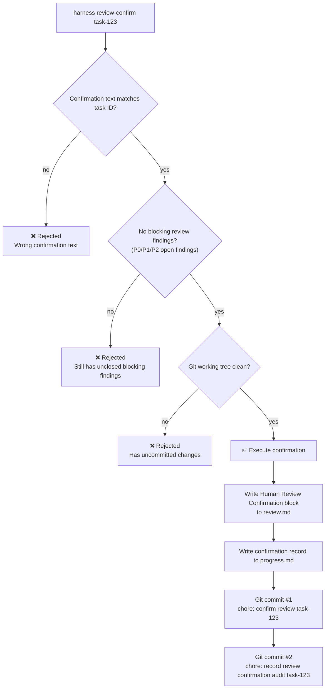
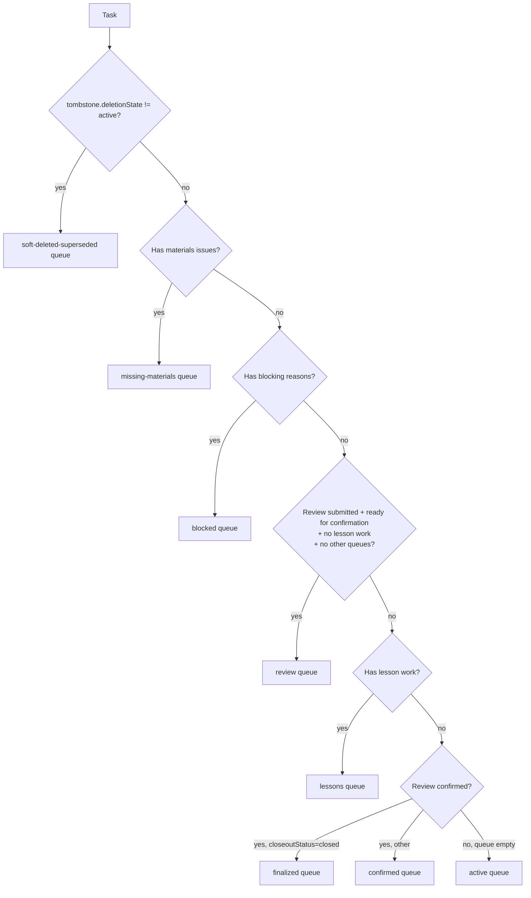
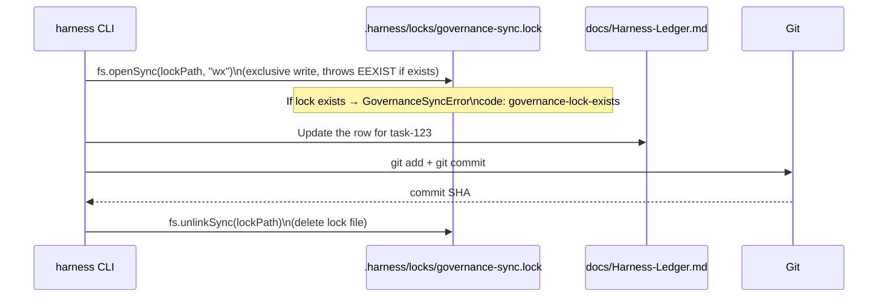

# 03 — Task Lifecycle

## Level 0 — A task's life

A task goes through six states from creation to closeout:



Each state transition is triggered by a corresponding CLI command. The `planned` state is
typically skipped in practice — Agents create a task and go directly to `in_progress`.

---

## Level 1 — States and their corresponding commands



**Key point**: `review-confirm` is the **only command in the entire system that cannot be
automatically executed by an Agent**. It requires a real human operation and writes an
auditable confirmation block with Git `user.name` / `user.email`.

---

## Level 2 — Budget determines gate strictness

Budget is the task's complexity level, and it directly determines how strict the review gates are:

| Gate | simple | standard | complex |
| --- | --- | --- | --- |
| Requires Visual Map phase progress | ✗ | ✓ | ✓ |
| Requires lesson_candidates.md | ✗ | ✓ | ✓ |
| Requires Agent to write review.md | ✗ | ✓ | ✓ |
| Requires all blocking findings closed | ✗ | ✓ | ✓ |
| Requires Walkthrough link | ✗ | ✓ | ✓ |
| Requires Lesson decision complete | ✗ | ✓ | ✓ |
| Requires human review-confirm | ✗ | ✓ | ✓ |

`simple` tasks can jump directly from `in_progress` to `done` with no gates.
`standard` and `complex` have identical gates — the difference is that `complex` tasks
typically require subagent authorization and adversarial review.

---

## Level 3 — Gate details for task-review

When an Agent runs `harness task-review`, the system performs three checks
**before entering review state** (`review-gates.mjs`):



How "phase has recorded progress" is determined (`review-gates.mjs`):
- `phase.completion > 0`, or
- `phase.state` is `in_progress / review / blocked / done`, or
- `phase.evidenceStatus` is `partial / present / waived`

After entering review state, the Agent needs to write `review.md` and fill in the findings table.

---

## Level 3 — Gate details for review-confirm

When a human runs `harness review-confirm`, the system performs four checks
**before executing the confirmation**:



**Two-commit strategy**: The first commit covers review.md and progress.md; the second
commits the final audit metadata. Even if the second commit fails, the first commit has
already locked in the confirmation record.

**Human Review Confirmation block format** (written to review.md):

```markdown
## Human Review Confirmation

| Field | Value |
| --- | --- |
| Confirmation ID | HRC-<timestamp> |
| Confirmed At | <ISO timestamp> |
| Reviewer | <git user.name> |
| Reviewer Email | <git user.email> |
| Task Key | <canonical task id> |
| Confirm Text | <task id confirmation> |
| Evidence Checked | <evidence path> |
| Commit SHA | <git commit sha> |
| Audit Status | committed |
```

---

## Level 3 — lifecycleState derivation logic

`lifecycleState` is derived from task state + review state combined. It's not stored in files
and is recalculated on every run.

The complete decision tree for the derivation function `deriveLifecycleState()` (in priority order):

| Condition | lifecycleState |
| --- | --- |
| `reviewStatus == "blocked-open-findings"` | `review-blocked` |
| `closeoutStatus == "closed"` and `reviewStatus != "confirmed"` | `closed-review-pending` |
| `closeoutStatus == "closed"` | `closed` |
| `state == "blocked"` | `blocked` |
| `state == "done"` | `closing` |
| `state == "review"` | `in_review` |
| `state == "in_progress"` | `active` |
| `state == "planned"` or `"not_started"` | `ready` |
| other | `unknown` |

---

## Level 3 — Lifecycle queues

Tasks are automatically assigned to different queues based on their current state, and these
queues are visible in the Dashboard. **A task can belong to multiple queues simultaneously**
(e.g., both `missing-materials` and `blocked` at the same time).

Queue assignment logic (`deriveTaskQueues()`):



**Sources of blocking reasons**: materials issues, P0-P2 blocking findings, state conflicts,
outdated scanner version.

---

## Level 4 — Governance Sync: how state changes are written to the ledger

Every task state change triggers `syncTaskGovernance()`, which atomically updates `Harness-Ledger.md`.

**Lock mechanism** (`governance-sync.mjs`):



The lock file is created with the `wx` flag (write + exclusive) — this is an atomic Node.js
filesystem operation. If the file already exists, `openSync` throws `EEXIST` and won't overwrite.

**Difference from `governance rebuild`**:

| Operation | How triggered | Write target | Frequency |
| --- | --- | --- | --- |
| `syncTaskGovernance` | Automatic (on every state change) | Corresponding row in `Harness-Ledger.md` | High frequency |
| `rebuildGovernanceIndexes` | Manual (`harness governance rebuild`) | `docs/09-PLANNING/generated/` index tables | Low frequency |

---

## Level 3 — Tombstone: soft-delete and merge

Tasks can be soft-deleted, merged, or superseded rather than physically deleted.
The Tombstone block is appended to the end of `task_plan.md` (not replacing existing content),
preserving the historical audit trail.

Supported operations:
- `supersedeTask()`: mark as replaced by a new task
- `softDeleteTask()`: soft-delete
- `archiveTask()`: archive
- `reopenTask()`: remove the Tombstone block and reactivate the task

**Tombstone block format**:

```markdown
## Task Tombstone

| Field | Value |
| --- | --- |
| State | superseded |
| Superseded By | new-task-id |
| Reason | <reason text> |
| Operator | coordinator |
| Timestamp | <ISO timestamp> |
| Reopen Eligible | yes |
| Archive Eligible | no |
```

---

## Level 2 — Design decisions

### Why lifecycleState is needed as a derived state

`task.state` is the raw execution phase that Agents write into `progress.md` — it only has
coarse-grained values and has many historical aliases (`complete`, `completed`, `doing`,
`active`, etc.). This field can't distinguish "Agent says it's done" from "human confirmed
it's done", and can't distinguish "waiting for human review" from "missing materials".

`lifecycleState` is derived from multiple files and is the primary lifecycle semantic for
the Dashboard. The core scenario driving this design: a task with `task.state = review`
might actually be in three completely different governance states — "missing materials",
"has open P0 finding", or "waiting for human review" — but the old model lumped all three
into the same review queue.

### Why a task can belong to multiple queues simultaneously

A task can simultaneously be "waiting for human review" (Review queue) and "has pending
lesson candidate" (Lessons queue). These two things have different responsible parties
(the former is the human reviewer, the latter is the coordinator) and different exit
conditions — they shouldn't be merged into one state. The multi-queue model lets each
governance concern be tracked independently.

### Why Tombstone doesn't physically delete the task directory

The document library has no database-level foreign keys. Physical deletion would leave
orphan references (the Ledger, Closeout SSoT, and other tasks' `Supersedes` fields may
all point to the deleted task). Tombstone markers let the Soft-deleted / Superseded queue
provide read-only traceability for "why isn't this task in the active queue".

### Why review-confirm requires two Git commits

Two commits make the audit commit's SHA an immutable timestamp. The first commit covers
the confirmation itself; the second commit contains an audit record with the first commit's
SHA. If only files were written without committing, Agents could forge confirmation state
without leaving a Git history. The validator can verify that the confirmation commit
actually exists in Git history.

### Why governance-sync uses a file lock instead of Git's own lock

Git's own lock (`.git/index.lock`) only protects index operations, not the read-modify-write
sequence on Markdown files. Two concurrent CLI processes could simultaneously read the same
governance table, each modify it, then commit one after the other — the second would
overwrite the first's row updates. The file lock's granularity is "the entire governance
sync operation", not a single git command.

### Why simple budget skips all gates

Simple tasks correspond to trivial changes (doc corrections, config adjustments). Forcing
them through `task-review → review-confirm → task-complete` would make the overhead exceed
the value of the task itself. This is an intentional fast path, not an oversight.

### The design intent of the Lesson system

The Lesson system transforms reusable knowledge discovered during task execution from
"mentioned in chat" into a governance object that is "trackable, reviewable, and
sedimentable into standard docs". Lesson candidate decisions must be completed before
`review-confirm`, because `review-confirm` is the responsibility transfer point — once
human confirmation is done, the task enters finalization, and requiring the Agent to
add lesson decisions at that point would create accountability confusion.
