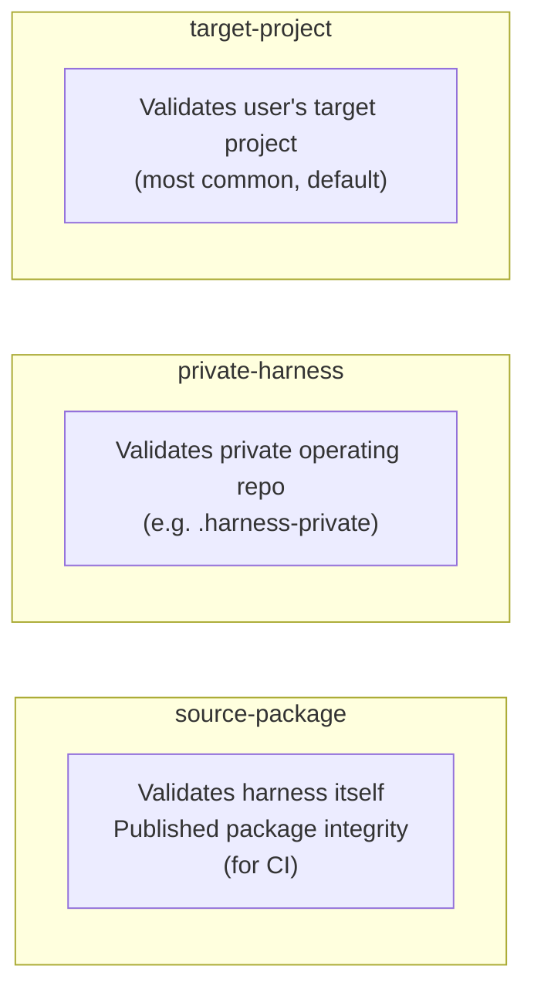
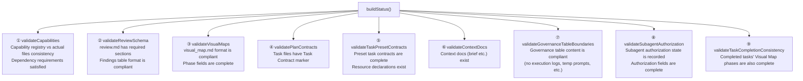
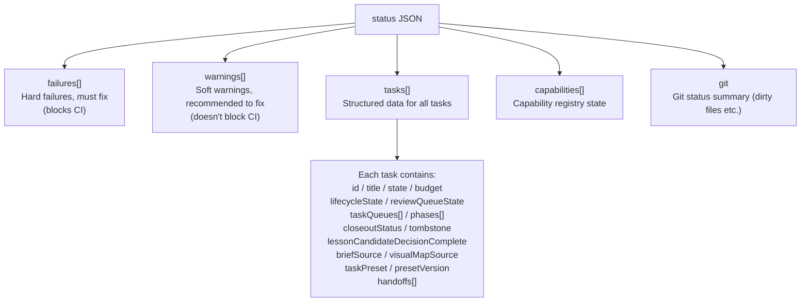
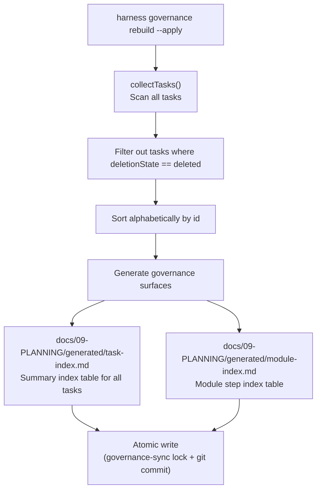

# 04 — Check System and Governance

## Level 0 — The purpose of checks

The core question behind `harness check` and `harness status` is:

> **Is this repository's documentation state compliant?**

The definition of "compliant" varies by context, which is why there are three profiles.
Each profile corresponds to a different use case and runs a different subset of validators.

---

## Level 1 — Three check profiles

| Profile | Typical command | Purpose |
| --- | --- | --- |
| `source-package` | `harness check --profile source-package .` | CI validation of harness's own published package; checks staged file boundaries (`.harness-private/` or generated dashboard must not be tracked) |
| `private-harness` | `harness check --profile private-harness .harness-private` | Validates private operating records |
| `target-project` | `harness check ~/my-app` (default) | Validates user project compliance, runs the full set of 9 validators |

**Special check for source-package**: In addition to running validators, it calls
`validateSourcePackageBoundary()` to check whether git staged files contain content
that shouldn't be published (`.harness-private/`, generated dashboard, etc.).

---

## Level 2 — Which validators does buildStatus() call

`buildStatus()` is the core check function. It calls 9 validators in sequence:

Each validator returns `failures` (hard failures, must fix) and `warnings` (soft warnings, recommended to fix).

> **Note**: `check-module-parallel.mjs` exists in `scripts/lib/` but is **not** in `buildStatus()`'s
> call chain — it's a standalone tool for validating worktree isolation in module parallel work.

---

## Level 3 — What each validator checks

### ① validateCapabilities

Reads `.harness-capabilities.json` and checks:
- Whether declared capabilities are all valid capability names (in the `allowedCapabilities` enum)
- Whether capability dependencies are all enabled (e.g. `subagent-worker` requires `module-parallel` first)
- Whether the artifact paths corresponding to capabilities exist

### ② validateReviewSchema

Scans all `review.md` files and checks whether each contains 4 required sections
(string matching, supports both English and Chinese):

1. `Reviewer Identity`
2. `Confidence Challenge`
3. `Evidence Checked`
4. `Final Confidence Basis`

For findings tables, also checks:
- Must have Severity (P0-P3), Open (yes/no), Disposition, Blocks Release columns
- **P0/P1 severity findings cannot have open=yes or blocks=yes simultaneously** (hard failure)
- `accepted-risk` / `deferred` disposition must have follow-up routing
- Evidence ID references (`E-\d+`) must exist in the Evidence ID table

For verifier-backed reviews, also requires `template_id: harness-verifier/v1` and
`verdict: pass|fail|inconclusive`.

### ③ validateVisualMaps

Checks that the Phase ID table in `visual_map.md` must contain 9 columns:
`Phase ID, Depends On, State, Completion, Output, Required Evidence, Evidence Status, Blocking Risk, Owner / Handoff`

Validation rules:
- `State` must be in `allowedPhaseStates`
- `Evidence Status` must be in `allowedEvidenceStatus`
- `Completion` must be an integer from 0-100
- When `state=done`, `completion` must = 100
- When `state=planned`, `completion` must = 0
- Visual maps from canonical sources require a `Visual Map Contract: v1.0` marker

### ④ validatePlanContracts

Checks whether `task_plan.md` contains a `Task Contract: harness-task/v1` marker line.
This is the most basic requirement for a task to be recognized by harness.

### ⑤ validateTaskPresetContracts

For tasks that use a Preset, checks:
- Whether the resource files declared by the Preset exist
- Whether `references/INDEX.md` has the corresponding index row
- Whether the "Preset Required Reads" in `task_plan.md` lists the required reads

### ⑦ validateGovernanceTableBoundaries

Checks content compliance for 5 global governance tables:

| Table | Content not allowed |
| --- | --- |
| Feature-SSoT | Module-level details, overly long evidence descriptions |
| Harness-Ledger | Execution logs, temporary fix prompts, raw conversation records |
| Closeout-SSoT | Execution logs, raw conversation records |
| Regression-SSoT | Execution logs, temporary prompts |
| Cadence-Ledger | Raw conversation records, temporary prompts |

**Time boundary**: Rows before 2026-05-24 are marked as legacy and only produce warnings;
rows after that date produce failures.

### ⑧ validateSubagentAuthorization

Scans all `execution_strategy.md` files for the **Subagent Authorization** table.

For rows with worker role and status `authorized`, checks completeness of 4 fields:
`Authorized By, Authorized At, Scope, Worktree / Branch`

Field values must be "concrete" (non-empty, not placeholder `[...]`, not `pending/n/a/none/—` etc.).

If the **Subagent Delegation Decision** table has a worker with decision=`ask-user`,
there must be a corresponding resolved row in the **User Authorization Decision** table.

**warning vs failure**: produces failure in strict mode; produces warning in adoption mode.

### ⑨ validateTaskCompletionConsistency

Checks tasks with `task.state=done` to see whether all phases in their Visual Map are also complete.

"Complete" is determined as: `phase.state=skipped` or `(phase.state=done and phase.completion=100)`.

If incomplete phases exist:
- `closeoutStatus=closed` → **failure**
- Otherwise → **warning**

---

## Level 2 — Check output structure

Core fields in `harness status --json` output:

---

## Level 3 — Governance index rebuild

`harness governance rebuild --apply` rebuilds global index tables from task scan results:

This operation is **manually triggered** and does not run automatically on every task state change.
What runs automatically is `syncTaskGovernance()`, which only updates the corresponding row
in `Harness-Ledger.md`.

**Why they're separate**: `Harness-Ledger.md` is a high-frequency write ledger (updated on
every state change), while the `generated/` index tables are low-frequency full rebuilds
(require scanning all tasks, which is costly). Keeping them separate avoids triggering a
full scan on every state change.

---

## Level 2 — Design decisions

### Why the validator has two levels: failures and warnings

Both levels existed from the start. The design motivation was **migration compatibility**:
- Newly installed projects (`strict=true`) report failure for missing files and block CI
- Legacy projects in `safe-adoption` mode report the same missing files as
  `adoption-needed: ...` warnings without blocking

This lets harness gradually tighten standards without breaking existing users.
Three or more levels were never considered — two levels are sufficient to distinguish
"must fix" from "recommended migration".

### Why governance tables have a time boundary

Rows before 2026-05-24 are marked as legacy and only produce warnings; rows after produce failures.
This is because governance table content standards were introduced later, and historical data
can't suddenly become hard failures that block all operations. The time boundary requires
newly written rows to be compliant while giving historical data a migration window.

### Why subagent authorization distinguishes strict and adoption modes

The strictness of subagent authorization checks depends on project maturity:
- New projects require complete authorization records from the start (strict → failure)
- Legacy projects during migration may have many historical tasks missing authorization
  records (adoption → warning)

This avoids the experience problem of "all historical tasks suddenly reporting errors
after adopting harness".

### Why validateTaskCompletionConsistency distinguishes closed vs non-closed

If a task already has `closeoutStatus=closed` (human-confirmed closeout) but still has
incomplete phases in the Visual Map, this is a serious inconsistency — it means the
closeout confirmation missed a check, and must report failure.

If the task isn't closed yet, the same inconsistency is only a warning — the Agent may
still be working, or some phases may be marked as skipped later.
