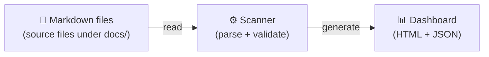
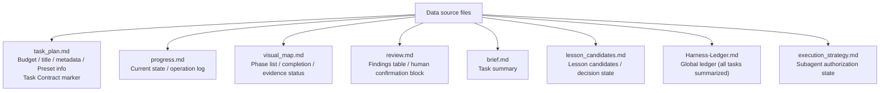
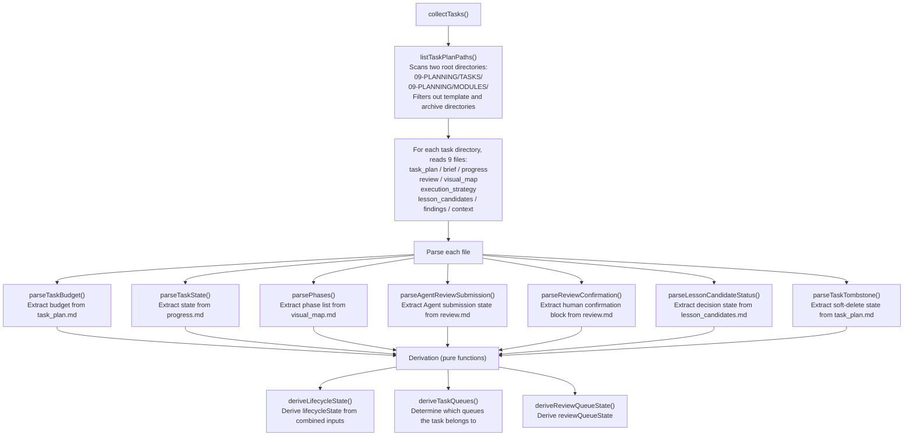
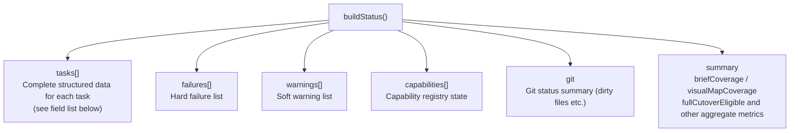
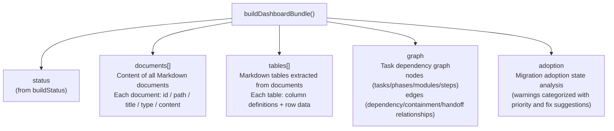
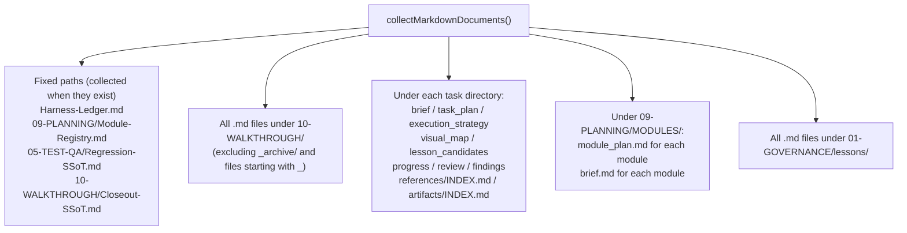
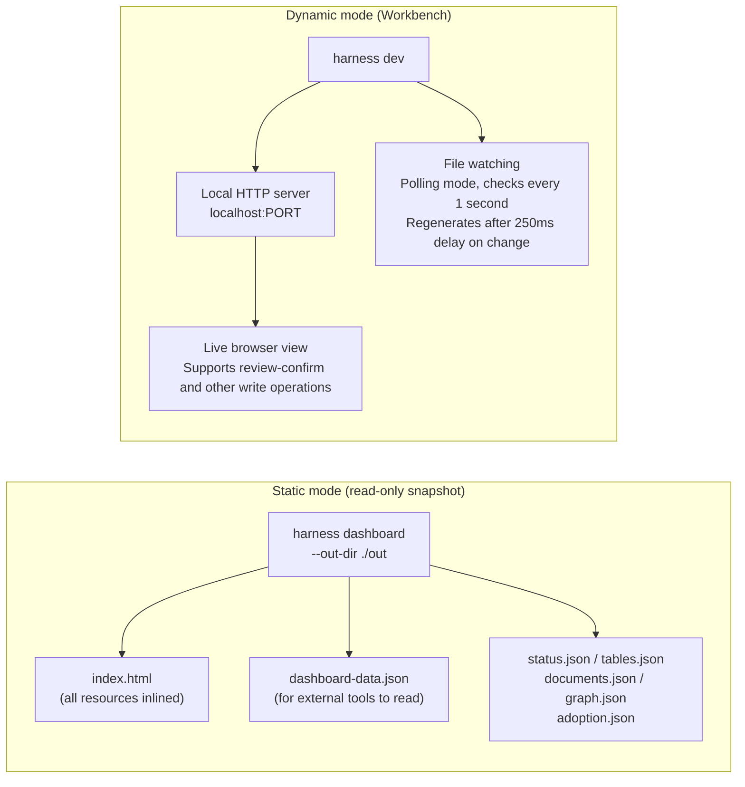

# 05 — Data Flow: From Markdown to Dashboard

## Level 0 — Where data starts and ends



All data comes from Markdown files — no database, no external services.
Every run re-reads from the filesystem from scratch, caching no intermediate state.

---

## Level 1 — Which files are data sources



---

## Level 2 — How the Scanner processes these files

The Scanner layer (`task-scanner.mjs` + `task-review-model.mjs`) parses raw Markdown
into structured objects.

### collectTasks() discovery flow



### parseTaskState() format

Extracts state from the first line after the `## Current Status` or `## Status` heading
in `progress.md`:

```markdown
## Current Status

in_progress
```

Supports Chinese aliases (`进行中` → `in_progress`). Falls back to legacy table parsing
mode if the format doesn't match expectations.

### parsePhases() table format

Finds the table with a `Phase ID` column header in `visual_map.md` and extracts 9 fields:

```markdown
| Phase ID | Depends On | State | Completion | Output | Required Evidence | Evidence Status | Blocking Risk | Owner / Handoff |
| --- | --- | --- | --- | --- | --- | --- | --- | --- |
| P1 | — | done | 100 | ... | E-001 | present | low | coordinator |
```

The dependency field supports multiple values separated by commas, semicolons, or `&`.

---

## Level 2 — What buildStatus() assembles from Scanner results



**Complete fields of a task object**:

| Field | Meaning |
| --- | --- |
| `path` | Relative path |
| `title` | Task title |
| `state` | Task state (`in_progress / done / ...`) |
| `stateSource` | State source (`valid / invalid`) |
| `budget` | Budget level (`simple / standard / complex`) |
| `lifecycleState` | Derived lifecycle state |
| `reviewQueueState` | Review queue state |
| `taskQueues[]` | List of queues the task belongs to |
| `phases[]` | Phase list (with id / state / completion / evidenceStatus) |
| `closeoutStatus` | Closeout status |
| `tombstone` | Soft-delete information |
| `briefSource` | Brief source (`standalone / missing / ...`) |
| `visualMapSource` | Visual map source (`canonical / legacy / missing`) |
| `taskPreset` | Preset ID used |
| `presetVersion` | Preset version |
| `handoffs` | Handoff information array |
| `lessonCandidateDecisionComplete` | Whether Lesson decision is complete |

---

## Level 3 — What buildDashboardBundle() adds on top of status

`buildDashboardBundle()` calls `buildStatus()` then additionally collects four types of data:



### documents collection scope

Which files `collectMarkdownDocuments()` collects:



After collection, uniformly filters out `_archive/`, `_task-template/`, and
`_optional-structures/` paths.

### graph data structure

The graph contains two types of elements:

- **nodes**: task nodes, phase nodes, module nodes, step nodes
- **edges**: dependency relationships (phase → phase), containment relationships (task → phase),
  handoff relationships (step → step)

If the source node of a dependency doesn't exist, a virtual node of type
`external-dependency` is created.

---

## Level 2 — Two Dashboard generation modes



**Key boundary**: The static Dashboard is read-only and cannot trigger any write operations.
Only `harness dev` (Workbench mode) can execute write operations like `review-confirm`
and `task-start`.

### Dashboard HTML generation

Dashboard HTML is generated via string concatenation (no template engine).
`app.js` is obtained via manifest or direct read — if a manifest exists, it reads and
concatenates multiple source files in order (modular source code under `app-src/`).

`<` in the payload is escaped to `&lt;` to prevent HTML injection.

### File watching implementation

`dashboard-workbench.mjs` file watching uses **polling mode** (`startPollingWatch()`):
- Checks the latest modification time (mtime) of the directory tree every 1000ms
- When a change is detected, triggers regeneration after a 250ms delay (debounce)
- Watch scope: the entire `target.docsRoot`, excluding `.git`, `node_modules`, `tmp`

---

## Level 3 — Core capabilities of markdown-utils.mjs

The technical foundation that lets the whole system derive state from Markdown files is
the table parsing capability provided by `markdown-utils.mjs`:

| Function | Purpose |
| --- | --- |
| `markdownTableRows()` | Extract all table rows |
| `parseAllMarkdownTables()` | Parse all tables in a document, return array of structured objects |
| `splitMarkdownRow()` | Split row cells (handles escaped pipe characters and code blocks) |
| `tableAfterHeading()` | Locate the table after a specific heading |
| `getCell()` | Get a cell by column name (supports multiple aliases) |
| `splitList()` | Split comma/semicolon/plus-separated lists |
| `splitDependencies()` | Split dependencies, filtering out `none/n/a` placeholders |

**Pipe characters inside code blocks**: `splitMarkdownRow()` tracks code block state —
`|` inside code blocks is not treated as a column separator and the original content is preserved.

---

## Level 2 — Design decisions

### Why Dashboard is plain HTML + vanilla JS, not React/Vite

harness is distributed via `npx`. Introducing React/Vite would mean users pull in large
build dependencies on every run, breaking the zero-dependency portability. Static HTML can
be opened directly from `file://` and shared as a CI evidence snapshot without any runtime.

The vanilla JS components in app-src (`DashboardShell`, `SidebarNav`, `TableView`, etc.)
are concatenated in order via manifest. Each file is < 600 lines, git-diff readable,
no webpack/esbuild needed.

### Why the static Dashboard is read-only

The static Dashboard's role is "shareable evidence snapshot" — it can be generated by CI,
opened offline, and sent to external reviewers. In these scenarios, write operations have
no security boundary (no CSRF/Origin/Host validation). Write operations can only be
executed in Workbench mode, because the Workbench server binds to `127.0.0.1` and has
a complete security validation chain.

### Why `harness dev` and `harness dashboard` are two separate commands

`harness dashboard` generates a static read-only snapshot (suitable for CI, migration
reports, offline evidence). `harness dev` starts a local dynamic Workbench server with
file watching, auto-refresh, and review-confirm write operations. The boundary is:
**static snapshots can be shared; the dynamic Workbench is local-only**.

### Why file watching uses polling instead of fs.watch

`fs.watch` has known missed-event issues on macOS for deep directory trees, and harness's
docs directory structure is a multi-level nested Markdown file tree. The polling approach
is simple to implement, has predictable behavior, and doesn't introduce third-party
dependencies like chokidar (consistent with the zero-dependency principle).
1-second polling + 250ms debounce is sufficient for human editing scenarios.

### Why not introduce SQLite or a JSON database

Introducing JSON/SQLite without a clear authority boundary would create drift between
Markdown, JSON, and SQLite as three separate facts. Git review is friendly to Markdown/JSON
diffs but not to SQLite diffs. Current scale is "hundreds of tasks" — generated JSON +
indexed in-memory filtering is sufficient.

The decision: Markdown is the single source of truth, generated JSON index is a
regenerable cache, and SQLite is only considered when task count and query complexity
exceed what JSON can handle — and even then, only as a regenerable query cache, never
hand-written, never as an authoritative source of truth.
