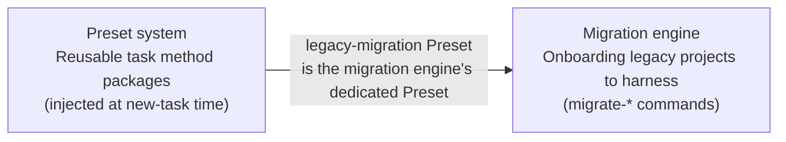
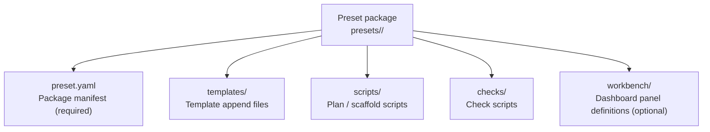
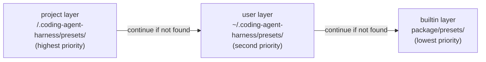
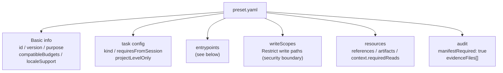
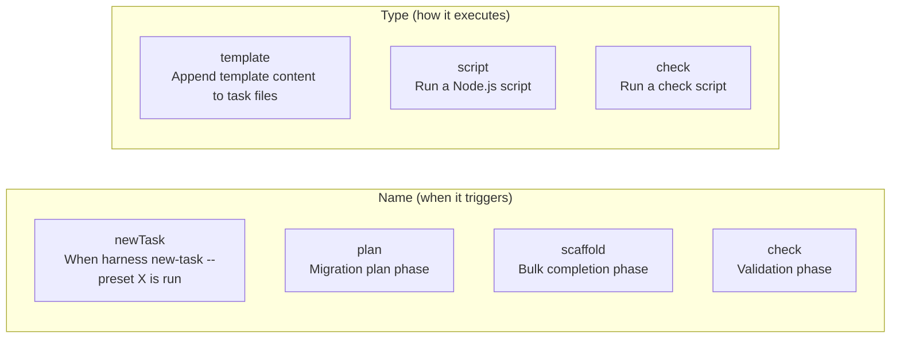
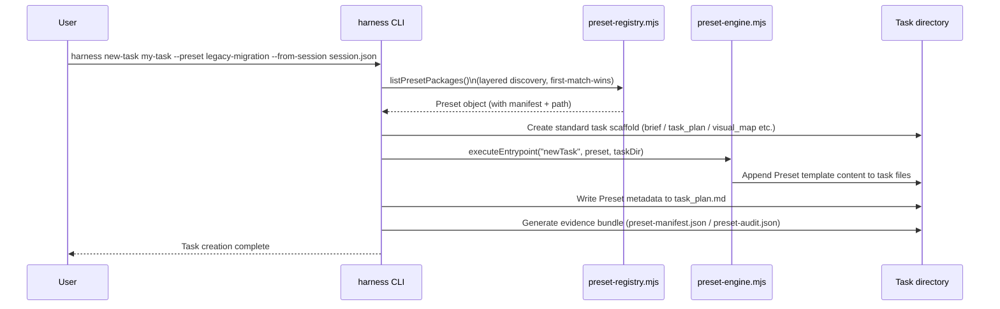
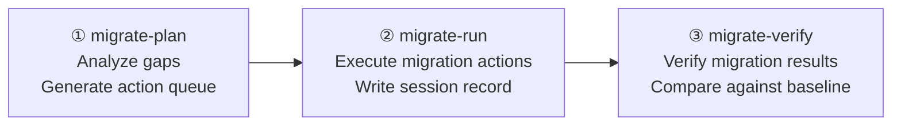
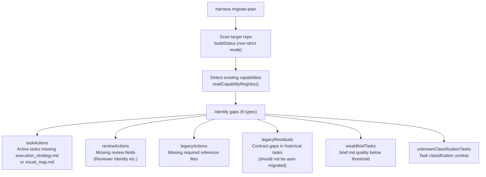
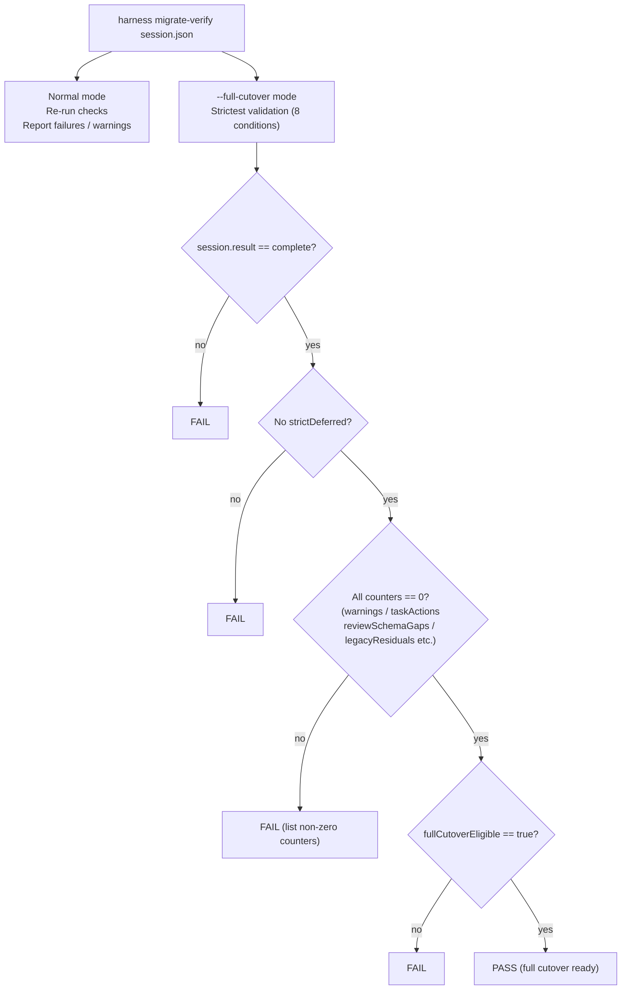
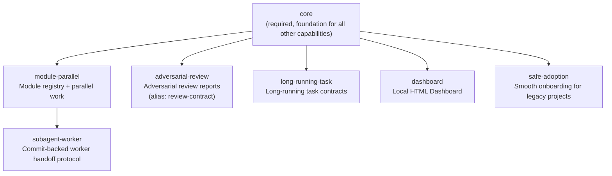

# 06 — Preset System and Migration Engine

## Level 0 — Two independent subsystems

This document covers two related but independent subsystems:



Their relationship: the migration engine has a dedicated Preset (`legacy-migration`), but
the Preset system itself is general-purpose — any type of task can have its own Preset.

---

## Part 1 — Preset System

### Level 1 — What is a Preset

A Preset is a **reusable task method package** that bundles everything a specific type of
task needs:
- Template append content (appended on top of standard templates)
- Execution scripts (run during plan / scaffold phases)
- Check scripts (validate Preset compliance)
- Resource declarations (reference files, artifacts, required reads)



### Level 1 — Layered discovery: three search layers

Presets are searched in **project → user → builtin** order, with **first-match-wins** for
same-named Presets:



This design allows:
- **Project-level override**: put a same-named Preset in the project to override the builtin version
- **User-level override**: put a Preset in the home directory to apply to all projects
- **Builtin fallback**: Presets bundled with the package serve as the default implementation

`harness preset install --project <preset-id>` installs a Preset to the project layer;
`harness preset uninstall --project <preset-id>` removes it from the project layer
(doesn't affect user and builtin layers).

### Level 2 — preset.yaml structure



### Level 3 — Entrypoint type system

Each entrypoint has two dimensions: **name** (when it triggers) and **type** (how it executes):



Differences between the three execution types:
- **template**: Renders a template file and appends the result to task files
  (`task_plan.md`, `execution_strategy.md`, etc.)
- **script**: Executes a Node.js script that can read/write the filesystem;
  returns results as audit evidence
- **check**: Executes a check script that validates Preset application completeness;
  blocks task creation on failure

Each entrypoint also declares `writes` (allowed write path globs) and `reads`
(allowed read path globs).

### Level 3 — writeScopes security boundary

`writeScopes` is a path allowlist that restricts Presets to only writing to declared directories.
`assertPresetWriteScope()` checks whether the relative path matches any scope on every file write.

```
writeScopes:
  tasks:
    path: docs/09-PLANNING/TASKS/**
    access: write
```

Supports `path/**` wildcards for a directory and all its subdirectories.
Relative paths must be normalized (no `../`, no absolute paths) to prevent path traversal attacks.

### Level 2 — Preset lifecycle



### Level 1 — Currently available Presets

| Preset ID | Purpose | Compatible Budget | Special requirements |
| --- | --- | --- | --- |
| `legacy-migration` | Migrate legacy harness projects to v1.0 | complex | Requires `--from-session session.json` |
| `lesson-sedimentation` | Lesson sedimentation tasks | standard, complex | None |
| `module` | Module parallel work tasks | standard, complex | Requires `--module <module-id>` |
| `standard-task` | Standard task method | standard, complex | None |

---

## Part 2 — Migration Engine

### Level 1 — Three phases of migration



### Level 2 — What migrate-plan does

`buildMigrationPlan()` identifies 6 types of gaps:



**Action queue format**: Each taskAction contains `taskId`, `path`, `files[]`, `commands[]`,
and an `action` description. `commands[]` is a list of harness CLI commands that can be
executed directly.

### Level 2 — Two modes of migrate-verify



`--full-cutover` is the final acceptance criteria for migration completion: all 8 conditions
must be satisfied to pass.

---

## Part 3 — Capability Registry

### Level 1 — Capability dependency graph



### Level 2 — selectWhen for each capability

| Capability | When to enable |
| --- | --- |
| `core` | Always — this is the required foundation |
| `module-parallel` | When the project has 2+ independent modules needing parallel ownership |
| `subagent-worker` | When code-change subagents need to work in isolated worktrees and commit handoffs |
| `adversarial-review` | When release, architecture, security, data, or policy risks require independent review artifacts |
| `long-running-task` | When Agents may run across multiple loops without per-step user confirmation |
| `dashboard` | When local read-only state visualization is needed |
| `safe-adoption` | When onboarding v1.0 into an existing harness project without rewriting history |

### Level 2 — Preset resource declarations (resources)

Presets can declare three types of resources. These are auto-generated at task creation
time and validated by the checker:

| Resource type | Meaning | Validation |
| --- | --- | --- |
| `resources.references` | Reference files provided by the Preset | File exists + indexed in `references/INDEX.md` + required reads declared in `task_plan.md` |
| `resources.artifacts` | Artifacts generated by the Preset | File exists + indexed in `artifacts/INDEX.md` |
| `context.requiredReads` | Reference file IDs that must be read | Recorded in both indexes |

This is a **three-layer validation chain**: file exists → indexed in index table →
required reads declared in task_plan.md. Any missing layer produces a failure.

---

## Part 4 — Design decisions

### Why Presets weren't there from the start

The Preset system evolved from the need "migrating legacy projects is too complex". Initially
there was only `new-task --budget complex` with no Preset concept. When users raised the
legacy project migration need, the initial proposal was to invent a new "Ultra" task level.

Research found the problem wasn't that Complex was insufficient — it was "without Presets,
every Agent has to figure out how to structure the migration process from scratch". Three
independent subagent adversarial reviews all pointed to the same conclusion: Preset is the
right abstraction, Ultra is over-engineering.

Reasons for rejecting Ultra:
1. Ultra would introduce a second task system, breaking the consistency of simple/standard/complex
2. The root cause wasn't that Complex couldn't handle it, but that there was no pre-filled scaffold
3. Preset is a general abstraction, not just for migration — any type of task can have its own Preset

### Why Preset manifests use YAML

YAML was chosen for readability — Preset manifests need to be written and reviewed by humans,
and YAML has fewer quotes and brackets than JSON. A lightweight custom parser (`parseSimpleYaml()`)
was written instead of introducing `js-yaml` to maintain zero dependencies. JS format was
ruled out because Presets need to be cross-tool auditable and can't be executable code.

### Why layered discovery (project/user/builtin)

Layered discovery was introduced two days after the Preset system itself. Initially it only
read from the package's fixed `presets/` path. The core problem layered design solves:
- Different projects can have their own private Presets (project layer)
- Users can install Presets shared across projects (user layer)
- Package bundled Presets serve as fallback, usable without installation (builtin layer)

Priority order (project > user > builtin) ensures project-level customization can override
global defaults.

### Why migration is split into three phases instead of one step

The core consideration is "can't auto-migrate" — Presets only scaffold structure, they don't
automatically modify historical docs, auto-stage, or auto-commit. Before actually writing to
the target repo, users still need to confirm the write scope and migration depth.

- `migrate-plan`: read-only analysis, no side effects
- `migrate-run`: write execution, requires user confirmation
- `migrate-verify`: post-hoc verification, confirms migration results

Three separate steps give users a confirmation opportunity at every node with side effects.

### Why full-cutover verification is so strict

`full-cutover` is an irreversible declaration — once migration is declared complete,
subsequent Agents won't treat this project as a migration target anymore. A more lenient
approach (only checking strict pass) was rejected because real-world project validation
(471 tasks) proved that even with a strict pass, weak briefs or legacy-only visual maps
could still remain.

### writeScopes security boundary

writeScopes and the Preset system were introduced simultaneously — it wasn't a security
hardening added later. Presets are third-party installable packages, and without write
scope restrictions, a malicious or buggy Preset could overwrite arbitrary files. The
runtime enforces path checks, rejecting paths starting with `../` and absolute paths
(path traversal protection).
