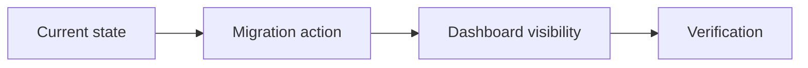

# Legacy Harness Migration Agent Prompt

Chinese mirror: `docs-release/guides/legacy-migration-agent-prompt.zh-CN.md`

Use this prompt when an agent must migrate an older Harness project into the v1.0 document kernel without destroying historical evidence.

## Mission

You are migrating an existing project from a pre-v1 Harness layout to v1.0.

Your default job is not to rewrite the whole `docs/` tree. The default baseline preserves history, installs the v1.0 compatibility layer, identifies active work, and makes current work visible in the dashboard.

Migration is not a single strategy. The agent must scan the target project first, produce a migration plan, recommend a migration mode, and ask the user for confirmation before writing files.

If the user asks for proof that a legacy project is fully migrated, also follow:

- `docs-release/guides/full-legacy-migration-subagent-strategy.md`
- `docs-release/guides/full-legacy-migration-subagent-strategy.zh-CN.md`

This prompt alone is enough for baseline safe-adoption. Full readable cutover has stricter gates.

## Non-Negotiable Rules

1. Do not overwrite `AGENTS.md`, `CLAUDE.md`, historical task folders, Harness Ledger, SSoTs, reviews, walkthroughs, or evidence files.
2. Do not convert hundreds of old tasks into v1 tasks mechanically.
3. Treat closed or unknown historical tasks as legacy residuals in baseline mode unless the user says they are active again.
4. Add `module-parallel` only when the project has real module owners, write scopes, and integration rules. A large task count alone is not a module boundary.
5. Keep the normal check as a migration signal. Use `--strict` only after active tasks are upgraded.
6. Start with `migrate-run`, then prove the result with `migrate-verify`. Do not hand-roll the first adoption pass.
7. Every migration action must be explainable from the generated `migrate-plan.json` and `session.json`.
8. Do not stage, commit, push, or open a PR unless the user explicitly asks.
9. Dashboard evidence must be an existing HTML dashboard path. A Markdown ledger or docs page is not a dashboard.
10. Full readable cutover is stricter than baseline: it requires zero warnings/actions/residuals, strict pass, and dashboard brief coverage `total/total`.
11. Before writing files, complete the scan, recommend a rewrite mode, and get user confirmation. Do not silently choose either fill-gaps-only or full rewrite.

## Step 0: Scan, Then Ask the User

Scan first. Do not write files:

```bash
git -C /path/to/project status --short --branch
harness status --json /path/to/project > /tmp/harness-status.json
harness migrate-plan --json --limit 1000 /path/to/project > /tmp/harness-migrate-plan.json
```

Then return a short migration plan and ask for confirmation. The plan must include:

- task count, brief coverage, and canonical `visual_map.md` coverage;
- `migrate-plan.summary` warnings, taskActions, reviewSchemaGaps, legacyReferenceGaps, legacyResiduals, and fullCutoverEligible;
- dirty / untracked file explanation;
- whether the project is a microservice, multi-repo, split frontend/backend, or externally integrated project, and whether the user has been asked for external source material;
- recommended migration mode and rationale;
- estimated write scope, token / time cost, and whether subagents are needed;
- questions that need user confirmation.

The agent should recommend one of these modes instead of expecting the user to know them upfront:

| Mode | Recommend when | Write strategy |
| --- | --- | --- |
| `baseline-preserve` | The user only needs safe v1.0 adoption and has many historical tasks, without strict-clean as the immediate goal. | Do not rewrite historical tasks; add registry, dashboard, active tasks, required metadata, and warning queue only. |
| `status-aware-rewrite` | The user wants real current work migrated and wants rewrite depth decided by task state. | Rewrite current, reopened, or current-evidence tasks from SSoT / Ledger / progress / review / git evidence; historical tasks become readable index cards or residuals. |
| `full-semantic-rewrite` | The user wants proof that the old project can be rebuilt as a fully readable v1.0 Harness. | Rewrite every task into the v1.0 readable contract; rewrite existing briefs, execution strategies, and visual maps when they are too thin or old-format. |

Example confirmation prompt:

```text
I recommend status-aware-rewrite because this project has 470+ historical tasks, but only a subset appears to be current evidence.
Please confirm:
1. Use this mode, or choose baseline-preserve / full-semantic-rewrite?
2. May I rewrite existing brief and visual_map files, or only add missing files?
3. Does this project have external architecture docs, API docs, diagrams, meeting notes, links, source paths, or exported packets that should be organized during migration?
4. May I start subagents split by date range or module?
```

`visual_map.md` is a diagram collection, not a requirement to draw every possible diagram. It may contain phase flow, sequence, architecture, data-flow, state, topology, or decision maps only when the diagram improves human understanding. Do not generate empty or decorative diagrams just to satisfy a checker.

If the user provides external source material, first use `docs/11-REFERENCE/external-source-intake-standard.md` to create a `docs/04-DEVELOPMENT/external-source-packs/<source-key>/` index and digests, then project stable facts into `03-ARCHITECTURE`, `04-DEVELOPMENT/external-context`, or `06-INTEGRATIONS`. Do not dump raw external documents directly into `03/04/06`.

## Step 1: Baseline

This prompt assumes the target agent has the installed `harness` command. If you are debugging from the source checkout, replace `harness` with `node scripts/harness.mjs`.

After user confirmation, run or reuse:

```bash
git -C /path/to/project status --short --branch
harness migrate-plan --json --limit 50 /path/to/project > /tmp/harness-migrate-plan.json
```

Read the migration plan and confirm the user-selected mode before editing anything.

Before writing files:

- Explain every dirty or untracked path from `git status`.
- Preserve `/tmp/harness-migrate-plan.json` as the baseline snapshot for this run.
- Stop if dirty files are unrelated and the owner is unclear.
- Decide locale. If the target mixes Chinese and English, choose explicitly:
  - `--locale zh-CN` for Chinese users, Chinese project operating context, or Chinese-facing docs.
  - `--locale en-US` for English teams or English-facing docs.
- Record concrete locale evidence from entry files or product-facing docs, such as `AGENTS.md`, `CLAUDE.md`, `README.md`, `docs/Harness-Ledger.md`, and active task docs. Stop and ask for a locale decision if those signals conflict.
- Run the migration rail:

```bash
harness migrate-run \
  --locale zh-CN \
  --session-dir /tmp/cah-migration-project \
  --out-dir /tmp/cah-migration-project/dashboard \
  /path/to/project
```

If `migrate-run` reports a dirty target, stop and explain the dirty files. Use `--allow-dirty` only after the user or repo owner accepts those files as part of the migration context.

The command writes:

- `session.json`
- `report.md`
- `migrate-plan.json`
- `status-normal.json`
- `status-strict.json`
- `dashboard/index.html`

Classify the output:

| Output | Meaning | Action |
| --- | --- | --- |
| `taskActions` | Active or reopened tasks that should receive v1 files | Upgrade carefully |
| `legacyResiduals` | Historical task contract gaps | Do not rewrite by default |
| `reviewActions` | Reviews missing v1 schema | Upgrade only current release-blocking reviews |
| `legacyActions` | Missing older reference/governance files | Create only if the capability is intentionally adopted |
| `recommendedCapabilities` | Candidate capabilities | Evaluate against project facts |

Before you continue, choose the target completion mode:

| Mode | When to use | Final claim |
| --- | --- | --- |
| Baseline safe-adoption | User wants a first safe migration surface and warning queue. | "baseline usable" |
| Full readable cutover | User wants proof that another agent can migrate the old project fully. | "migration complete" only after all gates pass |

For full readable cutover, continue with subagents. Do not let a single agent silently patch every class of issue.

After generating the dashboard in Step 6, inspect `adoption.warnings` from the dashboard bundle. Treat every warning as a queue item with:

- `category`: human-facing bucket.
- `type`: stable issue type.
- `scope`: task, module, review, reference, capability, or project.
- `priority`: P1/P2/P3 cleanup order.
- `phase`: migration phase where the item should be handled.
- `fixability`: template, guided, human-evidence, decision, or manual.
- `status`: open, done, deferred, or accepted-residual.
- `confidence`: high, medium, or low classification confidence.
- `affected`: primary affected path.
- `affectedPaths`: files to inspect or assign.
- `requiredAction`: next action to execute.
- `detail`: original warning detail.

For cleanup reporting, every warning batch needs owner/action/status. Do not mark a warning done only because it was seen.

## Step 2: Install Safe Adoption

This is normally done by `migrate-run`. Only use the lower-level commands when debugging the rail:

```bash
harness add-capability safe-adoption --locale zh-CN /path/to/project
harness add-capability dashboard --locale zh-CN /path/to/project
```

Expected behavior:

- Existing files should show `skip-existing`.
- `.harness-capabilities.json` should declare `core`, `safe-adoption`, and `dashboard`.
- No historical task content should be overwritten.

Stop if existing project docs are overwritten.

## Step 3: Upgrade Active Work Only

Before editing task files, build the evidence map in this order:

1. Read `docs/Harness-Ledger.md`, `docs/10-WALKTHROUGH/Closeout-SSoT.md`, `docs/05-TEST-QA/Regression-SSoT.md`, and any legacy project-specific regression SSoT.
2. Cross-check candidate active tasks against their `progress.md`, walkthrough links, regression rows, and recent git commits.
3. Classify each task as `current-active`, `closed-with-evidence`, `closed-with-residual`, `superseded`, or `unknown-history`.
4. In baseline mode, repair only `current-active` and `unknown-history that is still referenced by SSoT as current evidence`. In a confirmed rewrite mode, rewrite existing v1 surfaces that evidence proves weak or stale.
5. For closed historical tasks, route the residual in the migration report instead of adding fake current files.

If you use subagents for baseline triage, assign them evidence work, not list-making:

- Reviewer A: inspect SSoT and ledger rows for completion status.
- Reviewer B: inspect task `progress.md` / walkthrough / review evidence.
- Reviewer C: inspect git history and regression evidence for whether the task was actually completed.

Every repaired task must name the evidence used to decide it is active or reopened.

For every item in `taskActions`, add or adapt:

- `brief.md`
- `execution_strategy.md`
- `visual_map.md`

Do not write generic placeholder briefs. A useful `brief.md` must answer:

- What is this task trying to achieve?
- What is the execution flow?
- What should a human look at first?
- What is currently blocked or risky?
- Which SSoT, ledger, progress, walkthrough, regression row, review, or git evidence says this task is still current.

Use diagrams when they improve understanding:



After each upgrade, record evidence:

```bash
harness task-log <task-id> \
  --message "migrated active task to v1 visibility contract" \
  --evidence "file:TARGET:docs/09-PLANNING/TASKS/<task>/brief.md:created" \
  /path/to/project
```

## Step 4: Preserve Historical Backlog

If the project has hundreds of old task folders:

- Keep them searchable in dashboard metadata.
- Keep their old `task_plan.md`, `progress.md`, and review evidence intact.
- Do not add `brief.md` to every old task.
- Record the count and category as migration residuals.
- Use SSoT/ledger evidence to decide completion. Do not infer “unfinished” only because a v1 template file is missing.

A good residual entry says:

```text
470 historical tasks remain in legacy format. They are searchable in the dashboard, but not upgraded to v1 brief/strategy/visual_map unless reopened or reused as current release evidence.
```

For full readable cutover, this baseline rule changes:

- Every task must have a standalone `brief.md` so the dashboard can be read by a human.
- Historical task briefs must not claim active execution unless evidence supports it.
- Write them as readable index cards: task goal, first human read, evidence flow, current status judgment, risks/residuals, evidence sources.
- Keep `execution_strategy.md` and `visual_map.md` focused on active/current tasks or user-confirmed semantic rewrite scope. `visual_map.md` should contain only useful diagrams, not empty diagrams for coverage.
- Split the work across subagents by date range, module, or migration bucket.

## Step 5: Decide Whether Modules Exist

Only create `Module-Registry.md` and module plans when all are true:

- There are two or more stable product or engineering domains.
- Each domain has a clear owner or worker lane.
- Write scopes can be made non-overlapping.
- Shared files have coordinator ownership.
- Module status can be maintained after migration.

If these are not true, keep the project as a single-line Harness with `safe-adoption`.

Module classification order:

1. Use explicit modules first: existing `docs/09-PLANNING/MODULES/<module>/` folders or maintained `Module-Registry.md`.
2. Use dashboard inferred modules only for browsing, filtering, and cleanup routing. Inferred grouping is not a capability declaration.
3. Keep uncertain history as `legacy-unclassified`.

Before creating module files, produce a classification summary:

- Candidate module name.
- Product or engineering domain rationale.
- Owner and non-overlapping write scope.
- Shared-file coordinator rule.
- Count of tasks left as `legacy-unclassified`.

Do not create modules from date buckets, file paths alone, or a desire to make the dashboard look tidy.

## Step 6: Generate Dashboard

This is normally done by `migrate-run --out-dir`. If you need a standalone debug dashboard, generate both forms:

```bash
harness dashboard --out /tmp/harness-dashboard.html /path/to/project
harness dashboard --out-dir /tmp/harness-dashboard /path/to/project
```

The dashboard must show:

- A project flow for small projects, or an aggregate migration runway for large legacy projects.
- Active task briefs when active tasks exist.
- Searchable and paginated historical tasks.
- Migration attention as a warning workbench, not a fake all-green state.
- Legacy residuals separated from current blockers.

For projects with hundreds of tasks, use the dashboard like this:

1. Start with the aggregate migration runway, not the raw task graph.
2. In Task Index, group by migration bucket to separate active/current work from historical records.
3. Switch to module grouping only after inferred or explicit modules are meaningful.
4. Use warning filters to fix one warning class at a time.
5. Regenerate the dashboard after each cleanup batch and compare counts.

## Step 7: Verify

Run:

```bash
harness migrate-verify /tmp/cah-migration-project/session.json
harness check --profile target-project /path/to/project
harness check --profile target-project --strict /path/to/project
harness status --json /path/to/project
harness migrate-plan --json /path/to/project
git -C /path/to/project diff --cached --name-only
```

`migrate-verify` must pass before you report the migration as usable. It checks the capability registry, selected locale, dashboard HTML evidence, normal check status, staged files, and whether strict failures have an explicit `strictDeferred` owner/trigger/next action.

If you perform additional cleanup after the first session, regenerate the session and dashboard with `migrate-run` or clearly label the first session as baseline and provide fresh final check/dashboard evidence. Do not report a stale baseline dashboard as final evidence.

For full readable cutover, additionally verify:

```bash
node -e '
const fs = require("fs");
const status = JSON.parse(fs.readFileSync("/tmp/cah-migration-project/dashboard/data/status.json", "utf8"));
console.log(status.summary.briefCoverage);
console.log(status.tasks.filter((task) => task.briefSource !== "standalone" || !task.briefPath).slice(0, 5));
'
```

Expected:

- `ready == total`
- `missing == 0`
- no sample task missing `briefPath`

Also open the dashboard task index and confirm it shows `total / total`.

Do not claim strict migration is complete unless:

- Active tasks have v1 visibility files.
- Current release-blocking reviews use v1 review schema.
- Remaining historical gaps have owner/action/status or an accepted residual reason.
- `--strict` passes.

Do not claim full readable migration is complete unless:

- All strict-complete conditions above pass.
- `migrate-plan` has 0 warnings/actions/residuals.
- Dashboard brief coverage is 100%.
- Final adversarial review lanes pass: CLI/session, brief quality, and boundary/git state.

If the user accepts remaining residuals, report `strict deferred`, not `strict complete`. Include owner, expiry or trigger condition, and next action for every accepted residual.

## Expected Final Report

Return:

- Files created and skipped.
- Capability registry state.
- Number of active task actions completed.
- Number of legacy residuals left untouched.
- Dashboard paths.
- `session.json` and `report.md` paths.
- Normal check result.
- Strict check result or explicit reason it remains deferred.
- Dashboard brief coverage result.
- Subagent worker roles used.
- Final adversarial review outcome.
