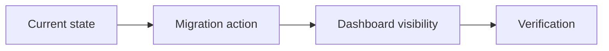

# Legacy Harness Migration Agent Prompt

Use this prompt when an agent must migrate an older Harness project into the v1.0 document kernel without destroying historical evidence.

## Mission

You are migrating an existing project from a pre-v1 Harness layout to v1.0.

Your job is not to rewrite the whole `docs/` tree. Your job is to preserve history, install the v1.0 compatibility layer, identify active work, and make current work visible in the dashboard.

## Non-Negotiable Rules

1. Do not overwrite `AGENTS.md`, `CLAUDE.md`, historical task folders, Harness Ledger, SSoTs, reviews, walkthroughs, or evidence files.
2. Do not convert hundreds of old tasks into v1 tasks mechanically.
3. Treat closed or unknown historical tasks as legacy residuals unless the user says they are active again.
4. Add `module-parallel` only when the project has real module owners, write scopes, and integration rules. A large task count alone is not a module boundary.
5. Keep the normal check as a migration signal. Use `--strict` only after active tasks are upgraded.
6. Every migration action must be explainable from `migrate-plan --json`.

## Step 1: Baseline

Run:

```bash
git status --short --branch
node scripts/harness.mjs status --json /path/to/project > /tmp/harness-status.json
node scripts/harness.mjs migrate-plan --json --limit 50 /path/to/project > /tmp/harness-migrate-plan.json
```

Read the migration plan before editing anything.

Classify the output:

| Output | Meaning | Action |
| --- | --- | --- |
| `taskActions` | Active or reopened tasks that should receive v1 files | Upgrade carefully |
| `legacyResiduals` | Historical task contract gaps | Do not rewrite by default |
| `reviewActions` | Reviews missing v1 schema | Upgrade only current release-blocking reviews |
| `legacyActions` | Missing older reference/governance files | Create only if the capability is intentionally adopted |
| `recommendedCapabilities` | Candidate capabilities | Evaluate against project facts |

## Step 2: Install Safe Adoption

Run:

```bash
node scripts/harness.mjs add-capability safe-adoption --locale zh-CN /path/to/project
node scripts/harness.mjs add-capability dashboard --locale zh-CN /path/to/project
```

Expected behavior:

- Existing files should show `skip-existing`.
- `.harness-capabilities.json` should declare `core`, `safe-adoption`, and `dashboard`.
- No historical task content should be overwritten.

Stop if existing project docs are overwritten.

## Step 3: Upgrade Active Work Only

For every item in `taskActions`, add or adapt:

- `brief.md`
- `execution_strategy.md`
- `visual_roadmap.md`

Do not write generic placeholder briefs. A useful `brief.md` must answer:

- What is this task trying to achieve?
- What is the execution flow?
- What should a human look at first?
- What is currently blocked or risky?

Use diagrams when they improve understanding:



After each upgrade, record evidence:

```bash
node scripts/harness.mjs task-log <task-id> \
  --message "migrated active task to v1 visibility contract" \
  --evidence "file:TARGET:docs/09-PLANNING/TASKS/<task>/brief.md:created" \
  /path/to/project
```

## Step 4: Preserve Historical Backlog

If the project has hundreds of old task folders:

- Keep them searchable in dashboard metadata.
- Keep their old `task_plan.md`, `progress.md`, and review evidence intact.
- Do not add `brief.md` to every old task.
- Record the count and category as migration residuals.

A good residual entry says:

```text
470 historical tasks remain in legacy format. They are searchable in the dashboard, but not upgraded to v1 brief/strategy/roadmap unless reopened or reused as current release evidence.
```

## Step 5: Decide Whether Modules Exist

Only create `Module-Registry.md` and module plans when all are true:

- There are two or more stable product or engineering domains.
- Each domain has a clear owner or worker lane.
- Write scopes can be made non-overlapping.
- Shared files have coordinator ownership.
- Module status can be maintained after migration.

If these are not true, keep the project as a single-line Harness with `safe-adoption`.

## Step 6: Generate Dashboard

Generate both forms:

```bash
node scripts/harness.mjs dashboard --out /tmp/harness-dashboard.html /path/to/project
node scripts/harness.mjs dashboard --out-dir /tmp/harness-dashboard /path/to/project
```

The dashboard must show:

- A project flow or a clear fallback.
- Active task briefs when active tasks exist.
- Searchable historical tasks.
- Migration attention, not a fake all-green state.
- Legacy residuals separated from current blockers.

## Step 7: Verify

Run:

```bash
node scripts/harness.mjs check --profile target-project /path/to/project
node scripts/harness.mjs status --json /path/to/project
node scripts/harness.mjs migrate-plan --json /path/to/project
```

Do not claim strict migration is complete unless:

- Active tasks have v1 visibility files.
- Current release-blocking reviews use v1 review schema.
- Remaining historical gaps have owner/action/status or an accepted residual reason.
- `--strict` passes, or the user accepts the listed residuals.

## Expected Final Report

Return:

- Files created and skipped.
- Capability registry state.
- Number of active task actions completed.
- Number of legacy residuals left untouched.
- Dashboard paths.
- Normal check result.
- Strict check result or explicit reason it remains deferred.
