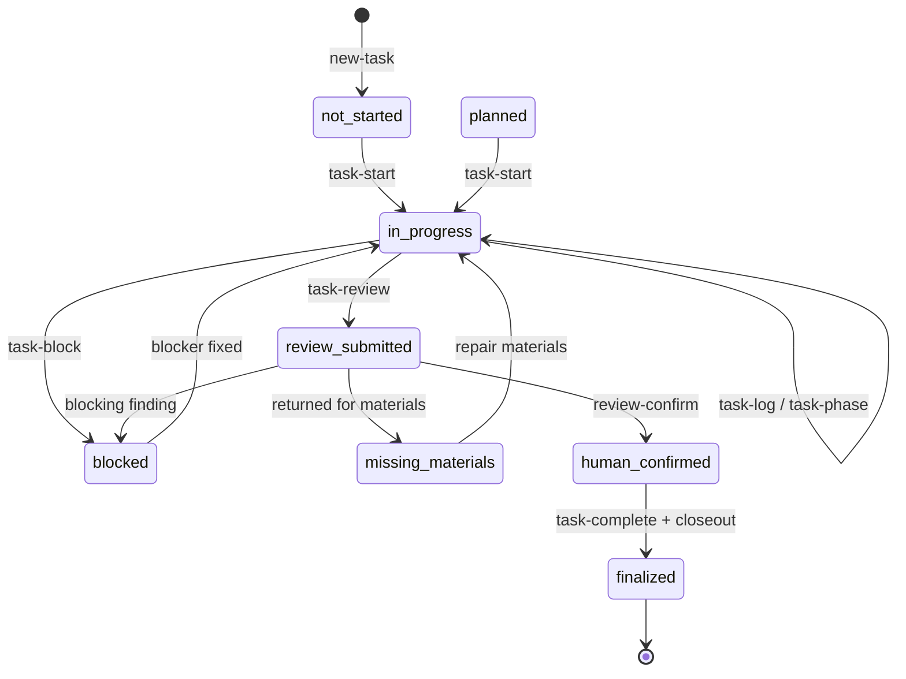
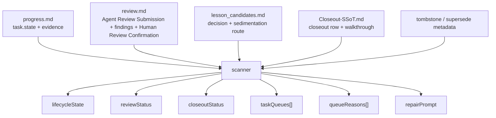
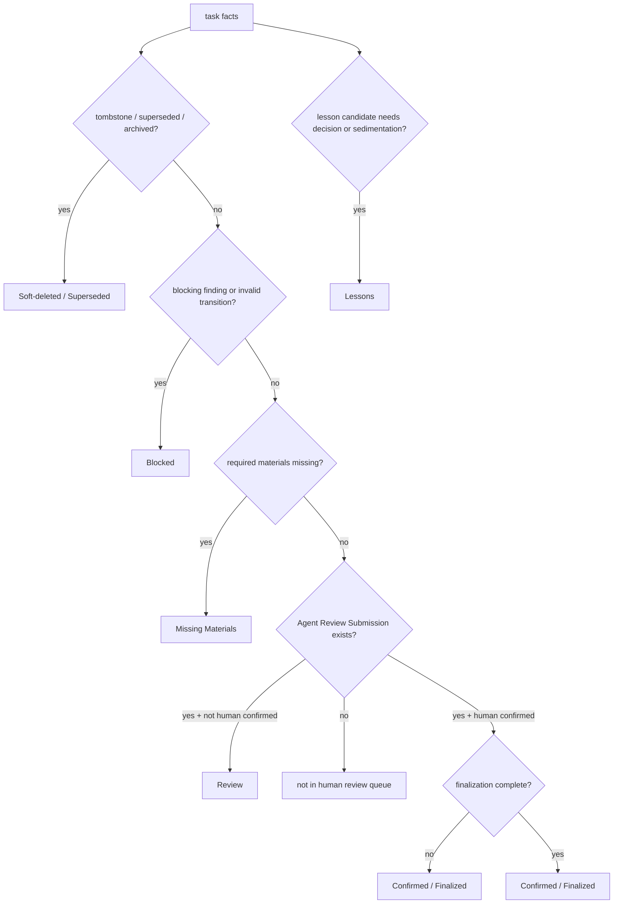
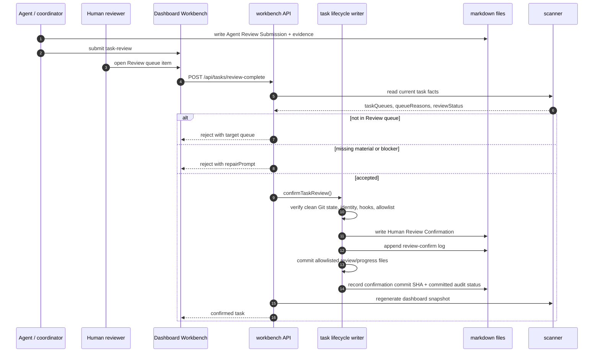

# Task State Machine And Lifecycle Queues

Chinese mirror: `docs-release/guides/task-state-machine.md`

Coding Agent Harness does not model task state as a single field. The Dashboard derives the visible lifecycle from multiple files:

- `progress.md` stores raw `task.state` and execution evidence.
- `review.md` stores Agent Review Submission, material findings, and Human Review Confirmation.
- `lesson_candidates.md` records lesson candidate decisions and sedimentation routing.
- `10-WALKTHROUGH/Closeout-SSoT.md` records closeout status and links walkthrough evidence.
- Tombstone / supersede metadata records whether a task was soft-deleted, merged, archived, or replaced.
- The scanner derives `lifecycleState`, `reviewStatus`, `closeoutStatus`, `taskQueues[]`, `queueReasons[]`, and `repairPrompt` from those files.

The older `reviewQueueState` model was enough for a single review page. After PF-024, the public model is a set of lifecycle queues: Review, Missing Materials, Blocked, Lessons, Confirmed / Finalized, and Soft-deleted / Superseded.

## Raw Task Command Flow

`task-review` means the agent submitted a review packet. It does not mean human approval. `review-confirm` is the Human Review Confirmation gate. `task-complete` / closeout is not a substitute for review confirmation.

## Derived State

| Field | Source | Purpose |
| --- | --- | --- |
| `task.state` | `progress.md` | Raw execution stage. |
| `reviewStatus` | `review.md` + findings + Human Review Confirmation | Separates missing review, agent-submitted review, blockers, and human confirmation. |
| `closeoutStatus` | `Closeout-SSoT.md` | Separates missing, pending, and closed closeout. |
| `lifecycleState` | scanner-derived | Main Dashboard lifecycle meaning. |
| `taskQueues[]` | scanner-derived | Which lifecycle queues include the task. A task can be visible in more than one governance queue. |
| `queueReasons[]` | scanner-derived | Why the task entered a queue, including source file, field, and repair action. |
| `repairPrompt` | scanner-derived | A copyable, scoped repair prompt for a Coding Agent. |

## Lifecycle Matrix

| Condition | `lifecycleState` | Meaning |
| --- | --- | --- |
| Tombstone, superseded-by, archive, or abandoned marker exists | `soft-deleted-superseded` | Hidden by default, but preserved for audit and replacement tracing. |
| Open P0-P2 finding, invalid transition, audit failure, or failed human-review gate | `blocked` | Cannot enter human confirmation until the blocker is fixed or waived. |
| Standard / complex task is missing required files, sections, evidence, lesson decision, or review submission | `missing-materials` | Needs agent repair; not part of the human review queue. |
| `task-review` was submitted, materials are ready, and Human Review Confirmation is missing | `review-submitted` | Truly waiting for human review. |
| Human Review Confirmation exists, but closeout / ledger / lessons are not fully closed | `confirmed-finalization-pending` | Accountability moved to the reviewer, but governance closeout remains. |
| Human Review Confirmation exists, and closeout / ledger / lesson routing are complete | `finalized` | Truly complete and traceable. |
| `task.state = blocked` without a review blocker | `active-blocked` | Execution is blocked. |
| `task.state = in_progress` | `active` | Work is active. |
| `task.state = planned/not_started` | `ready` | Work has not started; not in human review by default. |

## Review Status

| `reviewStatus` | Meaning |
| --- | --- |
| `missing` | No usable review document or Agent Review Submission exists. |
| `required` | Review document exists, but the packet is not ready for human review. |
| `submitted` | An agent submitted a review packet. This is not human confirmation. |
| `blocked-open-findings` | There is an open P0-P2 finding or a finding that blocks release / confirmation. |
| `confirmed` | `Human Review Confirmation` exists. |

Agent self-review, subagent review, and coordinator review can only move a task toward `submitted`. Only `review-confirm` or an explicit Dashboard Workbench human confirmation writes `Human Review Confirmation`.

## Lifecycle Queues

The Dashboard lifecycle workbench is a set of queues, not one mixed review list.

| Queue | Entry condition | Primary owner | Exit condition |
| --- | --- | --- | --- |
| Review | Review packet submitted, materials ready, and no human confirmation yet. | human | Human confirms or returns it. |
| Missing Materials | Missing file, section, evidence, lesson decision, review submission, or incomplete phase. | agent | Agent repairs materials and resubmits review. |
| Blocked | Blocking finding, state conflict, Git audit failure, completion gate failure, or human waiver required. | agent + human | Fixed, closed, or explicitly waived. |
| Lessons | Lesson candidate needs decision, task-local retention, rejection, dry-run promotion, or a sedimentation task. | human + agent | Decision is complete, or a traceable sedimentation task exists. |
| Confirmed / Finalized | Human-confirmed, or finalized and ready for read-only tracing. | coordinator | Closeout, ledger, and lesson routing are complete; then read-only. |
| Soft-deleted / Superseded | Task was soft-deleted, replaced, merged, archived, or abandoned. | coordinator | Read-only tracing; reopen only when needed. |

The Review queue only waits for human confirmation. Missing materials, blockers, lesson sedimentation, confirmed-but-not-finalized work, and historical superseded tasks must not masquerade as Review queue items.

## Global Table Boundary

Global governance tables only keep index, state, route, and audit summary. They help the Dashboard find the source of truth, but they do not carry module-local facts, long evidence, execution logs, or temporary repair prompts.

| Layer | Should record | Should not record |
| --- | --- | --- |
| Global tables: Feature SSoT, Harness Ledger, Closeout SSoT, Regression SSoT, Cadence Ledger | Current state, owner, task/module/detail links, regression gate, closeout or audit summary | Module-internal steps, undecided lesson candidates, full command output, long evidence paragraphs, review transcripts, temporary repair prompts |
| Module layer: Module Registry, `module_plan.md` | Module boundary, module steps, handoff, current blockers, and local evidence indexes | Final promoted lesson body or cross-module release audit ledger |
| Task layer: `brief.md`, `task_plan.md`, `progress.md`, `review.md`, `lesson_candidates.md`, `artifacts/INDEX.md` | Execution detail, evidence, agent review, candidate lessons, repair prompts, and raw artifact routing | Cross-task ledgers or promoted lesson detail bodies |

The checker enforces this boundary for new global table rows. Overloaded rows that already existed before 2026-05-24 are surfaced in Dashboard migration advice as `legacy-report-only`; they are not automatically deleted or bulk-rewritten. New rows that continue placing task/module-local detail in global tables are reported as `governance-table-entropy` failures. Lesson candidates stay in `lesson_candidates.md`; accepted reusable lessons live in `docs/01-GOVERNANCE/lessons/*.md`. The fix is to keep the global summary row and move detail into module/task/detail documents linked from that row.

## Human Confirmation Loop

Strict rule: an agent can prepare review evidence and submit the task for review, but the task is not human-confirmed until the Human Review Confirmation block exists. Confirmation must use gated auto-commit: the CLI and Workbench reject dirty Git state, missing commit identity, hook/preflight failure, or writes outside the current task `review.md` / `progress.md` allowlist, and return recovery guidance.

## Lesson Sedimentation

Lesson promotion does not write a shared Lessons table. The Dashboard or CLI should prefer a dry-run or follow-up sedimentation task so the assignee first:

- Classifies scope and boundary reason.
- Checks conflicts against existing lesson candidates, lesson detail docs, reference standards, templates, and checkers.
- Proposes a target diff or no-action reason.
- Writes the promoted lesson detail doc or standard update only after human approval.

`needs-promotion` should not block human review confirmation by itself, but it must enter the Lessons queue and remain traceable in closeout / ledger records.

## Soft Delete And Supersede

The document library does not hard-delete task directories by default.

| State | Meaning | Requirement |
| --- | --- | --- |
| `active` | Normal task. | Dashboard shows it by default. |
| `soft-deleted` | Task was abandoned but the directory stays. | Write a tombstone with operator, timestamp, reason, and reopen eligibility. |
| `superseded` | Task was replaced or merged into a newer task. | Old task records `Superseded By`; new task records `Supersedes`. |
| `archived` | Task moved to archive. | Reference checks must pass first, and a redirect stub or generated index entry must remain. |
| `hard-deleted` | Physically deleted. | Forbidden by default; allowed only for mistaken tasks with no references, ledger, progress, or review evidence. |

The Soft-deleted / Superseded queue is read-only tracing. It tells users why a task is not active and which task replaced it.
