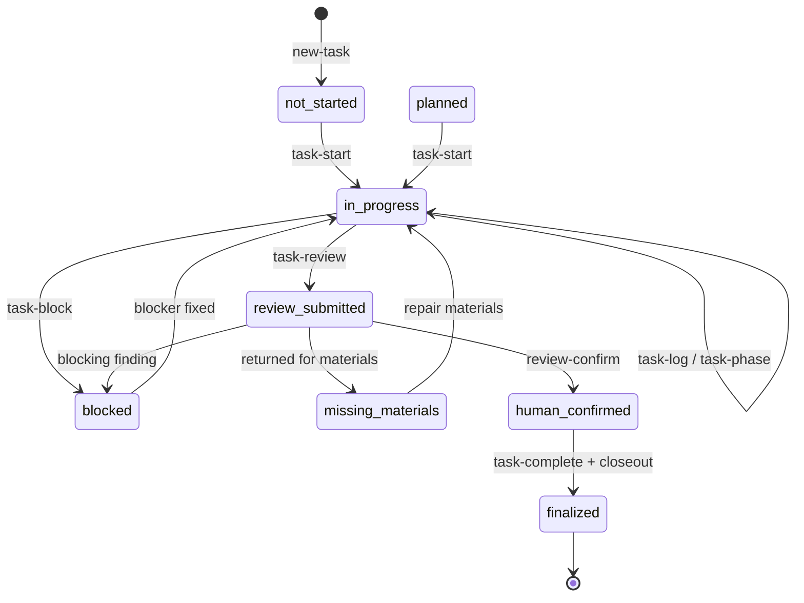
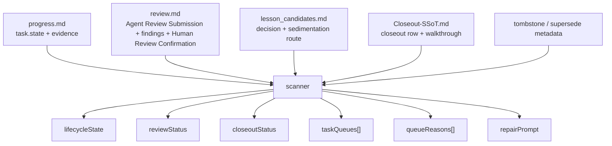
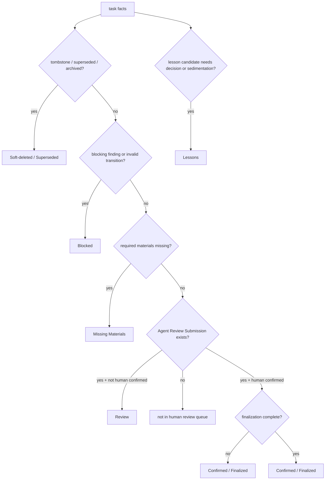
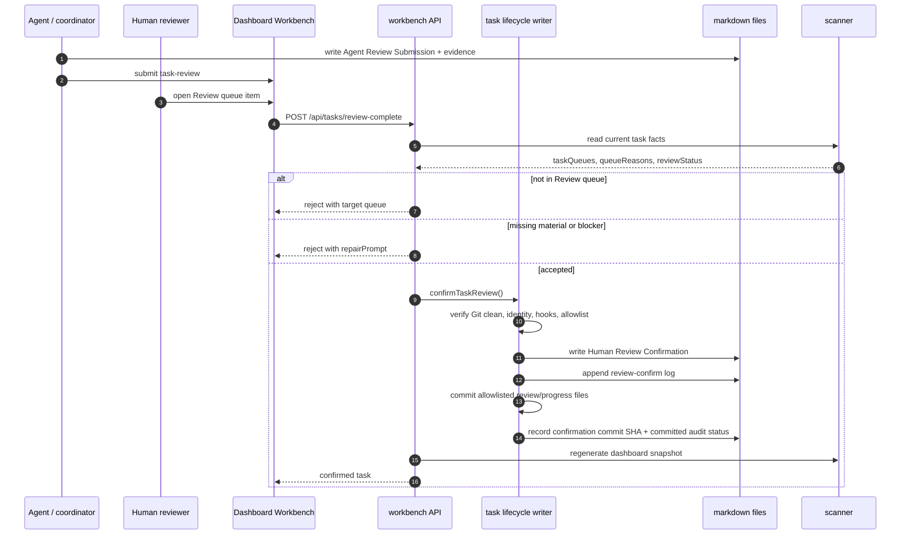

# 任务状态机与生命周期队列

English mirror: `docs-release/guides/task-state-machine.en-US.md`

Coding Agent Harness 的任务状态不是一个单字段。Dashboard 里看到的生命周期由多个文件共同推导：

- `progress.md` 记录原始 `task.state` 和执行证据。
- `review.md` 记录 Agent Review Submission、material findings 和 Human Review Confirmation。
- `lesson_candidates.md` 记录 lesson candidate 的人工判定和后续沉淀路由。
- `10-WALKTHROUGH/Closeout-SSoT.md` 记录任务是否完成收口，并链接 walkthrough。
- Tombstone / supersede 信息记录任务是否被软删除、合并、归档或替代。
- Scanner 从这些文件推导 `lifecycleState`、`reviewStatus`、`closeoutStatus`、`taskQueues[]`、`queueReasons[]` 和 `repairPrompt`。

旧版 `reviewQueueState` 只适合表示单一审查页面。PF-024 后，公开模型改为多个生命周期队列：Review、Missing Materials、Blocked、Lessons、Confirmed / Finalized、Soft-deleted / Superseded。

## 原始任务命令流

`task-review` 表示 Agent 提交审查材料包，不表示人工批准。`review-confirm` 才表示 Human Review Confirmation。`task-complete` / closeout 也不是 review confirmation 的替代品。

## 派生状态

| 字段 | 来源 | 作用 |
| --- | --- | --- |
| `task.state` | `progress.md` | 原始执行阶段。 |
| `reviewStatus` | `review.md` + findings + Human Review Confirmation | 区分缺审查、Agent 已提交审查、阻塞、人工确认。 |
| `closeoutStatus` | `Closeout-SSoT.md` | 区分收口缺失、待处理、已关闭。 |
| `lifecycleState` | scanner 派生 | Dashboard 的主生命周期语义。 |
| `taskQueues[]` | scanner 派生 | 任务属于哪些生命周期队列。一个任务可同时在多个治理队列中可见。 |
| `queueReasons[]` | scanner 派生 | 为什么进入队列，以及对应源文件、字段和修复动作。 |
| `repairPrompt` | scanner 派生 | 可复制给 Coding Agent 的受限修复提示。 |

## 生命周期矩阵

| 条件 | `lifecycleState` | 含义 |
| --- | --- | --- |
| 有 tombstone、superseded-by、archive 或 abandoned 标记 | `soft-deleted-superseded` | 默认隐藏，但保留审计和替代链。 |
| 有 open P0-P2 finding、非法状态转换、审计失败或人审门禁失败 | `blocked` | 不能进入人工确认，必须先修 blocker 或记录 waiver。 |
| 标准/复杂任务缺必需文件、章节、证据、lesson decision 或 review submission | `missing-materials` | 需要 Agent 补材料，不属于人审队列。 |
| 已执行 `task-review`，材料齐全，且未 Human Review Confirmation | `review-submitted` | 真正等待人审。 |
| 已 Human Review Confirmation，但 closeout / ledger / lessons 仍未全部收口 | `confirmed-finalization-pending` | 责任已转移给确认人，但治理收口仍待完成。 |
| 已 Human Review Confirmation，且 closeout / ledger / lesson routing 完成 | `finalized` | 真正完成，可只读追溯。 |
| `task.state = blocked` 但没有 review blocker | `active-blocked` | 执行阻塞。 |
| `task.state = in_progress` | `active` | 执行中。 |
| `task.state = planned/not_started` | `ready` | 准备中，默认不进入人审队列。 |

## 审查状态

| `reviewStatus` | 含义 |
| --- | --- |
| `missing` | 没有可用 review 文档或缺 Agent Review Submission。 |
| `required` | 有 review 文档，但还没有足够材料可提交人审。 |
| `submitted` | Agent 已提交审查材料包；这不是人工确认。 |
| `blocked-open-findings` | 有 open P0-P2 finding，或 finding 阻塞发布 / 确认。 |
| `confirmed` | 已写入 `Human Review Confirmation`。 |

Agent 自查、subagent 审查和 coordinator 审查都只能让任务接近 `submitted`。只有 `review-confirm` 或 Workbench 的明确人工确认动作会写入 `Human Review Confirmation`。

## 生命周期队列

Dashboard 的 lifecycle workbench 是多个队列，不是一个混合 review 列表。

| 队列 | 进入条件 | 主要责任方 | 退出条件 |
| --- | --- | --- | --- |
| Review | 已提交 review packet，材料齐，且未人工确认。 | human | 人工确认或退回。 |
| Missing Materials | 缺文件、缺章节、缺证据、缺 lesson decision、缺 review submission 或 phase 未完成。 | agent | 补齐材料并重新提交 review。 |
| Blocked | 有 blocking finding、状态矛盾、Git 审计失败、完成门禁失败或需要 human waiver。 | agent + human | 修复、关闭、或人工豁免。 |
| Lessons | lesson candidate 需要判定、保留、拒绝、dry-run promotion 或创建沉淀任务。 | human + agent | 决策完成，或创建可追踪沉淀任务。 |
| Confirmed / Finalized | 已人工确认，或已结项需要只读追溯。 | coordinator | closeout、ledger、lesson routing 全部完成；之后只读。 |
| Soft-deleted / Superseded | 任务被软删除、替代、合并、归档或废弃。 | coordinator | 只读追溯；必要时 reopen。 |

Review 队列只等人确认。缺材料、阻塞、lesson 沉淀、已确认待结项、历史替代任务都不应伪装成 Review 队列项。

## 全局表边界

全局治理表只保留索引、状态、路由和审计摘要。它们帮助 Dashboard 找到事实位置，
但不承载模块局部事实、长证据、执行流水或临时修复提示。

| 层级 | 应该记录什么 | 不应该记录什么 |
| --- | --- | --- |
| 全局表：Feature SSoT、Lessons SSoT、Harness Ledger、Closeout SSoT、Regression SSoT、Cadence Ledger | 当前状态、负责人、任务/模块/详情文档链接、回归 gate、收口或审计摘要 | 模块内步骤、未判定 lesson candidate、`Status=candidate` 的 Lessons SSoT 行、完整命令输出、长证据段落、review transcript、临时 repair prompt |
| 模块层：Module Registry、`module_plan.md` | 模块边界、模块内步骤、handoff、当前阻塞和局部证据索引 | 已 promotion 的全局 lesson 正文、跨模块发布审计总账 |
| 任务层：`brief.md`、`task_plan.md`、`progress.md`、`review.md`、`lesson_candidates.md`、`artifacts/INDEX.md` | 执行细节、证据、agent review、候选 lesson、修复提示和 raw artifact 路由 | 可复用规范的最终 SSoT 行，或跨任务总账 |

Checker 对新增全局表行执行该边界。2026-05-24 之前已经存在的过载行默认作为
`legacy-report-only` 出现在 Dashboard 迁移建议里，不会被自动删除或批量改写。
新增行如果把 task/module 局部细节继续塞进全局表，会作为 `governance-table-entropy`
失败项报告。Lessons SSoT 新行必须是已 promotion / approved / merged / superseded 的治理条目，
且必须有真实详情文档；候选仍留在 `lesson_candidates.md`。修复方式是保留全局摘要行，
把细节移动到 module/task/detail 文档并在全局表中链接过去。

## 人工确认闭环

严格规则：Agent 可以准备 review evidence，也可以提交审查；但任务只有在 Human Review Confirmation block 存在后，才算人工确认。确认动作必须通过 gated auto-commit：Git 状态不干净、提交身份缺失、hook/preflight 失败，或待写文件超出当前任务 `review.md` / `progress.md` 白名单时，CLI 和 Workbench 都会拒绝并返回恢复建议。

## Lesson 沉淀

Lesson promotion 默认不直接写 Lessons SSoT。Dashboard 或 CLI 应优先创建 dry-run 或后续沉淀任务，让执行者先完成：

- 分类 scope 和边界原因。
- 检查既有 Lessons SSoT、reference standard、template、checker 是否冲突。
- 给出目标 diff 或 no-action 理由。
- 由人工批准后再写 SSoT 或标准文档。

`needs-promotion` 不应阻塞人审确认本身，但必须进入 Lessons 队列，并在 closeout / ledger 中可追踪。

## 软删除与替代

文档库默认不 hard delete 任务目录。

| 状态 | 含义 | 要求 |
| --- | --- | --- |
| `active` | 正常任务。 | Dashboard 默认显示。 |
| `soft-deleted` | 任务被废弃但保留目录。 | 写 tombstone，记录操作者、时间、原因和 reopen eligibility。 |
| `superseded` | 任务被新任务替代或合并。 | 旧任务记录 `Superseded By`，新任务记录 `Supersedes`。 |
| `archived` | 任务移入归档。 | 必须先通过引用检查，并留下 redirect stub 或 generated index entry。 |
| `hard-deleted` | 物理删除。 | 默认禁止；只允许误创建且无引用、无 ledger、无 progress、无 review 证据的任务。 |

Soft-deleted / Superseded 队列用于只读追溯，帮助用户看清“为什么这个任务不在活跃队列里”以及替代任务是谁。
