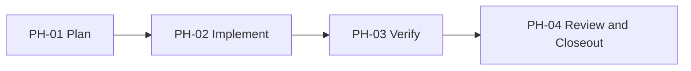

# [Task Name] - Visual Map

Visual Map Contract: v1.0

This file is the task's diagram collection. It is not only a phase roadmap.
Include only diagrams that materially help a human or agent understand the task.

## Map Index

| ID | Type | Purpose | Required For Understanding | Source Evidence | Promotion Candidate |
| --- | --- | --- | --- | --- | --- |
| MAP-01 | phase | Show the execution phases and dependencies | yes | `task_plan.md` | no |

## Phase Graph

## Phase Table

| Phase ID | Depends On | State | Completion | Output | Required Evidence | Evidence Status | Blocking Risk | Owner / Handoff |
| --- | --- | --- | ---: | --- | --- | --- | --- | --- |
| PH-01 | none | planned | 0 | Approved task plan and execution strategy | `task_plan.md`, `execution_strategy.md` | missing | none | coordinator |
| PH-02 | PH-01 | planned | 0 | Scoped implementation or document update | diff, worker handoff, or artifact path | missing | [risk] | [owner] |
| PH-03 | PH-02 | planned | 0 | Verification evidence | commands, logs, screenshots, or runtime proof | missing | [risk] | [owner] |
| PH-04 | PH-03 | planned | 0 | Review disposition and closeout updates | `review.md`, progress update, ledger updates | missing | [risk] | coordinator |

Allowed Evidence Status: missing, partial, present, waived.

## Supporting Maps

Add optional diagrams only when useful:

- architecture: module, component, or service structure.
- sequence: frontend/backend/service/database/agent interaction.
- data-flow: data movement and ownership.
- state: state machine or lifecycle.
- topology: repo, service, worker, or worktree layout.
- decision: branch and tradeoff tree.

## Map Notes

- Use `missing` when no evidence has been checked.
- Use `partial` when some evidence exists but required checks remain.
- Use `present` when the phase has sufficient evidence for its current claim.
- Use `waived` only when the reason and owner are recorded in `progress.md`.
